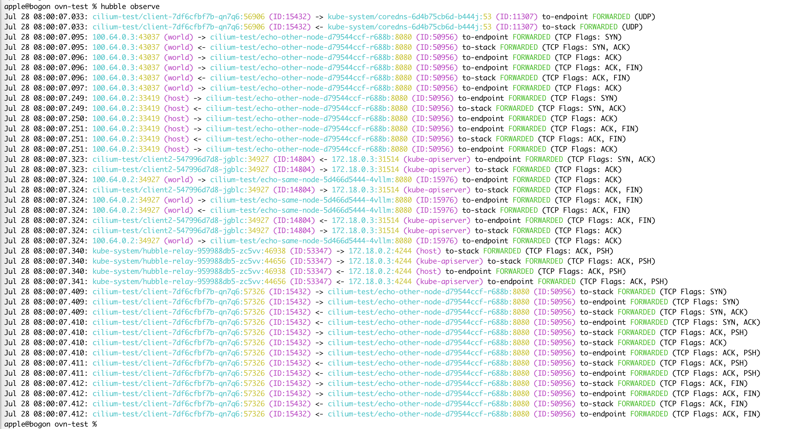

# Cilium Network Traffic Observation

Kube-OVN supports Cilium integration, please refer to [Cilium integration](with-cilium.en.md) for details.

Cilium provides rich network traffic observation capabilities, and the flow observability is provided by Hubble. Hubble can observe the traffic across nodes, clusters, and even multi-cluster scenarios.

## Install Hubble

In the default Cilium integration installation, the Hubble related components are not installed, so to support traffic observation, you need to supplement the installation of Hubble on the environment.

Execute the following command to install Hubble using helm:

```bash
helm upgrade cilium cilium/cilium --version 1.11.6 \
   --namespace kube-system \
   --reuse-values \
   --set hubble.relay.enabled=true \
   --set hubble.ui.enabled=true
```

After installing Hubble, execute `cilium status` to check the status of the component and confirm that the installation is successful.

```bash
# cilium status
    /¯¯\
 /¯¯\__/¯¯\    Cilium:         OK
 \__/¯¯\__/    Operator:       OK
 /¯¯\__/¯¯\    Hubble:         OK
 \__/¯¯\__/    ClusterMesh:    disabled
    \__/

Deployment        hubble-relay       Desired: 1, Ready: 1/1, Available: 1/1
Deployment        cilium-operator    Desired: 2, Ready: 2/2, Available: 2/2
DaemonSet         cilium             Desired: 2, Ready: 2/2, Available: 2/2
Deployment        hubble-ui          Desired: 1, Ready: 1/1, Available: 1/1
Containers:       cilium             Running: 2
                  hubble-ui          Running: 1
                  hubble-relay       Running: 1
                  cilium-operator    Running: 2
Cluster Pods:     16/17 managed by Cilium
Image versions    hubble-relay       quay.io/cilium/hubble-relay:v1.11.6@sha256:fd9034a2d04d5b973f1e8ed44f230ea195b89c37955ff32e34e5aa68f3ed675a: 1
                  cilium-operator    quay.io/cilium/operator-generic:v1.11.6@sha256:9f6063c7bcaede801a39315ec7c166309f6a6783e98665f6693939cf1701bc17: 2
                  cilium             quay.io/cilium/cilium:v1.11.6@sha256:f7f93c26739b6641a3fa3d76b1e1605b15989f25d06625260099e01c8243f54c: 2
                  hubble-ui          quay.io/cilium/hubble-ui:v0.9.0@sha256:0ef04e9a29212925da6bdfd0ba5b581765e41a01f1cc30563cef9b30b457fea0: 1
                  hubble-ui          quay.io/cilium/hubble-ui-backend:v0.9.0@sha256:000df6b76719f607a9edefb9af94dfd1811a6f1b6a8a9c537cba90bf12df474b: 1
apple@bogon cilium %
```

After installing the Hubble component, you need to install the command line to view the traffic information in the environment.
Execute the following command to install Hubble CLI:

```bash
curl -L --fail --remote-name-all https://github.com/cilium/hubble/releases/download/v0.10.0/hubble-linux-amd64.tar.gz
sudo tar xzvfC hubble-linux-amd64.tar.gz /usr/local/bin
```

## Deploy and test

Cilium offers a traffic test deployment solution, you can directly use the official deployment solution to deploy the test.

Execute the command `cilium connectivity test`, Cilium will automatically create the `cilium-test` namespace, and deploy the test under cilium-test.

After the normal deployment, you can view the resource information under the `cilium-test` namespace, as follows:

```bash
# kubectl get all -n cilium-test
NAME                                  READY   STATUS    RESTARTS   AGE
pod/client-7df6cfbf7b-z5t2j           1/1     Running   0          21s
pod/client2-547996d7d8-nvgxg          1/1     Running   0          21s
pod/echo-other-node-d79544ccf-hl4gg   2/2     Running   0          21s
pod/echo-same-node-5d466d5444-ml7tc   2/2     Running   0          21s

NAME                      TYPE       CLUSTER-IP      EXTERNAL-IP   PORT(S)          AGE
service/echo-other-node   NodePort   10.109.58.126   <none>        8080:32269/TCP   21s
service/echo-same-node    NodePort   10.108.70.32    <none>        8080:32490/TCP   21s

NAME                              READY   UP-TO-DATE   AVAILABLE   AGE
deployment.apps/client            1/1     1            1           21s
deployment.apps/client2           1/1     1            1           21s
deployment.apps/echo-other-node   1/1     1            1           21s
deployment.apps/echo-same-node    1/1     1            1           21s

NAME                                        DESIRED   CURRENT   READY   AGE
replicaset.apps/client-7df6cfbf7b           1         1         1       21s
replicaset.apps/client2-547996d7d8          1         1         1       21s
replicaset.apps/echo-other-node-d79544ccf   1         1         1       21s
replicaset.apps/echo-same-node-5d466d5444   1         1         1       21s
```

## Use the command line to observe traffic

By default, the network traffic observation only provides the traffic observed by the Cilium agent on each node.

Execute the `hubble observe` command in the Cilium agent pod under the `kube-system namespace` to view the traffic information on the node.

```bash
# kubectl get pod -n kube-system -o wide
NAME                                             READY   STATUS    RESTARTS   AGE     IP           NODE                     NOMINATED NODE   READINESS GATES
cilium-d6h56                                     1/1     Running   0          2d20h   172.18.0.2   kube-ovn-worker          <none>           <none>
cilium-operator-5887f78bbb-c7sb2                 1/1     Running   0          2d20h   172.18.0.2   kube-ovn-worker          <none>           <none>
cilium-operator-5887f78bbb-wj8gt                 1/1     Running   0          2d20h   172.18.0.3   kube-ovn-control-plane   <none>           <none>
cilium-tq5xb                                     1/1     Running   0          2d20h   172.18.0.3   kube-ovn-control-plane   <none>           <none>
kube-ovn-pinger-7lgk8                            1/1     Running   0          21h     10.16.0.19   kube-ovn-control-plane   <none>           <none>
kube-ovn-pinger-msvcn                            1/1     Running   0          21h     10.16.0.18   kube-ovn-worker          <none>           <none>

# kubectl exec -it -n kube-system cilium-d6h56 -- bash
root@kube-ovn-worker:/home/cilium# hubble observe --from-namespace kube-system
Jul 29 03:24:25.551: kube-system/kube-ovn-pinger-msvcn:35576 -> 172.18.0.3:6642 to-stack FORWARDED (TCP Flags: ACK, PSH)
Jul 29 03:24:25.561: kube-system/kube-ovn-pinger-msvcn:35576 -> 172.18.0.3:6642 to-stack FORWARDED (TCP Flags: RST)
Jul 29 03:24:25.561: kube-system/kube-ovn-pinger-msvcn:35576 -> 172.18.0.3:6642 to-stack FORWARDED (TCP Flags: ACK, RST)
Jul 29 03:24:25.572: kube-system/kube-ovn-pinger-msvcn:35578 -> 172.18.0.3:6642 to-stack FORWARDED (TCP Flags: SYN)
Jul 29 03:24:25.572: kube-system/kube-ovn-pinger-msvcn:35578 -> 172.18.0.3:6642 to-stack FORWARDED (TCP Flags: ACK)
Jul 29 03:24:25.651: kube-system/kube-ovn-pinger-msvcn:35578 -> 172.18.0.3:6642 to-stack FORWARDED (TCP Flags: ACK, PSH)
Jul 29 03:24:25.661: kube-system/kube-ovn-pinger-msvcn:35578 -> 172.18.0.3:6642 to-stack FORWARDED (TCP Flags: RST)
Jul 29 03:24:25.661: kube-system/kube-ovn-pinger-msvcn:35578 -> 172.18.0.3:6642 to-stack FORWARDED (TCP Flags: ACK, RST)
Jul 29 03:24:25.761: kube-system/kube-ovn-pinger-msvcn:52004 -> 172.18.0.3:6443 to-stack FORWARDED (TCP Flags: ACK, PSH)
Jul 29 03:24:25.779: kube-system/kube-ovn-pinger-msvcn -> kube-system/kube-ovn-pinger-7lgk8 to-stack FORWARDED (ICMPv4 EchoRequest)
Jul 29 03:24:25.779: kube-system/kube-ovn-pinger-msvcn <- kube-system/kube-ovn-pinger-7lgk8 to-endpoint FORWARDED (ICMPv4 EchoReply)
Jul 29 03:24:25.866: kube-system/hubble-ui-7596f7ff6f-7j6f2:55836 <- kube-system/hubble-relay-959988db5-zc5vv:4245 to-stack FORWARDED (TCP Flags: ACK)
Jul 29 03:24:25.866: kube-system/hubble-ui-7596f7ff6f-7j6f2:55836 <- kube-system/hubble-relay-959988db5-zc5vv:80 to-endpoint FORWARDED (TCP Flags: ACK)
Jul 29 03:24:25.866: kube-system/hubble-ui-7596f7ff6f-7j6f2:55836 -> kube-system/hubble-relay-959988db5-zc5vv:4245 to-stack FORWARDED (TCP Flags: ACK)
Jul 29 03:24:25.866: kube-system/hubble-ui-7596f7ff6f-7j6f2:55836 -> kube-system/hubble-relay-959988db5-zc5vv:4245 to-endpoint FORWARDED (TCP Flags: ACK)
Jul 29 03:24:25.975: kube-system/kube-ovn-pinger-7lgk8 -> kube-system/kube-ovn-pinger-msvcn to-endpoint FORWARDED (ICMPv4 EchoRequest)
Jul 29 03:24:25.975: kube-system/kube-ovn-pinger-7lgk8 <- kube-system/kube-ovn-pinger-msvcn to-stack FORWARDED (ICMPv4 EchoReply)
Jul 29 03:24:25.979: kube-system/kube-ovn-pinger-msvcn -> 172.18.0.3 to-stack FORWARDED (ICMPv4 EchoRequest)
Jul 29 03:24:26.037: kube-system/coredns-6d4b75cb6d-lbgjg:36430 -> 172.18.0.3:6443 to-stack FORWARDED (TCP Flags: ACK)
Jul 29 03:24:26.282: kube-system/kube-ovn-pinger-msvcn -> 172.18.0.2 to-stack FORWARDED (ICMPv4 EchoRequest)
```

After deploying Hubble Relay, Hubble can provide complete cluster-wide network traffic observation.

### Configure port forwarding

In order to access the Hubble API normally, you need to create a port forwarding to forward the local request to the Hubble Service. You can execute the `kubectl port-forward deployment/hubble-relay -n kube-system 4245:4245` command to open the port forwarding in the current terminal.

The port forwarding configuration can refer to [Port Forwarding](https://kubernetes.io/docs/tasks/access-application-cluster/port-forward-access-application-cluster/).

`kubectl port-forward` is a blocking command, you can open a new terminal to execute the following command to observe the traffic information.

After configuring the port forwarding, execute the `hubble status` command in the terminal. If there is an output similar to the following, the port forwarding configuration is correct, and you can use the command line to observe the traffic.

```bash
# hubble status
Healthcheck (via localhost:4245): Ok
Current/Max Flows: 8,190/8,190 (100.00%)
Flows/s: 22.86
Connected Nodes: 2/2
```

### Use the command line to observe traffic

Execute the `hubble observe` command in the terminal to view the traffic information of the cluster.

The traffic observed by the `cilium-test` namespace is as follows:



Pay attention to the `hubble observe` command display result, which is the traffic information queried when the current command line is executed. Executing the command line multiple times can view different traffic information.
For more detailed observation information, you can execute the `hubble help observe` command to view the detailed usage of Hubble CLI.

## Use UI to observe traffic

Execute the `cilium status` command to confirm that the Hubble UI has been successfully installed. In the second step of the Hubble installation, the installation of the UI has been supplemented.

Execute the command `cilium hubble ui` to automatically create port forwarding and map the `hubble-ui service` to the local port.

When the command is executed normally, the local browser will be automatically opened and jump to the Hubble UI interface. If it does not jump automatically, enter `http://localhost:12000` in the browser to open the UI observation interface.

On the top left of the UI, select the `cilium-test` namespace to view the test traffic information provided by Cilium.


## Hubble Traffic Monitoring

Hubble component provides monitoring of Pod network behavior in the cluster. In order to support viewing the monitoring data provided by Hubble, you need to enable monitoring statistics.

Refer to the following command to supplement the `hubble.metrics.enabled` configuration item:

```bash
helm upgrade cilium cilium/cilium --version 1.11.6 \
   --namespace kube-system \
   --reuse-values \
   --set hubble.relay.enabled=true \
   --set hubble.ui.enabled=true \
   --set hubble.metrics.enabled="{dns,drop,tcp,flow,icmp,http}"
```

After the deployment is completed, you can view the monitoring data provided by Hubble through the `hubble-metrics` service. Execute the following command to view the monitoring data:

```bash
# curl 172.18.0.2:9091/metrics
# HELP hubble_drop_total Number of drops
# TYPE hubble_drop_total counter
hubble_drop_total{protocol="ICMPv6",reason="Unsupported L3 protocol"} 2
# HELP hubble_flows_processed_total Total number of flows processed
# TYPE hubble_flows_processed_total counter
hubble_flows_processed_total{protocol="ICMPv4",subtype="to-endpoint",type="Trace",verdict="FORWARDED"} 335
hubble_flows_processed_total{protocol="ICMPv4",subtype="to-stack",type="Trace",verdict="FORWARDED"} 335
hubble_flows_processed_total{protocol="ICMPv6",subtype="",type="Drop",verdict="DROPPED"} 2
hubble_flows_processed_total{protocol="TCP",subtype="to-endpoint",type="Trace",verdict="FORWARDED"} 8282
hubble_flows_processed_total{protocol="TCP",subtype="to-stack",type="Trace",verdict="FORWARDED"} 6767
hubble_flows_processed_total{protocol="UDP",subtype="to-endpoint",type="Trace",verdict="FORWARDED"} 1642
hubble_flows_processed_total{protocol="UDP",subtype="to-stack",type="Trace",verdict="FORWARDED"} 1642
# HELP hubble_icmp_total Number of ICMP messages
# TYPE hubble_icmp_total counter
hubble_icmp_total{family="IPv4",type="EchoReply"} 335
hubble_icmp_total{family="IPv4",type="EchoRequest"} 335
hubble_icmp_total{family="IPv4",type="RouterSolicitation"} 2
# HELP hubble_tcp_flags_total TCP flag occurrences
# TYPE hubble_tcp_flags_total counter
hubble_tcp_flags_total{family="IPv4",flag="FIN"} 2043
hubble_tcp_flags_total{family="IPv4",flag="RST"} 301
hubble_tcp_flags_total{family="IPv4",flag="SYN"} 1169
hubble_tcp_flags_total{family="IPv4",flag="SYN-ACK"} 1169
```
