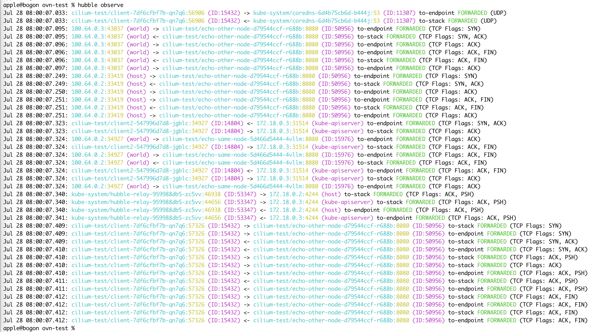
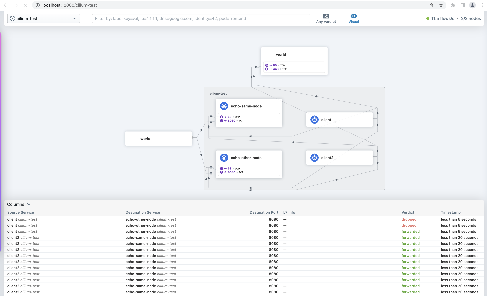

# Cilium 网络流量观测

Kube-OVN 当前已经支持与 Cilium 集成，具体操作可以参考 [Cilium 集成](with-cilium.md)。

Cilium 提供了丰富的网络流量观测能力，流量可观测性是由 Hubble 提供的。Hubble 可以观察节点、集群甚至多集群场景下跨集群的流量。

## 安装 Hubble

默认的 Cilium 集成安装中，并没有安装 Hubble 相关组件，因此要支持流量观测，需要先在环境上补充安装 Hubble。

执行以下命令，使用 helm 安装 Hubble：

```bash
helm upgrade cilium cilium/cilium --version 1.11.6 \
   --namespace kube-system \
   --reuse-values \
   --set hubble.relay.enabled=true \
   --set hubble.ui.enabled=true
```

补充安装 Hubble 之后，执行 `cilium status` 查看组件状态，确认 Hubble 安装成功。

```bash
# cilium status
    /¯¯\
 /¯¯\__/¯¯\    Cilium:         OK
 \__/¯¯\__/    Operator:       OK
 /¯¯\__/¯¯\    Hubble:         OK
 \__/¯¯\__/    ClusterMesh:    disabled
    \__/

Deployment        hubble-relay       Desired: 1, Ready: 1/1, Available: 1/1
Deployment        cilium-operator    Desired: 2, Ready: 2/2, Available: 2/2
DaemonSet         cilium             Desired: 2, Ready: 2/2, Available: 2/2
Deployment        hubble-ui          Desired: 1, Ready: 1/1, Available: 1/1
Containers:       cilium             Running: 2
                  hubble-ui          Running: 1
                  hubble-relay       Running: 1
                  cilium-operator    Running: 2
Cluster Pods:     16/17 managed by Cilium
Image versions    hubble-relay       quay.io/cilium/hubble-relay:v1.11.6@sha256:fd9034a2d04d5b973f1e8ed44f230ea195b89c37955ff32e34e5aa68f3ed675a: 1
                  cilium-operator    quay.io/cilium/operator-generic:v1.11.6@sha256:9f6063c7bcaede801a39315ec7c166309f6a6783e98665f6693939cf1701bc17: 2
                  cilium             quay.io/cilium/cilium:v1.11.6@sha256:f7f93c26739b6641a3fa3d76b1e1605b15989f25d06625260099e01c8243f54c: 2
                  hubble-ui          quay.io/cilium/hubble-ui:v0.9.0@sha256:0ef04e9a29212925da6bdfd0ba5b581765e41a01f1cc30563cef9b30b457fea0: 1
                  hubble-ui          quay.io/cilium/hubble-ui-backend:v0.9.0@sha256:000df6b76719f607a9edefb9af94dfd1811a6f1b6a8a9c537cba90bf12df474b: 1
apple@bogon cilium %
```

安装 Hubble 组件之后，需要安装命令行，用于在环境上查看流量信息。
执行以下命令，安装 Hubble CLI :

```bash
curl -L --fail --remote-name-all https://github.com/cilium/hubble/releases/download/v0.10.0/hubble-linux-amd64.tar.gz
sudo tar xzvfC hubble-linux-amd64.tar.gz /usr/local/bin
```

## 部署测试业务

Cilium 官方提供了一个流量测试的部署方案，可以直接使用官方部署的业务进行测试。

执行命令 `cilium connectivity test`，Cilium 会自动创建 `cilium-test` 的 Namespace，同时在 cilium-test 下部署测试业务。

正常部署完后，可以查看 cilium-test namespace 下的资源信息，参考如下：

```bash
# kubectl get all -n cilium-test
NAME                                  READY   STATUS    RESTARTS   AGE
pod/client-7df6cfbf7b-z5t2j           1/1     Running   0          21s
pod/client2-547996d7d8-nvgxg          1/1     Running   0          21s
pod/echo-other-node-d79544ccf-hl4gg   2/2     Running   0          21s
pod/echo-same-node-5d466d5444-ml7tc   2/2     Running   0          21s

NAME                      TYPE       CLUSTER-IP      EXTERNAL-IP   PORT(S)          AGE
service/echo-other-node   NodePort   10.109.58.126   <none>        8080:32269/TCP   21s
service/echo-same-node    NodePort   10.108.70.32    <none>        8080:32490/TCP   21s

NAME                              READY   UP-TO-DATE   AVAILABLE   AGE
deployment.apps/client            1/1     1            1           21s
deployment.apps/client2           1/1     1            1           21s
deployment.apps/echo-other-node   1/1     1            1           21s
deployment.apps/echo-same-node    1/1     1            1           21s

NAME                                        DESIRED   CURRENT   READY   AGE
replicaset.apps/client-7df6cfbf7b           1         1         1       21s
replicaset.apps/client2-547996d7d8          1         1         1       21s
replicaset.apps/echo-other-node-d79544ccf   1         1         1       21s
replicaset.apps/echo-same-node-5d466d5444   1         1         1       21s
```

## 使用命令行进行流量观测

默认情况下，网络流量观测仅提供每个节点 Cilium 代理观察到的流量。
可以在 `kube-system namespace` 下的 Cilium 代理 pod 中执行 `hubble observe` 命令，查看该节点上的流量信息。

```bash
# kubectl get pod -n kube-system -o wide
NAME                                             READY   STATUS    RESTARTS   AGE     IP           NODE                     NOMINATED NODE   READINESS GATES
cilium-d6h56                                     1/1     Running   0          2d20h   172.18.0.2   kube-ovn-worker          <none>           <none>
cilium-operator-5887f78bbb-c7sb2                 1/1     Running   0          2d20h   172.18.0.2   kube-ovn-worker          <none>           <none>
cilium-operator-5887f78bbb-wj8gt                 1/1     Running   0          2d20h   172.18.0.3   kube-ovn-control-plane   <none>           <none>
cilium-tq5xb                                     1/1     Running   0          2d20h   172.18.0.3   kube-ovn-control-plane   <none>           <none>
kube-ovn-pinger-7lgk8                            1/1     Running   0          21h     10.16.0.19   kube-ovn-control-plane   <none>           <none>
kube-ovn-pinger-msvcn                            1/1     Running   0          21h     10.16.0.18   kube-ovn-worker          <none>           <none>

# kubectl exec -it -n kube-system cilium-d6h56 -- bash
root@kube-ovn-worker:/home/cilium# hubble observe --from-namespace kube-system
Jul 29 03:24:25.551: kube-system/kube-ovn-pinger-msvcn:35576 -> 172.18.0.3:6642 to-stack FORWARDED (TCP Flags: ACK, PSH)
Jul 29 03:24:25.561: kube-system/kube-ovn-pinger-msvcn:35576 -> 172.18.0.3:6642 to-stack FORWARDED (TCP Flags: RST)
Jul 29 03:24:25.561: kube-system/kube-ovn-pinger-msvcn:35576 -> 172.18.0.3:6642 to-stack FORWARDED (TCP Flags: ACK, RST)
Jul 29 03:24:25.572: kube-system/kube-ovn-pinger-msvcn:35578 -> 172.18.0.3:6642 to-stack FORWARDED (TCP Flags: SYN)
Jul 29 03:24:25.572: kube-system/kube-ovn-pinger-msvcn:35578 -> 172.18.0.3:6642 to-stack FORWARDED (TCP Flags: ACK)
Jul 29 03:24:25.651: kube-system/kube-ovn-pinger-msvcn:35578 -> 172.18.0.3:6642 to-stack FORWARDED (TCP Flags: ACK, PSH)
Jul 29 03:24:25.661: kube-system/kube-ovn-pinger-msvcn:35578 -> 172.18.0.3:6642 to-stack FORWARDED (TCP Flags: RST)
Jul 29 03:24:25.661: kube-system/kube-ovn-pinger-msvcn:35578 -> 172.18.0.3:6642 to-stack FORWARDED (TCP Flags: ACK, RST)
Jul 29 03:24:25.761: kube-system/kube-ovn-pinger-msvcn:52004 -> 172.18.0.3:6443 to-stack FORWARDED (TCP Flags: ACK, PSH)
Jul 29 03:24:25.779: kube-system/kube-ovn-pinger-msvcn -> kube-system/kube-ovn-pinger-7lgk8 to-stack FORWARDED (ICMPv4 EchoRequest)
Jul 29 03:24:25.779: kube-system/kube-ovn-pinger-msvcn <- kube-system/kube-ovn-pinger-7lgk8 to-endpoint FORWARDED (ICMPv4 EchoReply)
Jul 29 03:24:25.866: kube-system/hubble-ui-7596f7ff6f-7j6f2:55836 <- kube-system/hubble-relay-959988db5-zc5vv:4245 to-stack FORWARDED (TCP Flags: ACK)
Jul 29 03:24:25.866: kube-system/hubble-ui-7596f7ff6f-7j6f2:55836 <- kube-system/hubble-relay-959988db5-zc5vv:80 to-endpoint FORWARDED (TCP Flags: ACK)
Jul 29 03:24:25.866: kube-system/hubble-ui-7596f7ff6f-7j6f2:55836 -> kube-system/hubble-relay-959988db5-zc5vv:4245 to-stack FORWARDED (TCP Flags: ACK)
Jul 29 03:24:25.866: kube-system/hubble-ui-7596f7ff6f-7j6f2:55836 -> kube-system/hubble-relay-959988db5-zc5vv:4245 to-endpoint FORWARDED (TCP Flags: ACK)
Jul 29 03:24:25.975: kube-system/kube-ovn-pinger-7lgk8 -> kube-system/kube-ovn-pinger-msvcn to-endpoint FORWARDED (ICMPv4 EchoRequest)
Jul 29 03:24:25.975: kube-system/kube-ovn-pinger-7lgk8 <- kube-system/kube-ovn-pinger-msvcn to-stack FORWARDED (ICMPv4 EchoReply)
Jul 29 03:24:25.979: kube-system/kube-ovn-pinger-msvcn -> 172.18.0.3 to-stack FORWARDED (ICMPv4 EchoRequest)
Jul 29 03:24:26.037: kube-system/coredns-6d4b75cb6d-lbgjg:36430 -> 172.18.0.3:6443 to-stack FORWARDED (TCP Flags: ACK)
Jul 29 03:24:26.282: kube-system/kube-ovn-pinger-msvcn -> 172.18.0.2 to-stack FORWARDED (ICMPv4 EchoRequest)
```

部署 Hubble Relay 后，Hubble 可以提供完整的集群范围的网络流量观测。

### 配置端口转发

为了能正常访问 Hubble API，需要创建端口转发，将本地请求转发到 Hubble Service。可以执行 `kubectl port-forward deployment/hubble-relay -n kube-system 4245:4245` 命令，在当前终端开启端口转发。

端口转发配置可以参考 [端口转发](https://kubernetes.io/docs/tasks/access-application-cluster/port-forward-access-application-cluster/)。

`kubectl port-forward` 命令不会返回，需要打开另一个终端来继续测试。

配置完端口转发之后，在终端执行 `hubble status` 命令，如果有类似如下输出，则端口转发配置正确，可以使用命令行进行流量观测。

```bash
# hubble status
Healthcheck (via localhost:4245): Ok
Current/Max Flows: 8,190/8,190 (100.00%)
Flows/s: 22.86
Connected Nodes: 2/2
```

### 命令行观测

在终端上执行 `hubble observe` 命令，查看集群的流量信息。
观测到的 cilium-test 相关的测试流量参考如下：


需要注意的是， `hubble observe` 命令的显示结果，是当前命令行执行时查询到的流量信息。多次执行命令行，可以查看到不同的流量信息。
更多详细的观测信息，可以执行 `hubble help observe` 命令查看 Hubble CLI 的详细使用方式。

## 使用 UI 进行流量观测

执行 `cilium status` 命令，确认 Hubble UI 已经安装成功。在第二步的 Hubble 安装中，已经补充了 UI 的安装。

执行命令 `cilium hubble ui` 可以自动创建端口转发，将 `hubble-ui service` 映射到本地端口。
正常情况下，执行完命令后，会自动打开本地的浏览器，跳转到 Hubble UI 界面。如果没有自动跳转，在浏览器中输入 `http://localhost:12000` 打开 UI 观察界面。

在界面左上角，选择 `cilium-test` namespace，查看 Cilium 提供的测试流量信息。


## Hubble 流量监控

Hubble 组件提供了集群中 Pod 网络行为的监控，为了支持查看 Hubble 提供的监控数据，需要使能监控统计。

参考以下命令，补充 `hubble.metrics.enabled` 配置项:

```bash
helm upgrade cilium cilium/cilium --version 1.11.6 \
   --namespace kube-system \
   --reuse-values \
   --set hubble.relay.enabled=true \
   --set hubble.ui.enabled=true \
   --set hubble.metrics.enabled="{dns,drop,tcp,flow,icmp,http}"
```

部署之后，会在 kube-system namespace 生成名称为 `hubble-metrics` 的服务。通过访问 Endpoints 查询 Hubble 提供的监控指标，参考如下:

```bash
# curl 172.18.0.2:9091/metrics
# HELP hubble_drop_total Number of drops
# TYPE hubble_drop_total counter
hubble_drop_total{protocol="ICMPv6",reason="Unsupported L3 protocol"} 2
# HELP hubble_flows_processed_total Total number of flows processed
# TYPE hubble_flows_processed_total counter
hubble_flows_processed_total{protocol="ICMPv4",subtype="to-endpoint",type="Trace",verdict="FORWARDED"} 335
hubble_flows_processed_total{protocol="ICMPv4",subtype="to-stack",type="Trace",verdict="FORWARDED"} 335
hubble_flows_processed_total{protocol="ICMPv6",subtype="",type="Drop",verdict="DROPPED"} 2
hubble_flows_processed_total{protocol="TCP",subtype="to-endpoint",type="Trace",verdict="FORWARDED"} 8282
hubble_flows_processed_total{protocol="TCP",subtype="to-stack",type="Trace",verdict="FORWARDED"} 6767
hubble_flows_processed_total{protocol="UDP",subtype="to-endpoint",type="Trace",verdict="FORWARDED"} 1642
hubble_flows_processed_total{protocol="UDP",subtype="to-stack",type="Trace",verdict="FORWARDED"} 1642
# HELP hubble_icmp_total Number of ICMP messages
# TYPE hubble_icmp_total counter
hubble_icmp_total{family="IPv4",type="EchoReply"} 335
hubble_icmp_total{family="IPv4",type="EchoRequest"} 335
hubble_icmp_total{family="IPv4",type="RouterSolicitation"} 2
# HELP hubble_tcp_flags_total TCP flag occurrences
# TYPE hubble_tcp_flags_total counter
hubble_tcp_flags_total{family="IPv4",flag="FIN"} 2043
hubble_tcp_flags_total{family="IPv4",flag="RST"} 301
hubble_tcp_flags_total{family="IPv4",flag="SYN"} 1169
hubble_tcp_flags_total{family="IPv4",flag="SYN-ACK"} 1169
```
