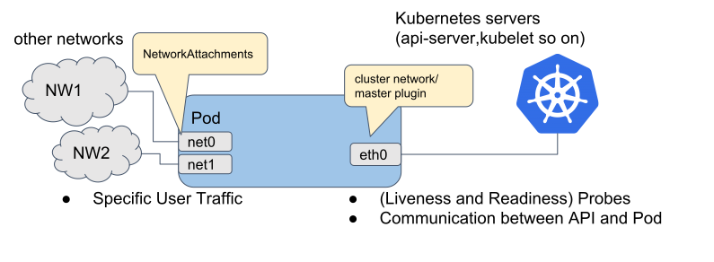

# 多网卡管理

Kube-OVN 可以为其他 CNI 网络插件（如 macvlan、vlan、host-device 等）提供集群级别的 IPAM 能力，
使这些网络插件能够使用 Kube-OVN 的子网和固定 IP 功能。

Kube-OVN 还支持在多块网卡均为 Kube-OVN 类型时的地址管理。

## 工作原理

多网卡管理：

下面是由 [Multus CNI](https://github.com/k8snetworkplumbingwg/multus-cni) 提供的连接到 pod 的网络接口示意图。图中显示 pod 有三个接口：eth0、net0 和 net1。
eth0 连接 kubernetes 集群网络，用于连接 kubernetes 服务器（如 kubernetes api-server、kubelet 等）。
net0 和 net1 是附属网络接口，通过使用其他 CNI 插件（如 vlan/vxlan/ptp）连接其他网络。



IPAM：

通过使用 [Multus CNI](https://github.com/k8snetworkplumbingwg/multus-cni)，我们可以给一个 Pod 添加多块不同网络的网卡。
然而我们仍然缺乏对集群范围内不同网络的 IP 地址进行管理的能力。在 Kube-OVN 中，我们已经能够通过 Subnet 和 IP 的 CRD 来进行 IP 的高级管理，
例如子网管理、IP 预留、随机分配、固定分配等。现在我们对子网进行扩展，以接入其他不同的网络插件，使得其他网络插件也可以使用 Kube-OVN 的 IPAM 功能。

### 工作流程


上图展示了如何通过 Kube-OVN 来管理其他网络插件的 IP 地址。其中容器的 eth0 网卡接入 OVN 网络，net1 网卡接入其他 CNI 网络。
net1 网络的网络定义来自于 multus-cni 中的 NetworkAttachmentDefinition 资源定义。

当 Pod 创建时，`kube-ovn-controller` 会监听到 Pod 添加事件，并根据 Pod 中的 annotation 去寻找到对应的 Subnet 并从中进行 IP 的分配和管理，
并将 Pod 所分配到的地址信息写回到 Pod annotation 中。

在容器所在节点上，CNI 可以通过在配置中将 `kube-ovn-cni` 设置为 ipam 插件。`kube-ovn-cni` 将会读取 Pod annotation 并将地址信息通过 CNI 协议的标准格式返回给相应的 CNI 插件。

## 兼容性问题

`NetworkAttachmentDefinition` 支持 `spec` 为空，multus 会自动在 `defaultConfDir` 搜索同名的 CNI 配置文件，如下所示：

```yaml
apiVersion: "k8s.cni.cncf.io/v1"
kind: NetworkAttachmentDefinition
metadata:
  name: macvlan-conf-2
```

但是 `kube-ovn-controller` 需要集中获取每个 `NetworkAttachmentDefinition` 里的 `provider` 信息，而无法从每个节点获取对应的配置文件。由于 `spec` 为空时配置信息分散在各个节点上，`kube-ovn-controller` 无法获取所需的 `provider` 信息，因此 `spec` 为空的用法与 Kube-OVN 的 IPAM 能力存在兼容性问题。

## 使用方法

### 安装 Kube-OVN 和 Multus

请参考 [Kube-OVN 一键安装](../start/one-step-install.md) 和 [Multus how to use](https://github.com/k8snetworkplumbingwg/multus-cni/blob/master/docs/how-to-use.md) 来安装 Kube-OVN 和 Multus-CNI。

### 为其他 CNI 提供 IPAM

此时主网卡为 Kube-OVN 类型网卡，附属网卡为其他类型 CNI。

#### 创建 NetworkAttachmentDefinition

这里我们使用 macvlan 作为容器网络的第二个网络，并将其 ipam 设置为 `kube-ovn`：

```shell
# 加载 macvlan 模块
sudo modprobe macvlan
```

```yaml
apiVersion: "k8s.cni.cncf.io/v1"
kind: NetworkAttachmentDefinition
metadata:
  name: macvlan
  namespace: default
spec:
  config: '{
      "cniVersion": "0.3.0",
      "type": "macvlan",
      "master": "eth0",
      "mode": "bridge",
      "ipam": {
        "type": "kube-ovn",
        "server_socket": "/run/openvswitch/kube-ovn-daemon.sock",
        "provider": "macvlan.default"
      }
    }'
```

- `spec.config.ipam.type`: 需要设置为 `kube-ovn` 来调用 kube-ovn 的插件获取地址信息。
- `server_socket`: Kube-OVN 通信使用的 socket 文件，默认位置为 `/run/openvswitch/kube-ovn-daemon.sock`。
- `provider`: 当前 NetworkAttachmentDefinition 的 `<name>.<namespace>`，Kube-OVN 将会使用这些信息找到对应的 Subnet 资源。
- `master`: 宿主机的物理网卡

!!! info

    这里的 `provider` 和 Underlay 中的 `ProviderNetwork` 是两个不同的概念，并没有直接关联。由于早期命名的原因可能会造成误解，请注意区分。

#### 创建一个 Kube-OVN Subnet

创建一个 Kube-OVN Subnet，设置对应的 `cidrBlock` 和 `exclude_ips`，`provider` 应该设置为对应的 NetworkAttachmentDefinition 的 `<name>.<namespace>`。
例如用 macvlan 提供附属网卡，创建 Subnet 如下：

```yaml
apiVersion: kubeovn.io/v1
kind: Subnet
metadata:
  name: macvlan
spec:
  protocol: IPv4
  provider: macvlan.default
  cidrBlock: 172.17.0.0/16
  gateway: 172.17.0.1
  excludeIps:
  - 172.17.0.0..172.17.0.10
```

> 注意：`gateway`、`private`、`nat` 字段只对 `provider` 类型为 ovn 的网络生效，不适用于 attachment network（附属网络）。

##### 创建一个多网络的 Pod

对于地址随机分配的 Pod，只需要添加如下 annotation `k8s.v1.cni.cncf.io/networks`，取值为对应的 NetworkAttachmentDefinition 的 `<namespace>/<name>`：

```yaml
apiVersion: v1
kind: Pod
metadata:
  name: samplepod
  namespace: default
  annotations:
    k8s.v1.cni.cncf.io/networks: default/macvlan
spec:
  containers:
  - name: samplepod
    command: ["/bin/ash", "-c", "trap : TERM INT; sleep infinity & wait"]
    image: docker.io/library/alpine:edge
```

##### 创建固定 IP 的 Pod

对于固定 IP 的 Pod，添加 `<networkAttachmentName>.<networkAttachmentNamespace>.kubernetes.io/ip_address` annotation：

```yaml
apiVersion: v1
kind: Pod
metadata:
  name: static-ip
  namespace: default
  annotations:
    k8s.v1.cni.cncf.io/networks: default/macvlan
    ovn.kubernetes.io/ip_address: 10.16.0.15
    ovn.kubernetes.io/mac_address: 00:00:00:53:6B:B6
    macvlan.default.kubernetes.io/ip_address: 172.17.0.100
    macvlan.default.kubernetes.io/mac_address: 00:00:00:53:6B:BB
spec:
  containers:
  - name: static-ip
    image: docker.io/library/nginx:alpine
```

##### 创建使用固定 IP 的工作负载

对于使用 ippool 的工作负载，添加 `<networkAttachmentName>.<networkAttachmentNamespace>.kubernetes.io/ip_pool` annotation：

```yaml
apiVersion: apps/v1
kind: Deployment
metadata:
  namespace: default
  name: static-workload
  labels:
    app: static-workload
spec:
  replicas: 2
  selector:
    matchLabels:
      app: static-workload
  template:
    metadata:
      labels:
        app: static-workload
      annotations:
        k8s.v1.cni.cncf.io/networks: default/macvlan
        ovn.kubernetes.io/ip_pool: 10.16.0.15,10.16.0.16,10.16.0.17
        macvlan.default.kubernetes.io/ip_pool: 172.17.0.200,172.17.0.201,172.17.0.202
    spec:
      containers:
      - name: static-workload
        image: docker.io/library/nginx:alpine
```

##### 创建默认路由为 macvlan 的 Pod

对于使用 macvlan 作为附属网卡的 Pod，若希望将附属网卡作为 Pod 的默认路由，只需要添加如下 annotation，其中 `default-route` 为网关地址：

```yaml
apiVersion: v1
kind: Pod
metadata:
  name: samplepod-route
  namespace: default
  annotations:
    k8s.v1.cni.cncf.io/networks: '[{
      "name": "macvlan",
      "namespace": "default",
      "default-route": ["172.17.0.1"]
    }]'
spec:
  containers:
  - name: samplepod-route
    command: ["/bin/ash", "-c", "trap : TERM INT; sleep infinity & wait"]
    image: docker.io/library/alpine:edge
```

##### 创建主网卡为 macvlan 的 Pod

对于使用 macvlan 作为主网卡的 Pod，只需要添加如下 annotation `v1.multus-cni.io/default-network`，取值为对应的 NetworkAttachmentDefinition 的 `<namespace>/<name>`：

```yaml
apiVersion: v1
kind: Pod
metadata:
  name: samplepod-macvlan
  namespace: default
  annotations:
    v1.multus-cni.io/default-network: default/macvlan
spec:
  containers:
  - name: samplepod-macvlan
    command: ["/bin/ash", "-c", "trap : TERM INT; sleep infinity & wait"]
    image: docker.io/library/alpine:edge
```

#### 创建一个 Kube-OVN Subnet（Provider ovn）

当需要从 `provider` 类型为 ovn 的 subnet 中获取 IP 时，可以创建一个 `provider` 为 ovn 的 Kube-OVN Subnet，设置对应的 `cidrBlock` 和 `exclude_ips`，创建 Subnet 如下：

```yaml
apiVersion: kubeovn.io/v1
kind: Subnet
metadata:
  name: macvlan
spec:
  protocol: IPv4
  provider: ovn
  cidrBlock: 172.17.0.0/16
  gateway: 172.17.0.1
  excludeIps:
  - 172.17.0.0..172.17.0.10
```

##### 创建一个多网络的 Pod

对于需要从 `provider` 类型为 ovn 的 subnet 中获取 IP 的 Pod，需将 annotation `k8s.v1.cni.cncf.io/networks` 和 `<networkAttachmentName>.<networkAttachmentNamespace>.kubernetes.io/logical_switch` 结合使用：

```yaml
apiVersion: v1
kind: Pod
metadata:
  name: samplepod
  namespace: default
  annotations:
    k8s.v1.cni.cncf.io/networks: default/macvlan
    macvlan.default.kubernetes.io/logical_switch: macvlan
spec:
  containers:
  - name: samplepod
    command: ["/bin/ash", "-c", "trap : TERM INT; sleep infinity & wait"]
    image: docker.io/library/alpine:edge
```

- `k8s.v1.cni.cncf.io/networks`: 取值为对应的 NetworkAttachmentDefinition 的 `<namespace>/<name>`
- `macvlan.default.kubernetes.io/logical_switch`: 取值为子网名

> 注意：
>
> - 通过 `<networkAttachmentName>.<networkAttachmentNamespace>.kubernetes.io/logical_switch` 指定子网的优先级高于通过 provider 指定子网。
> - 基于 ovn 类型的 subnet 提供 ipam 同样支持创建固定 IP 的 Pod、创建使用固定 IP 的工作负载、创建默认路由为 macvlan 的 Pod。
> - 但不支持创建主网卡为 macvlan 的 Pod。

### 附属网卡为 Kube-OVN 类型网卡

此时多块网卡均为 Kube-OVN 类型网卡。

#### 创建 NetworkAttachmentDefinition

将 `provider` 的后缀设置为 `ovn`：

```yaml
apiVersion: "k8s.cni.cncf.io/v1"
kind: NetworkAttachmentDefinition
metadata:
  name: attachnet
  namespace: default
spec:
  config: '{
      "cniVersion": "0.3.0",
      "type": "kube-ovn",
      "server_socket": "/run/openvswitch/kube-ovn-daemon.sock",
      "provider": "attachnet.default.ovn"
    }'
```

- `spec.config.type`: 设置为 `kube-ovn` 来触发 CNI 插件使用 Kube-OVN 子网。
- `server_socket`: Kube-OVN 通信使用的 socket 文件，默认位置为 `/run/openvswitch/kube-ovn-daemon.sock`。
- `provider`: 当前 NetworkAttachmentDefinition 的 `<name>.<namespace>.ovn`，Kube-OVN 将会使用这些信息找到对应的 Subnet 资源，注意后缀需要设置为 ovn。

#### 创建一个 Kube-OVN Subnet

如果以 Kube-OVN 作为附属网卡，则 `provider` 应该设置为对应的 NetworkAttachmentDefinition 的 `<name>.<namespace>.ovn`，并要以 `ovn` 作为后缀结束。
用 Kube-OVN 提供附属网卡，创建 Subnet 示例如下：

```yaml
apiVersion: kubeovn.io/v1
kind: Subnet
metadata:
  name: attachnet
spec:
  protocol: IPv4
  provider: attachnet.default.ovn
  cidrBlock: 172.17.0.0/16
  gateway: 172.17.0.1
  excludeIps:
  - 172.17.0.0..172.17.0.10
```

##### 创建一个多网络的 Pod

对于地址随机分配的 Pod，只需要添加如下 annotation `k8s.v1.cni.cncf.io/networks`，取值为对应的 NetworkAttachmentDefinition 的 `<namespace>/<name>`：

```yaml
apiVersion: v1
kind: Pod
metadata:
  name: samplepod
  namespace: default
  annotations:
    k8s.v1.cni.cncf.io/networks: default/attachnet
spec:
  containers:
  - name: samplepod
    command: ["/bin/ash", "-c", "trap : TERM INT; sleep infinity & wait"]
    image: docker.io/library/alpine:edge
```

##### 为附属网卡配置自定义路由

对于附属网卡为 Kube-OVN 类型的 Pod，可以通过 `<networkAttachmentName>.<networkAttachmentNamespace>.ovn.kubernetes.io/routes` annotation 来配置自定义路由：

```yaml
apiVersion: v1
kind: Pod
metadata:
  name: custom-routes-attach
  namespace: default
  annotations:
    k8s.v1.cni.cncf.io/networks: default/attachnet
    attachnet.default.ovn.kubernetes.io/routes: |
      [{
        "dst": "192.168.0.101/24",
        "gw": "172.17.0.254"
      }, {
        "gw": "172.17.0.254"
      }]
spec:
  containers:
  - name: custom-routes-attach
    command: ["/bin/ash", "-c", "trap : TERM INT; sleep infinity & wait"]
    image: docker.io/library/alpine:edge
```

> `dst` 字段为空表示修改默认路由。

如果工作负载为 Deployment、DaemonSet 或 StatefulSet，对应的 Annotation 需要配置在资源的 `.spec.template.metadata.annotations` 中：

```yaml
apiVersion: apps/v1
kind: Deployment
metadata:
  name: custom-routes-attach
  labels:
    app: nginx
spec:
  replicas: 2
  selector:
    matchLabels:
      app: nginx
  template:
    metadata:
      labels:
        app: nginx
      annotations:
        k8s.v1.cni.cncf.io/networks: default/attachnet
        attachnet.default.ovn.kubernetes.io/routes: |
          [{
            "dst": "192.168.0.101/24",
            "gw": "172.17.0.254"
          }, {
            "gw": "172.17.0.254"
          }]
    spec:
      containers:
      - name: nginx
        image: docker.io/library/nginx:alpine
```

#### 创建一个 Kube-OVN Subnet（Provider ovn）

当需要从 `provider` 类型为 ovn 的 subnet 中获取 IP 时，可以创建一个 `provider` 为 ovn 的 Kube-OVN Subnet，设置对应的 `cidrBlock` 和 `exclude_ips`，创建 Subnet 如下：

```yaml
apiVersion: kubeovn.io/v1
kind: Subnet
metadata:
  name: attachnet
spec:
  protocol: IPv4
  provider: ovn
  cidrBlock: 172.17.0.0/16
  gateway: 172.17.0.1
  excludeIps:
  - 172.17.0.0..172.17.0.10
```

##### 创建一个多网络的 Pod

对于需要从 `provider` 类型为 ovn 的 subnet 中获取 IP 的 Pod，需将 annotation `k8s.v1.cni.cncf.io/networks` 和 `<networkAttachmentName>.<networkAttachmentNamespace>.ovn.kubernetes.io/logical_switch` 结合使用：

```yaml
apiVersion: v1
kind: Pod
metadata:
  name: samplepod
  namespace: default
  annotations:
    k8s.v1.cni.cncf.io/networks: default/attachnet
    attachnet.default.ovn.kubernetes.io/logical_switch: attachnet
spec:
  containers:
  - name: samplepod
    command: ["/bin/ash", "-c", "trap : TERM INT; sleep infinity & wait"]
    image: docker.io/library/alpine:edge
```

- `k8s.v1.cni.cncf.io/networks`: 取值为对应的 NetworkAttachmentDefinition 的 `<namespace>/<name>`
- `attachnet.default.ovn.kubernetes.io/logical_switch`: 取值为子网名

> 注意：
>
> - 通过 `<networkAttachmentName>.<networkAttachmentNamespace>.ovn.kubernetes.io/logical_switch` 指定子网的优先级高于通过 provider 指定子网。
> - 对于附属网卡为 Kube-OVN 类型的 Pod，支持创建固定 IP 的 Pod、创建使用固定 IP 的工作负载、创建默认路由为 macvlan 的 Pod，同时也支持创建主网卡为 Kube-OVN 类型的 Pod，配置方式可参考上一节。
> - 对于附属网卡为 Kube-OVN 类型的 Pod，同样支持通过 `<networkAttachmentName>.<networkAttachmentNamespace>.ovn.kubernetes.io/routes` annotation 配置自定义路由。
