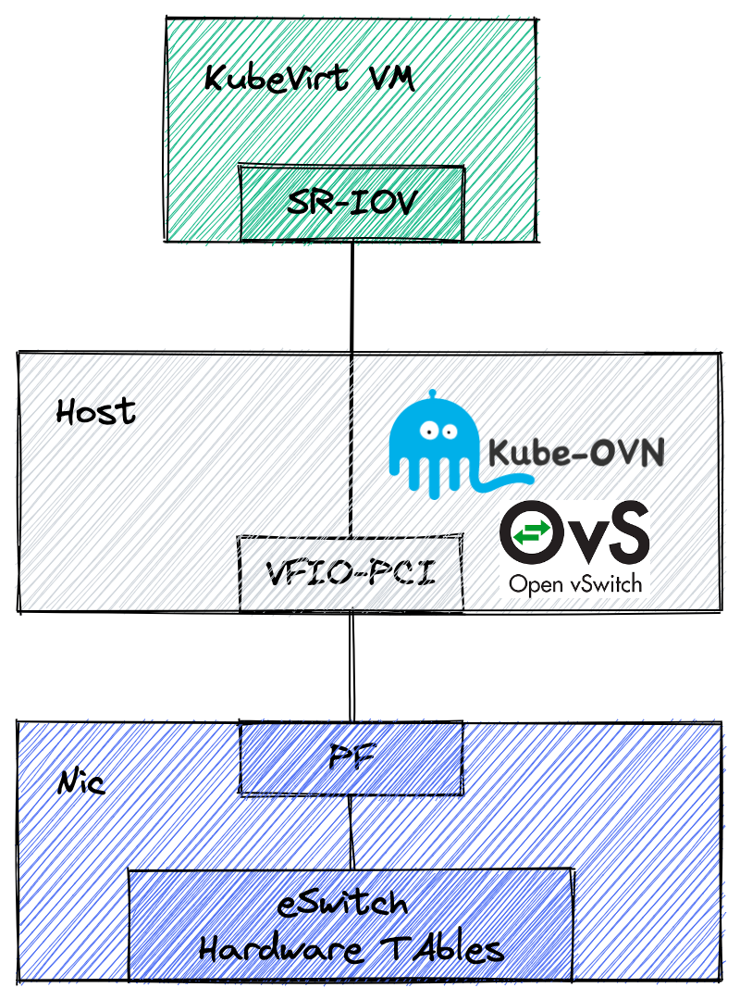

# Offload with Mellanox

Kube-OVN uses OVS for traffic forwarding in the final data plane, and the associated flow table matching,
tunnel encapsulation and other functions are CPU-intensive, which consumes a lot of CPU resources and leads to higher latency and lower throughput under heavy traffic.
Mellanox Accelerated Switching And Packet Processing (ASAP²) technology offloads OVS-related operations to an eSwitch within the eSwitch in the hardware.
This technology can shorten the data path without modifying the OVS control plane, avoiding the use of host CPU resources,
which dramatically reduce latency and significantly increase the throughput.



## Prerequisites

- Mellanox CX5/CX6/BlueField that support ASAP².
- CentOS 8 Stream or Linux 5.7 above.
- Since the current NIC does not support `dp_hash` and `hash` operation offload, OVN LB function should be disabled.
- In order to configure offload mode, the network card cannot be bound to a bond.

## Configure SR-IOV and Device Plugin

Mellanox network card supports two ways to configure offload, one is to manually configure the network card SR-IOV and Device Plugin, and the other is to use [sriov-network-operator](https://github.com/kubeovn/sriov-network-operator) Perform automatic configuration.

### Manually configure SR-IOV and Device Plugin

#### Configure SR-IOV

Query the device ID of the network card, in the following example it is `84:00.0` and `84.00.1`:

```bash
# lspci -nn | grep ConnectX-5
84:00.0 Ethernet controller [0200]: Mellanox Technologies MT27800 Family [ConnectX-5] [15b3:1017]
84:00.1 Ethernet controller [0200]: Mellanox Technologies MT27800 Family [ConnectX-5] [15b3:1017]
```

Find the corresponding NIC by its device ID:

```bash
# ls -l /sys/class/net/ | grep 84:00.0
lrwxrwxrwx 1 root root 0 Feb 4 16:16 enp132s0f0np0 -> ../../devices/pci0000:80/0000:80:08.0/0000:84:00.0/net/enp132s0f0np0
# ls -l /sys/class/net/ | grep 84:00.1
lrwxrwxrwx 1 root root 0 Feb 4 16:16 enp132s0f1np1 -> ../../devices/pci0000:80/0000:80:08.0/0000:84:00.1/net/enp132s0f1np1
```

Check whether the network card is bound to bond:

> In this example, the network cards enp132s0f0np0 and enp132s0f1np1 are bound to bond1

```shell
# ip link show enp132s0f0np0 | grep bond
160: enp132s0f0np0: <BROADCAST,MULTICAST,SLAVE,UP,LOWER_UP> mtu 1500 qdisc mq master bond1 state UP mode DEFAULT group default qlen 1000
# ip link show enp132s0f1np1 | grep bond
169: enp132s0f1np1: <BROADCAST,MULTICAST,SLAVE,UP,LOWER_UP> mtu 1500 qdisc mq master bond1 state UP mode DEFAULT group default qlen 1000
```

Remove bond and existing VF:

```shell
ifenslave -d bond1 enp132s0f0np0
ifenslave -d bond1 enp132s0f1np1
echo 0 > /sys/class/net/enp132s0f0np0/device/sriov_numvfs
echo 0 > /sys/class/net/enp132s0f1np1/device/sriov_numvfs
ip link set enp132s0f0np0 down
ip link set enp132s0f1np1 down
```

Steering Mode:

> OVS-kernel supports two steering modes for rule insertion into hardware:

- SMFS (software-managed flow steering): default mode; rules are inserted directly to the hardware by the software (driver). This mode is optimized for rule insertion.
- DMFS (device-managed flow steering): rule insertion is done using firmware commands. This mode is optimized for throughput with a small amount of rules in the system.

The steering mode can be configured via sysfs or devlink API in kernels that support it:

```bash
# Configure via sysfs
echo <smfs|dmfs> > /sys/class/net/enp132s0f0np0/compat/devlink/steering_mode
echo <smfs|dmfs> > /sys/class/net/enp132s0f1np1/compat/devlink/steering_mode
# Configure via devlink
devlink dev param set pci/84:00.0 name flow_steering_mode value smfs cmode runtime
devlink dev param set pci/84:00.1 name flow_steering_mode value smfs cmode runtime
```

> Note: If you don’t know which mode to choose, you can use the default mode without configuration.

Check the number of available VFs:

```bash
# cat /sys/class/net/enp132s0f0np0/device/sriov_totalvfs
127
# cat /sys/class/net/enp132s1f0np1/device/sriov_totalvfs
127
```

Create VFs and do not exceeding the number found above:

```bash
# echo '4' > /sys/class/net/enp132s0f0np0/device/sriov_numvfs
# echo '4' > /sys/class/net/enp132s1f0np1/device/sriov_numvfs
# ip link show enp132s0f0np0
160: enp132s0f0np0: <NO-CARRIER,BROADCAST,MULTICAST,UP> mtu 1500 qdisc mq state DOWN mode DEFAULT group default qlen 1000
    link/ether 08:c0:eb:74:c3:4a brd ff:ff:ff:ff:ff:ff
    vf 0 link/ether 00:00:00:00:00:00 brd ff:ff:ff:ff:ff:ff, spoof checking off, link-state disable, trust off, query_rss off
    vf 1 link/ether 00:00:00:00:00:00 brd ff:ff:ff:ff:ff:ff, spoof checking off, link-state disable, trust off, query_rss off
    vf 2 link/ether 00:00:00:00:00:00 brd ff:ff:ff:ff:ff:ff, spoof checking off, link-state disable, trust off, query_rss off
    vf 3 link/ether 00:00:00:00:00:00 brd ff:ff:ff:ff:ff:ff, spoof checking off, link-state disable, trust off, query_rss off
# ip link show enp132s0f1np1
169: enp132s0f1np1: <NO-CARRIER,BROADCAST,MULTICAST,UP> mtu 1500 qdisc mq state DOWN mode DEFAULT group default qlen 1000
    link/ether 08:c0:eb:74:c3:4b brd ff:ff:ff:ff:ff:ff
    vf 0 link/ether 00:00:00:00:00:00 brd ff:ff:ff:ff:ff:ff, spoof checking off, link-state disable, trust off, query_rss off
    vf 1 link/ether 00:00:00:00:00:00 brd ff:ff:ff:ff:ff:ff, spoof checking off, link-state disable, trust off, query_rss off
    vf 2 link/ether 00:00:00:00:00:00 brd ff:ff:ff:ff:ff:ff, spoof checking off, link-state disable, trust off, query_rss off
    vf 3 link/ether 00:00:00:00:00:00 brd ff:ff:ff:ff:ff:ff, spoof checking off, link-state disable, trust off, query_rss off
# ip link set enp132s0f0np0 up
# ip link set enp132s0f1np1 up
```

Find the device IDs corresponding to the above VFs:

```bash
# lspci -nn | grep ConnectX-5 | grep Virtual
84:00.2 Ethernet controller [0200]: Mellanox Technologies MT27800 Family [ConnectX-5 Virtual Function] [15b3:1018]
84:00.3 Ethernet controller [0200]: Mellanox Technologies MT27800 Family [ConnectX-5 Virtual Function] [15b3:1018]
84:00.4 Ethernet controller [0200]: Mellanox Technologies MT27800 Family [ConnectX-5 Virtual Function] [15b3:1018]
84:00.5 Ethernet controller [0200]: Mellanox Technologies MT27800 Family [ConnectX-5 Virtual Function] [15b3:1018]
84:00.6 Ethernet controller [0200]: Mellanox Technologies MT27800 Family [ConnectX-5 Virtual Function] [15b3:1018]
84:00.7 Ethernet controller [0200]: Mellanox Technologies MT27800 Family [ConnectX-5 Virtual Function] [15b3:1018]
84:01.0 Ethernet controller [0200]: Mellanox Technologies MT27800 Family [ConnectX-5 Virtual Function] [15b3:1018]
84:01.1 Ethernet controller [0200]: Mellanox Technologies MT27800 Family [ConnectX-5 Virtual Function] [15b3:1018]
```

Unbound the VFs from the driver:

```bash
echo 0000:84:00.2 > /sys/bus/pci/drivers/mlx5_core/unbind
echo 0000:84:00.3 > /sys/bus/pci/drivers/mlx5_core/unbind
echo 0000:84:00.4 > /sys/bus/pci/drivers/mlx5_core/unbind
echo 0000:84:00.5 > /sys/bus/pci/drivers/mlx5_core/unbind
echo 0000:84:00.6 > /sys/bus/pci/drivers/mlx5_core/unbind
echo 0000:84:00.7 > /sys/bus/pci/drivers/mlx5_core/unbind
echo 0000:84:01.0 > /sys/bus/pci/drivers/mlx5_core/unbind
echo 0000:84:01.1 > /sys/bus/pci/drivers/mlx5_core/unbind
```

Enable eSwitch mode and set up hardware offload:

```bash
devlink dev eswitch set pci/0000:84:00.0 mode switchdev
devlink dev eswitch set pci/0000:84:00.1 mode switchdev
ethtool -K enp132s0f0np0 hw-tc-offload on
ethtool -K enp132s0f1np1 hw-tc-offload on
```

SR-IOV VF LAG:

SR-IOV VF LAG allows the NIC's physical functions (PFs) to get the rules that the OVS tries to offload to the bond net-device, and to offload them to the hardware e-switch.The supported bond modes are as follows:

- Active-backup
- XOR
- LACP

> SR-IOV VF LAG enables complete offload of the LAG functionality to the hardware. The bonding creates a single bonded PF port. Packets from the up-link can arrive from any of the physical ports and are forwarded to the bond device.When hardware offload is used, packets from both ports can be forwarded to any of the VFs. Traffic from the VF can be forwarded to both ports according to the bonding state. This means that when in active-backup mode, only one PF is up, and traffic from any VF goes through this PF. When in XOR or LACP mode, if both PFs are up, traffic from any VF is split between these two PFs.

In this example, LACP mode will be used, and the configuration is as follows:

```shell
modprobe bonding mode=802.3ad
ip link set enp132s0f0np0 master bond1
ip link set enp132s0f1np1 master bond1
ip link set enp132s0f0np0 up
ip link set enp132s0f1np1 up
ip link set bond1 up
```

> Note: If you do not need to bind bond, please ignore the above operation.

Rebind the driver and complete the VF setup:

```bash
echo 0000:84:00.2 > /sys/bus/pci/drivers/mlx5_core/bind
echo 0000:84:00.3 > /sys/bus/pci/drivers/mlx5_core/bind
echo 0000:84:00.4 > /sys/bus/pci/drivers/mlx5_core/bind
echo 0000:84:00.5 > /sys/bus/pci/drivers/mlx5_core/bind
echo 0000:84:00.6 > /sys/bus/pci/drivers/mlx5_core/bind
echo 0000:84:00.7 > /sys/bus/pci/drivers/mlx5_core/bind
echo 0000:84:01.0 > /sys/bus/pci/drivers/mlx5_core/bind
echo 0000:84:01.1 > /sys/bus/pci/drivers/mlx5_core/bind
```

Some behaviors of `NetworkManager` may cause driver exceptions,
if offloading problems occur we recommended to close `NetworkManager` and try again.

```bash
systemctl stop NetworkManager
systemctl disable NetworkManager
```

#### Configure Device Plugin

Since each machine has a limited number of VFs and each Pod that uses acceleration will take up VF resources,
we need to use the SR-IOV Device Plugin to manage the corresponding resources so that the scheduler knows how to schedule.

Create SR-IOV Configmap:

```yaml
apiVersion: v1
kind: ConfigMap
metadata:
  name: sriovdp-config
  namespace: kube-system
data:
  config.json: |
    {
      "resourceList": [{
          "resourcePrefix": "mellanox.com",
          "resourceName": "cx5_sriov_switchdev",
          "selectors": {
                  "vendors": ["15b3"],
                  "devices": ["1018"],
                  "drivers": ["mlx5_core"]
              }
      }
      ]
    }
```

This plugin creates device plugin endpoints based on the configurations given in the config map associated with the SR-IOV Network Device Plugin.

- `selectors`: VF selectors
  - `vendors`: Target device's vendor Hex code as string
  - `devices`: Target Devices' device Hex code as string
  - `drivers`: Target device driver names as string

`selectors` also supports VF selection based on `pciAddresses`, `acpiIndexes` and other parameters. For more detailed configuration, please refer to [SR-IOV ConfigMap configuration](https://github.com/k8snetworkplumbingwg/sriov-network-device- plugin/tree/v3.6.2?tab=readme-ov-file#configurations)

Please read the [SR-IOV device plugin](https://github.com/intel/sriov-network-device-plugin) to deploy:

```bash
kubectl apply -f https://raw.githubusercontent.com/k8snetworkplumbingwg/sriov-network-device-plugin/v3.6.2/deployments/sriovdp-daemonset.yaml
```

Check if SR-IOV resources have been registered to Kubernetes Node:

```bash
kubectl describe node kube-ovn-01  | grep mellanox

mellanox.com/cx5_sriov_switchdev:  8
mellanox.com/cx5_sriov_switchdev:  8
mellanox.com/cx5_sriov_switchdev  0           0
```

### Configure SR-IOV and Device Plugin using sriov-network-operator

Install [node-feature-discovery](https://github.com/kubernetes-sigs/node-feature-discovery) to automatically detect hardware functions and system configuration:

```bash
kubectl apply -k https://github.com/kubernetes-sigs/node-feature-discovery/deployment/overlays/default?ref=v0.11.3
```

Or use the following command to manually add annotation to the network card with offload capability:

```bash
kubectl label nodes [offloadNicNode] feature.node.kubernetes.io/network-sriov.capable=true
```

Clone the code repository and install the Operator:

```bash
git clone --depth=1 https://github.com/kubeovn/sriov-network-operator.git
kubectl apply -k sriov-network-operator/deploy
```

Check if the Operator component is working properly:

```bash
# kubectl get -n kube-system all | grep sriov
NAME                                          READY   STATUS    RESTARTS   AGE
pod/sriov-network-config-daemon-bf9nt         1/1     Running   0          8s
pod/sriov-network-operator-54d7545f65-296gb   1/1     Running   0          10s

NAME                                         DESIRED   CURRENT   READY   UP-TO-DATE   AVAILABLE   NODE SELECTOR                                                 AGE
daemonset.apps/sriov-network-config-daemon   1         1         1       1            1           beta.kubernetes.io/os=linux,feature.node.kubernetes.io/network-sriov.capable=true   8s

NAME                                     READY   UP-TO-DATE   AVAILABLE   AGE
deployment.apps/sriov-network-operator   1/1     1            1           10s

NAME                                                DESIRED   CURRENT   READY   AGE
replicaset.apps/sriov-network-operator-54d7545f65   1         1         1       10s
```

Check `SriovNetworkNodeState`, taking the `node1` node as an example, there are two Mellanox network cards on this node:

```bash
# kubectl get sriovnetworknodestates.sriovnetwork.openshift.io -n kube-system node1 -o yaml
apiVersion: sriovnetwork.openshift.io/v1
kind: SriovNetworkNodeState
spec: ...
status:
  interfaces:
  - deviceID: "1017"
    driver: mlx5_core
    mtu: 1500
    pciAddress: "0000:5f:00.0"
    totalvfs: 8
    vendor: "15b3"
    linkSeed: 25000Mb/s
    linkType: ETH
    mac: 08:c0:eb:f4:85:bb
    name: ens41f0np0
  - deviceID: "1017"
    driver: mlx5_core
    mtu: 1500
    pciAddress: "0000:5f:00.1"
    totalvfs: 8
    vendor: "15b3"
    linkSeed: 25000Mb/s
    linkType: ETH
    mac: 08:c0:eb:f4:85:bb
    name: ens41f1np1
```

Create the `SriovNetworkNodePolicy` resource and select the network card to be managed through `nicSelector`:

```yaml
apiVersion: sriovnetwork.openshift.io/v1
kind: SriovNetworkNodePolicy
metadata:
  name: policy
  namespace: kube-system
spec:
  nodeSelector:
    feature.node.kubernetes.io/network-sriov.capable: "true"
  eSwitchMode: switchdev
  numVfs: 3
  nicSelector:
    pfNames:
    - ens41f0np0
    - ens41f1np1
  resourceName: cx_sriov_switchdev
```

Check the `status` field of `SriovNetworkNodeState` again:

```bash
# kubectl get sriovnetworknodestates.sriovnetwork.openshift.io -n kube-system node1 -o yaml

...
spec:
  interfaces:
  - eSwitchMode: switchdev
    name: ens41f0np0
    numVfs: 3
    pciAddress: 0000:5f:00.0
    vfGroups:
    - policyName: policy
      vfRange: 0-2
      resourceName: cx_sriov_switchdev
  - eSwitchMode: switchdev
    name: ens41f1np1
    numVfs: 3
    pciAddress: 0000:5f:00.1
    vfGroups:
    - policyName: policy
      vfRange: 0-2
      resourceName: cx_sriov_switchdev
status:
  interfaces
  - Vfs:
    - deviceID: 1018
      driver: mlx5_core
      pciAddress: 0000:5f:00.2
      vendor: "15b3"
    - deviceID: 1018
      driver: mlx5_core
      pciAddress: 0000:5f:00.3
      vendor: "15b3"
    - deviceID: 1018
      driver: mlx5_core
      pciAddress: 0000:5f:00.4
      vendor: "15b3"
    deviceID: "1017"
    driver: mlx5_core
    linkSeed: 25000Mb/s
    linkType: ETH
    mac: 08:c0:eb:f4:85:ab
    mtu: 1500
    name: ens41f0np0
    numVfs: 3
    pciAddress: 0000:5f:00.0
    totalvfs: 3
    vendor: "15b3"
  - Vfs:
    - deviceID: 1018
      driver: mlx5_core
      pciAddress: 0000:5f:00.5
      vendor: "15b3"
    - deviceID: 1018
      driver: mlx5_core
      pciAddress: 0000:5f:00.6
      vendor: "15b3"
    - deviceID: 1018
      driver: mlx5_core
      pciAddress: 0000:5f:00.7
      vendor: "15b3"
    deviceID: "1017"
    driver: mlx5_core
    linkSeed: 25000Mb/s
    linkType: ETH
    mac: 08:c0:eb:f4:85:bb
    mtu: 1500
    name: ens41f1np1
    numVfs: 3
    pciAddress: 0000:5f:00.1
    totalvfs: 3
    vendor: "15b3"
```

Check the status of VF:

```bash
# lspci -nn | grep ConnectX
5f:00.0 Ethernet controller [0200]: Mellanox Technologies MT27800 Family [ConnectX-5] [15b3:1017]
5f:00.1 Ethernet controller [0200]: Mellanox Technologies MT27800 Family [ConnectX-5] [15b3:1017]
5f:00.2 Ethernet controller [0200]: Mellanox Technologies MT27800 Family [ConnectX-5 Virtual Function] [15b3:1018]
5f:00.3 Ethernet controller [0200]: Mellanox Technologies MT27800 Family [ConnectX-5 Virtual Function] [15b3:1018]
5f:00.4 Ethernet controller [0200]: Mellanox Technologies MT27800 Family [ConnectX-5 Virtual Function] [15b3:1018]
5f:00.5 Ethernet controller [0200]: Mellanox Technologies MT27800 Family [ConnectX-5 Virtual Function] [15b3:1018]
5f:00.6 Ethernet controller [0200]: Mellanox Technologies MT27800 Family [ConnectX-5 Virtual Function] [15b3:1018]
5f:00.7 Ethernet controller [0200]: Mellanox Technologies MT27800 Family [ConnectX-5 Virtual Function] [15b3:1018]
```

Check PF working mode:

```bash
# cat /sys/class/net/ens41f0np0/compat/devlink/mode
switchdev
```

## Install Multus-CNI

The device IDs obtained during SR-IOV Device Plugin scheduling need to be passed to Kube-OVN via Multus-CNI, so Multus-CNI needs to be configured to perform the related tasks.

Please read [Multus-CNI Document](https://github.com/k8snetworkplumbingwg/multus-cni) to deploy：

```bash
kubectl apply -f https://raw.githubusercontent.com/k8snetworkplumbingwg/multus-cni/v4.0.2/deployments/multus-daemonset-thick.yml
```

> Note: multus provides Thin and Thick versions of the plug-in. To support SR-IOV, you need to install the Thick version.

Create `NetworkAttachmentDefinition`：

```yaml
apiVersion: "k8s.cni.cncf.io/v1"
kind: NetworkAttachmentDefinition
metadata:
  name: sriov
  namespace: default
  annotations:
    k8s.v1.cni.cncf.io/resourceName: mellanox.com/cx5_sriov_switchdev
spec:
  config: '{
    "cniVersion": "0.3.1",
    "name": "kube-ovn",
    "plugins":[
        {
            "type":"kube-ovn",
            "server_socket":"/run/openvswitch/kube-ovn-daemon.sock",
            "provider": "sriov.default.ovn"
        },
        {
            "type":"portmap",
            "capabilities":{
                "portMappings":true
            }
        }
    ]
}'
```

- `provider`: the format should be {name}.{namespace}.ovn of related `NetworkAttachmentDefinition`.

## Overlay offload

### Enable Offload in Kube-OVN

Download the scripts:

```bash
wget https://raw.githubusercontent.com/kubeovn/kube-ovn/{{ variables.branch }}/dist/images/install.sh
```

Change the related options，`IFACE` should be the physic NIC and has an IP:

```bash
ENABLE_MIRROR=${ENABLE_MIRROR:-false}
HW_OFFLOAD=${HW_OFFLOAD:-true}
ENABLE_LB=${ENABLE_LB:-false}
IFACE="bond1"
# Take manual configuration of the network card in SR-IOV and Device Plugin as an example. If bond is bound, set IFACE to bond1. If bond is not bound, set IFACE to enp132s0f0np0 or enp132s0f1np1.
```

Install Kube-OVN：

```bash
bash install.sh
```

### Create Pods with VF NICs

Pods that use VF for network offload acceleration can be created using the following yaml:

```yaml
apiVersion: v1
kind: Pod
metadata:
  name: nginx-overlay
  annotations:
    v1.multus-cni.io/default-network: default/sriov
    sriov.default.ovn.kubernetes.io/logical_switch: ovn-default
spec:
  containers:
  - name: nginx-overlay
    image: docker.io/library/nginx:alpine
    resources:
      requests:
        mellanox.com/cx5_sriov_switchdev: '1'
      limits:
        mellanox.com/cx5_sriov_switchdev: '1'
```

- `v1.multus-cni.io/default-network`: is the {namespace}/{name} of `NetworkAttachmentDefinition` in the previous step.
- `sriov.default.ovn.kubernetes.io/logical_switch`: Specify the Subnet to which the Pod belongs. If you want the subnet to which the Pod belongs to be the default subnet, this line annotation can be omitted.

## Underlay offload

### Enable Offload in Kube-OVN

Download the scripts:

```bash
wget https://raw.githubusercontent.com/kubeovn/kube-ovn/{{ variables.branch }}/dist/images/install.sh
```

Change the related options，`IFACE` should be the physic NIC and has an IP:

```bash
ENABLE_MIRROR=${ENABLE_MIRROR:-false}
HW_OFFLOAD=${HW_OFFLOAD:-true}
ENABLE_LB=${ENABLE_LB:-false}
IFACE=""
# If Underlay uninstallation is required, IFACE needs to be set to other non-PF network cards. (When IFACE is empty, the K8s cluster communication network card will be used by default. Note that this network card cannot be a PF network card)
```

Install Kube-OVN：

```bash
bash install.sh
```

### Create Pods with VF NICs

Pods that use VF for network offload acceleration can be created using the following yaml:

```yaml
apiVersion: kubeovn.io/v1
kind: ProviderNetwork
metadata:
  name: underlay-offload
spec:
  defaultInterface: bond1

---
apiVersion: kubeovn.io/v1
kind: Vlan
metadata:
  name: vlan0
spec:
  id: 0
  provider: underlay-offload

---
apiVersion: kubeovn.io/v1
kind: Subnet
metadata:
  name: vlan0
spec:
  protocol: IPv4
  provider: ovn
  cidrBlock: 10.10.204.0/24
  gateway: 10.10.204.254
  vlan: vlan0
  excludeIps:
  - 10.10.204.1..10.10.204.100

---
apiVersion: v1
kind: Pod
metadata:
  name: nginx-underlay
  annotations:
    k8s.v1.cni.cncf.io/networks: '[{
      "name": "sriov",
      "namespace": "default",
      "default-route": ["10.10.204.254"]
    }]'
    sriov.default.ovn.kubernetes.io/logical_switch: vlan0
spec:
  containers:
  - name: nginx-underlay
    image: docker.io/library/nginx:alpine
    resources:
      requests:
        mellanox.com/cx5_sriov_switchdev: '1'
      limits:
        mellanox.com/cx5_sriov_switchdev: '1'
```

- `v1.multus-cni.io/default-network`: is the {namespace}/{name} of `NetworkAttachmentDefinition` in the previous step.

> Note: In the above example, multus is used to create a Pod using VF as the secondary network card, and VF is used as the default route of the Pod. You can also use VF as the main network card of the Pod. For more details on multus configuration, see [Multiple Network Card Management](./multi-nic.md).

```yaml
apiVersion: v1
kind: Pod
metadata:
  name: nginx-underlay-noVF
  annotations:
    ovn.kubernetes.io/logical_switch: vlan0
spec:
  containers:
  - name: nginx-underlay-noVF
    image: docker.io/library/nginx:alpine
```

The above example will create a Pod that does not use VF for network offload acceleration, and its flow table will still be delivered to ovs-kernel but not to e-switch.

## offload verification

Running the following command in the `ovs-ovn` container of the Pod run node to observe if offload success.

```bash
# ovs-appctl dpctl/dump-flows -m type=offloaded
ufid:91cc45de-e7e9-4935-8f82-1890430b0f66, skb_priority(0/0),skb_mark(0/0),ct_state(0/0x23),ct_zone(0/0),ct_mark(0/0),ct_label(0/0x1),recirc_id(0),dp_hash(0/0),in_port(5b45c61b307e_h),packet_type(ns=0/0,id=0/0),eth(src=00:00:00:c5:6d:4e,dst=00:00:00:e7:16:ce),eth_type(0x0800),ipv4(src=0.0.0.0/0.0.0.0,dst=0.0.0.0/0.0.0.0,proto=0/0,tos=0/0,ttl=0/0,frag=no), packets:941539, bytes:62142230, used:0.260s, offloaded:yes, dp:tc, actions:54235e5753b8_h
ufid:e00768d7-e652-4d79-8182-3291d852b791, skb_priority(0/0),skb_mark(0/0),ct_state(0/0x23),ct_zone(0/0),ct_mark(0/0),ct_label(0/0x1),recirc_id(0),dp_hash(0/0),in_port(54235e5753b8_h),packet_type(ns=0/0,id=0/0),eth(src=00:00:00:e7:16:ce,dst=00:00:00:c5:6d:4e),eth_type(0x0800),ipv4(src=0.0.0.0/0.0.0.0,dst=0.0.0.0/0.0.0.0,proto=0/0,tos=0/0,ttl=0/0,frag=no), packets:82386659, bytes:115944854173, used:0.260s, offloaded:yes, dp:tc, actions:5b45c61b307e_h
```

If there is `offloaded:yes, dp:tc` content, the offloading is successful.
