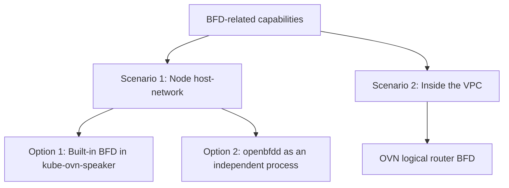

# BGP Support

Kube-OVN supports broadcasting the IP address of Pods/Subnets/Services/EIPs to the outside world via the BGP protocol.

To use this feature on Pods/Subnets/Services, you need to install `kube-ovn-speaker` on specific (or all) nodes and
add the corresponding annotation to the Pod or Subnet that needs to be exposed to the outside world.
Kube-OVN also supports broadcasting the IP address of services of type `ClusterIP` via the same annotation.

To use this feature on EIPs, you need to create your NAT Gateway with special parameters to enable the BGP speaker sidecar.
See [Publishing EIPs](#publishing-eips) for more information.

## Installing `kube-ovn-speaker`

`kube-ovn-speaker` uses [GoBGP](https://osrg.github.io/gobgp/) to publish routing information to the outside world and to
set the `next-hop` route to itself.

Since the nodes where `kube-ovn-speaker` is deployed need to carry return traffic, specific labeled nodes need to be selected for deployment:

```bash
kubectl label nodes speaker-node-1 ovn.kubernetes.io/bgp=true
kubectl label nodes speaker-node-2 ovn.kubernetes.io/bgp=true
```

> When there are multiple instances of kube-ovn-speaker,
> each of them will publish routes to the outside world, the upstream router needs to support multi-path ECMP.

Download the corresponding yaml:

```bash
wget https://raw.githubusercontent.com/kubeovn/kube-ovn/{{ variables.branch }}/yamls/speaker.yaml
```

Modify the corresponding configuration in yaml:

If you only have one switch:

```yaml
- --neighbor-address=10.32.32.254
- --neighbor-ipv6-address=2409:AB00:AB00:2000::AFB:8AFE
- --neighbor-as=65030
- --cluster-as=65000
# Optional: set --allowed-source-addresses to make sure nexthop in the allowed-source-addresses is valid.
# - --allowed-source-addresses=10.32.32.2,10.32.32.3,10.32.32.4,10.32.32.5
```

If you have a pair of switches:

```yaml

- --neighbor-address=10.32.32.252,10.32.32.253
- --neighbor-ipv6-address=2409:AB00:AB00:2000::AFB:8AFC,2409:AB00:AB00:2000::AFB:8AFD
- --neighbor-as=65030
- --cluster-as=65000
# Optional: set --allowed-source-addresses to make sure nexthop in the allowed-source-addresses is valid.
# - --allowed-source-addresses=10.32.32.2,10.32.32.3,10.32.32.4,10.32.32.5
```

- `neighbor-address`: The address of the BGP Peer, usually the router gateway address.
- `neighbor-as`: The AS number of the BGP Peer.
- `cluster-as`: The AS number of the container network.
- `allowed-source-addresses`: Comma-separated whitelist of source IPs allowed on the speaker node. When set, the speaker performs an `ip route get` lookup to the BGP peer and validates that the selected source IP is in the whitelist. If it doesn't match, the speaker refuses to start. This ensures the correct source IP is used when publishing routes in ECMP environments, preventing return traffic blackholes caused by source IP mismatches.

Apply the YAML:

```bash
kubectl apply -f speaker.yaml
```

## Publishing Pod/Subnet Routes

To use BGP for external routing on subnets, first set `natOutgoing` to `false` for the corresponding Subnet to allow the Pod IP to enter the underlying network directly.

Add annotation to publish routes:

```bash
kubectl annotate pod sample ovn.kubernetes.io/bgp=true
kubectl annotate subnet ovn-default ovn.kubernetes.io/bgp=true
```

Delete annotation to disable the publishing:

```bash
kubectl annotate pod sample ovn.kubernetes.io/bgp-
kubectl annotate subnet ovn-default ovn.kubernetes.io/bgp-
```

See [Announcement Policies](#announcement-policies) for the announcement behavior depending on the policy set in the annotation.

## Publishing Services of type `ClusterIP`

To announce the ClusterIP of services to the outside world, the `kube-ovn-speaker` option `announce-cluster-ip` needs to be set to `true`.
See the advanced options for more details.

Set the annotation to enable publishing:

```bash
kubectl annotate service sample ovn.kubernetes.io/bgp=true
```

Delete annotation to disable the publishing:

```bash
kubectl annotate service sample ovn.kubernetes.io/bgp-
```

The speakers will all start announcing the `ClusterIP` of that service to the outside world.

## Publishing EIPs

EIPs can be announced by the NAT gateways to which they are attached.
There are 2 announcement modes:

- **ARP**: the NAT gateway uses ARP to advertise the EIPs attached to itself, this mode is always enabled
- **BGP**: the NAT gateway provisions a sidecar to publish the EIPs to another BGP speaker

When BGP is enabled on a `VpcNatGateway` a new BGP speaker sidecar gets injected to it. When the gateway is in BGP mode, the behaviour becomes cumulative with the **ARP** mode. This means that EIPs will be announced by **BGP** but also keep being advertised using traditional **ARP**.

To add BGP capabilities to NAT gateways, we first need to create a new `NetworkAttachmentDefinition` that can be attached to our BGP speaker sidecars. This NAD will reference a provider shared by a `Subnet` in the default VPC (in which the Kubernetes API is running).
This will enable the sidecar to reach the K8S API, automatically detecting new EIPs added to the gateway. This operation only needs to be done once.  All the NAT gateways will use this provider from now on. This is the same principle used for the CoreDNS in a custom VPC, which means you can reuse that NAD if you've already done that setup before.

Create a `NetworkAttachmentDefinition` and a `Subnet` with the same `provider`.
The name of the provider needs to be of the form `nadName.nadNamespace.ovn`:

```yaml
apiVersion: "k8s.cni.cncf.io/v1"
kind: NetworkAttachmentDefinition
metadata:
  name: api-ovn-nad
  namespace: default
spec:
  config: '{
      "cniVersion": "0.3.0",
      "type": "kube-ovn",
      "server_socket": "/run/openvswitch/kube-ovn-daemon.sock",
      "provider": "api-ovn-nad.default.ovn"
    }'
---
apiVersion: kubeovn.io/v1
kind: Subnet
metadata:
  name: vpc-apiserver-subnet
spec:
  protocol: IPv4
  cidrBlock: 100.100.100.0/24
  provider: api-ovn-nad.default.ovn
```

The `ovn-vpc-nat-config` needs to be modified to reference our new provider and the image used by the BGP speaker:

```yaml
apiVersion: v1
kind: ConfigMap
metadata:
  name: ovn-vpc-nat-config
  namespace: kube-system
data:
  apiNadProvider: api-ovn-nad.default.ovn              # What NetworkAttachmentDefinition provider to use so that the sidecar
                                                       # can access the K8S API, as it can't by default due to VPC segmentation
  bgpSpeakerImage: docker.io/kubeovn/kube-ovn:v1.13.0  # Sets the BGP speaker image used
  image: docker.io/kubeovn/vpc-nat-gateway:v1.13.0
```

Configure RBAC permissions for the NAT gateway to access the Kubernetes API. Apply the following RBAC configuration:

```yaml
apiVersion: rbac.authorization.k8s.io/v1
kind: ClusterRole
metadata:
  labels:
    kubernetes.io/bootstrapping: rbac-defaults
  name: system:vpc-nat-gw
rules:
  - apiGroups:
      - ""
    resources:
      - services
      - pods
    verbs:
      - list
      - watch
  - apiGroups:
      - kubeovn.io
    resources:
      - iptables-eips
      - subnets
      - vpc-nat-gateways
    verbs:
      - list
      - watch
---
apiVersion: rbac.authorization.k8s.io/v1
kind: ClusterRoleBinding
metadata:
  annotations:
    rbac.authorization.kubernetes.io/autoupdate: "true"
  labels:
    kubernetes.io/bootstrapping: rbac-defaults
  name: vpc-nat-gw
roleRef:
  apiGroup: rbac.authorization.k8s.io
  kind: ClusterRole
  name: system:vpc-nat-gw
subjects:
  - kind: ServiceAccount
    name: vpc-nat-gw
    namespace: kube-system
---
apiVersion: v1
kind: ServiceAccount
metadata:
  name: vpc-nat-gw
  namespace: kube-system
```

The NAT gateway(s) now needs to be created with BGP enabled so that the speaker sidecar gets created along it:

```yaml
kind: VpcNatGateway
apiVersion: kubeovn.io/v1
metadata:
  name: vpc-natgw
spec:
  vpc: vpc1
  subnet: net1
  lanIp: 10.0.1.10
  bgpSpeaker:
    enabled: true
    asn: 65500
    remoteAsn: 65000
    neighbors:
      - 100.127.4.161
      - fd:01::1
    enableGracefulRestart: true # Optional
    routerId: 1.1.1.1           # Optional
    holdTime: 1m                # Optional
    password: "password123"     # Optional
    extraArgs:                  # Optional, passed directly to the BGP speaker
      - -v5                     # Enables verbose debugging of the BGP speaker sidecar
  selector:
    - "kubernetes.io/os: linux"
  externalSubnets:
  - ovn-vpc-external-network # Network on which we'll speak BGP and receive/send traffic to the outside world
                             # BGP neighbors need to be on that network
```

This gateway is now capable of announcing any EIP that gets attached to it as long as it has the BGP annotation:

```yaml
kubectl annotate eip sample ovn.kubernetes.io/bgp=true
```

## Announcement policies

There are 2 policies used by `kube-ovn-speaker` to announce the routes:

- **Cluster**: this policy makes the Pod IPs/Subnet CIDRs be announced from every speaker, whether there's Pods
that have that specific IP or that are part of the Subnet CIDR on that node. In other words, traffic may enter from
any node hosting a speaker, and then be internally routed in the cluster to the actual Pod. In this configuration
extra hops might be used. This is the default policy for Pods and Subnets.
- **Local**: this policy makes the Pod IPs be announced only from speakers on nodes that are actively hosting
them. In other words, traffic will only enter from the node hosting the Pod marked as needing BGP advertisement,
or from the node hosting a Pod with an IP belonging to a Subnet marked as needing BGP advertisement.
This makes the network path shorter as external traffic arrives directly to the physical host of the Pod.

**NOTE**: You'll probably need to run `kube-ovn-speaker` on every node for the`Local` policy to work.
If a Pod you're trying to announce lands on a node with no speaker on it, its IP will simply not be announced.

The default policy used is `Cluster`. Policies can be overridden for each Pod/Subnet using the `ovn.kubernetes.io/bgp` annotation:

- `ovn.kubernetes.io/bgp=cluster` or the default `ovn.kubernetes.io/bgp=true` will use policy `Cluster`
- `ovn.kubernetes.io/bgp=local` will use policy `Local`

NOTE: Announcement of Services of type `ClusterIP` doesn't support any policy other than `Cluster` as routing to the actual pod
is handled by a daemon such as `kube-proxy`. The annotation for Services only supports value `yes` and not `cluster`.

## BGP Advanced Options

`kube-ovn-speaker` supports more BGP parameters for advanced configuration, which can be adjusted by users according to their network environment:

- `announce-cluster-ip`: Whether to publish routes for Services of type `ClusterIP` to the public, default is `false`.
- `auth-password`: The access password for the BGP peer.
- `holdtime`: The heartbeat detection time between BGP neighbors. Neighbors with no messages after the change time will be removed, the default is 90 seconds.
- `graceful-restart`: Whether to enable BGP Graceful Restart.
- `graceful-restart-time`: BGP Graceful restart time refer to RFC4724 3.
- `graceful-restart-deferral-time`: BGP Graceful restart deferral time refer to RFC4724 4.1.
- `passivemode`: The Speaker runs in Passive mode and does not actively connect to the peer.
- `ebgp-multihop`: The TTL value of EBGP Peer, default is 1.
- `allowed-source-addresses`: Comma-separated whitelist of source IPs. On startup, the speaker performs an `ip route get` lookup to the BGP peer and validates the kernel-selected source IP against the whitelist. If it doesn't match, the speaker refuses to start. Used in ECMP environments to ensure the correct source IP is used for route publishing.
- `enable-bfd`: Enable the built-in BFD (Bidirectional Forwarding Detection) support in `kube-ovn-speaker`, default is `false`. See "Option 1: Built-in BFD in `kube-ovn-speaker`" below.
- `bfd-min-tx`: Minimum transmit interval for the built-in BFD in `kube-ovn-speaker`, in milliseconds. Default is `1000` (1 second).
- `bfd-min-rx`: Minimum receive interval for the built-in BFD in `kube-ovn-speaker`, in milliseconds. Default is `1000` (1 second).
- `bfd-detection-multiplier`: Detection multiplier for the built-in BFD in `kube-ovn-speaker`, default is `3`. Failure detection time = `bfd-min-rx * bfd-detection-multiplier`.

## BFD Fast Failure Detection

When BGP peers with upstream switches, BFD (Bidirectional Forwarding Detection) can be deployed for rapid link failure detection, enabling sub-second failover when combined with BGP ECMP.

In Kube-OVN environments, BFD-related capabilities can be understood in two scenarios:

- **Scenario 1: Node host-network layer**. This is used to establish BFD sessions on the links between the Kubernetes node host network and physical L3 switches, together with BGP ECMP for high availability and load sharing.
- **Scenario 2: Inside the VPC**. This corresponds to `OVN logical router BFD`, which is controlled by `VPC` CRD-related configuration, works at the VPC logical-router layer, and is managed automatically by the kube-ovn controller to enable BFD on links reachable inside the VPC.

Overview:



The rest of this section focuses on the node host-network scenario. In this scenario, there are currently two integration options:

- **Option 1: Built-in BFD in `kube-ovn-speaker`**. BFD sessions are maintained directly by GoBGP inside the speaker process, and are used to establish BFD on the node host network with physical L3 switches.
- **Option 2: Independent `openbfdd` deployment**. A separate process-based BFD DaemonSet is deployed to establish BFD on the node host network with physical L3 switches.

> Note: all three cases use the same BFD mechanism for fast failure detection. The difference is the network isolation domain and the link on which BFD is established. `OVN logical router BFD` works on links reachable inside the VPC; the two integration options described in this section work in the node host-network scenario, on the links between physical NICs and physical L3 switches, together with BGP ECMP for high availability and load sharing.

### Option 1: Built-in BFD in `kube-ovn-speaker`

`kube-ovn-speaker` supports fast failure detection through GoBGP's native BFD implementation ([RFC 5880](https://datatracker.ietf.org/doc/html/rfc5880) / [RFC 5881](https://datatracker.ietf.org/doc/html/rfc5881)).
Use this option when you want to enable BFD directly in the existing BGP speaker process without deploying an additional standalone daemon. This option runs inside the GoBGP layer of `kube-ovn-speaker` and is used to establish BFD sessions on the node host network with physical L3 switches.

#### Enabling BFD

Add BFD-related arguments to the `kube-ovn-speaker` startup parameters:

```yaml
args:
  - --enable-bfd=true
  # Optional parameters, the following are default values
  - --bfd-min-tx=1000
  - --bfd-min-rx=1000
  - --bfd-detection-multiplier=3
```

With the default parameters, the failure detection time is `1000ms × 3 = 3 seconds`.

For faster failure detection, for example 300ms:

```yaml
args:
  - --enable-bfd=true
  - --bfd-min-tx=100
  - --bfd-min-rx=100
  - --bfd-detection-multiplier=3
```

#### Prerequisites

- **The remote router must also have BFD enabled.** BFD is a bidirectional protocol; enabling it on only one side will not establish a BFD session.
- Firewalls must allow UDP port `3784` for BFD control packets.
- It is recommended to use conservative BFD timers. Overly aggressive timers may cause unnecessary BGP resets under CPU pressure or network jitter.

#### Verifying BFD Status

Use the `gobgp` command to check the BFD session status. JSON output is recommended:

```bash
gobgp -j neighbor <peer-address> | jq '{bfd_config: .bfd, bfd_state: .state.bfd_state}'
```

Example output:

```json
{
  "bfd_config": {
    "enabled": true,
    "port": 3784,
    "desired_minimum_tx_interval": 1000000,
    "required_minimum_receive": 1000000,
    "detection_multiplier": 3
  },
  "bfd_state": {
    "session_state": 1,
    "bfd_async": {
      "transmitted_packets": 100,
      "received_packets": 99
    }
  }
}
```

The `session_state` values are: `1` = UP, `2` = DOWN, `3` = ADMIN_DOWN, `4` = INIT.

#### Failure Behavior

When a BFD session detects that the remote peer is unreachable, GoBGP immediately performs a hard reset of the corresponding BGP peer with the communication string `BFD is down`.
Once the BGP session is torn down, routes are withdrawn, and the upstream router can quickly fail over to an alternate path.

### Option 2: Independent `openbfdd` Deployment

If you prefer to maintain BFD sessions independently on the host, rather than relying on the built-in implementation of `kube-ovn-speaker`, you can use the [openbfdd](https://github.com/authmillenon/openbfdd)-based BFD DaemonSet.
This option runs as an independent process on the node host network and establishes BFD sessions between BGP nodes and physical L3 switch gateways. With the default configuration, the failure detection time is `BFD_MULTI * max(BFD_MIN_TX, BFD_MIN_RX) = 3 * 1000ms = 3 seconds`. Tune the parameters for faster or more conservative detection.

The DaemonSet uses `hostNetwork: true` and contains three containers per pod:

- **init-peer**: Init container that discovers the local source IP to the gateway via `ip route get`, validates it against the whitelist, and writes the result to a shared volume.
- **bfdd**: The openbfdd daemon that uses the local IP discovered by the init container to establish a BFD session with the switch gateway. Initialized via `start-bfdd.sh` at startup; `bfdd-prestart.sh` serves as a startupProbe to validate session parameters.
- **reconcile**: Reconciliation loop container that checks the BFD session every 5 seconds and automatically re-adds the gateway peer if missing.

Download the corresponding YAML:

```bash
wget https://raw.githubusercontent.com/kubeovn/kube-ovn/{{ variables.branch }}/yamls/bfdd-daemonset.yaml
```

Edit `GATEWAY_ADDRESS` and `ALLOWED_SOURCE_ADDRESSES` to match your network. The whitelist should match the speaker's `--allowed-source-addresses` parameter:

```yaml
env:
  - name: GATEWAY_ADDRESS
    value: "10.32.32.1"                            # Switch gateway address
  - name: ALLOWED_SOURCE_ADDRESSES
    value: "10.32.32.2,10.32.32.3,10.32.32.4,10.32.32.5"  # Source IP whitelist
  - name: BFD_MIN_TX
    value: "1000"                                  # Minimum transmit interval (ms)
  - name: BFD_MIN_RX
    value: "1000"                                  # Minimum receive interval (ms)
  - name: BFD_MULTI
    value: "3"                                     # Detection multiplier
```

Deploy the DaemonSet:

```bash
kubectl apply -f bfdd-daemonset.yaml
```

#### BFD Debugging

```bash
# Check daemon status
bfdd-control status

# Check specific BFD session (remote=gateway, local=our source IP)
bfdd-control status remote <gateway-ip> local <local-ip>

# Add a BFD peer
bfdd-control allow <gateway-ip>

# Tune session parameters
bfdd-control session new set mintx <ms> ms   # Set minimum transmit interval
bfdd-control session new set minrx <ms> ms   # Set minimum receive interval
bfdd-control session new set multi <n>       # Set detection multiplier

# Disable command logging (reduces noise)
bfdd-control log type command no

# View local IP discovered by init container
cat /bfdd-peer/local-ip

# Check reconcile sidecar logs
kubectl logs -n kube-system ds/openbfdd -c reconcile

# Check init container logs
kubectl logs -n kube-system ds/openbfdd -c init-peer
```

### OVN-level BFD Debugging

OVN itself also supports BFD (managed by the kube-ovn controller), which is different from the two approaches above. Use the following commands:

```bash
# List OVN BFD entries
kubectl ko nbctl list bfd

# Find BFD by logical router port
kubectl ko nbctl find bfd logical_port=<lrp-name>

# Delete OVN BFD entry by UUID
kubectl ko nbctl destroy bfd <uuid>
```

## BGP routes debug

```bash

# show peer neighbor
gobgp neighbor

# show announced routes to one peer
gobgp neighbor 10.32.32.254 adj-out

```
