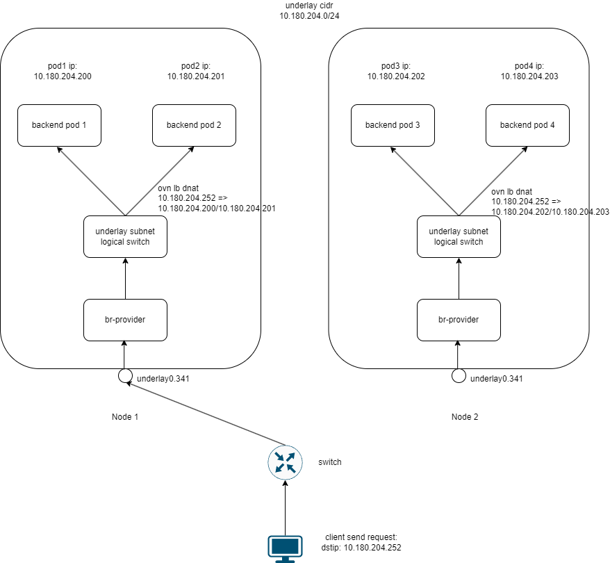

# Integrating MetalLB with Kube-OVN Underlay

[MetalLB](https://metallb.universe.tf/) is an open-source project that provides a network load balancer implementation for Kubernetes clusters, enabling network load balancing functionality for Service objects in Kubernetes clusters.

This document describes how to integrate MetalLB with Kube-OVN's Underlay subnet mode.

## Feature Introduction

Starting from version 1.14.0, Kube-OVN supports the integration of MetalLB with Underlay subnets, primarily used in the following scenarios:

- Directly using MetalLB-assigned IPs as external access addresses in physical networks
- Service backend Pods and MetalLB VIPs are in the same Underlay network
- Preserve client source IP and support local forwarding without SNAT

## Working Principle



<div align="center"><em>Figure 1: Network Traffic Path for MetalLB VIP Integration with Kube-OVN Underlay</em></div>

The traffic flow for MetalLB integration with Kube-OVN Underlay is as follows:

1. External client sends requests to the target VIP (e.g., 10.180.204.252), which is announced by MetalLB in L2 mode. In this traffic diagram, Node1 announces the metallb VIP
2. Requests reach the node announcing the VIP through the physical network, entering the `underlay0.341` network interface on the node
3. Traffic reaches the `br-provider` bridge on the node, serving as the entry point for the Underlay network
4. `br-provider` forwards traffic to the OVN logical network through OpenFlow flow table rules
5. Traffic enters the `underlay subnet` logical switch, processed by the OVN load balancer (`ovn lb dnat`)
6. OVN load balancer forwards to any Pod on the local node

The entire subnet segment is 10.180.204.0/24, including both the VIP and backend Pod IP addresses within this range.

## Prerequisites

- Kube-OVN controller enabled with `--enable-ovn-lb-prefer-local=true` option
- Underlay subnet configured with `enableExternalLBAddress=true`
- MetalLB address pool IP range added to Underlay subnet's `excludeIps`

## Deployment Steps

### 1. Deploy Kube-OVN

Deploy Kube-OVN following the standard procedure, ensuring the Kube-OVN controller is enabled with `--enable-ovn-lb-prefer-local=true` and `--ls-ct-skip-dst-lport-ips=false` options:

```bash
# Add parameters to the kube-ovn-controller Deployment configuration
kubectl edit deployment -n kube-system kube-ovn-controller
```

Add the following parameters to the command line:

```text
--enable-ovn-lb-prefer-local=true
--ls-ct-skip-dst-lport-ips=false
```

### 2. Configure Underlay Subnet

Create or modify the Underlay subnet to enable external LoadBalancer address support and exclude the IP range that MetalLB will use in excludeIps:

```yaml
apiVersion: kubeovn.io/v1
kind: Subnet
metadata:
  name: underlay-subnet
spec:
  protocol: IPv4
  provider: ovn
  cidrBlock: 10.180.204.0/24  # Matches the subnet segment in the diagram
  gateway: 10.180.204.1
  excludeIps:
  - 10.180.204.250
  - 10.180.204.251
  - 10.180.204.252  # MetalLB address pool range, includes the VIP 10.180.204.252
  natOutgoing: false
  enableExternalLBAddress: true   # When enabled, IPs in the subnet's CIDR can be used as metallb VIPs
```

### 3. Deploy MetalLB

Deploy MetalLB following the [MetalLB official documentation](https://metallb.universe.tf/installation/):

```bash
kubectl apply -f https://raw.githubusercontent.com/metallb/metallb/v0.13.7/config/manifests/metallb-native.yaml
```

Configure MetalLB's address pool and L2 advertisement mode:

```yaml
apiVersion: metallb.io/v1beta1
kind: IPAddressPool
metadata:
  name: underlay-pool
  namespace: metallb-system
spec:
  addresses:
  - 10.180.204.250-10.180.204.254  # Includes the VIP 10.180.204.252
---
apiVersion: metallb.io/v1beta1
kind: L2Advertisement
metadata:
  name: l2-advert
  namespace: metallb-system
spec:
  ipAddressPools:
  - underlay-pool
```

### 4. Create LoadBalancer Service

Create a LoadBalancer type Service to direct traffic to Pods in the Underlay subnet:

```yaml
apiVersion: apps/v1
kind: Deployment
metadata:
  labels:
    app: nginx
  name: deploy-169402624
spec:
  replicas: 3
  selector:
    matchLabels:
      app: nginx
  template:
    metadata:
      annotations:
        ovn.kubernetes.io/logical_switch: underlay-subnet
      labels:
        app: nginx
    spec:
      containers:
      - args:
        - netexec
        - --http-port
        - "80"
        image: kubeovn/agnhost:2.47
        imagePullPolicy: IfNotPresent
        name: nginx
---
apiVersion: v1
kind: Service
metadata:
  name: nginx-lb
spec:
  externalTrafficPolicy: Local
  ipFamilies:
  - IPv4
  ipFamilyPolicy: PreferDualStack
  ports:
  - port: 80
    protocol: TCP
    targetPort: 80
  selector:
    app: nginx
  type: LoadBalancer
```

## Testing and Verification

1. Verify that the Service has obtained the MetalLB-assigned IP address:

```bash
kubectl get svc nginx-lb
```

You should see the assigned IP address (e.g., 10.180.204.252) in the EXTERNAL-IP column.

2. Access the Service IP address from external:

```bash
curl http://10.180.204.252
```

3. Verify traffic is preferentially forwarded to local node Pods:

You can verify that the local preference feature is working by checking the Service's endpoints and Pod distribution:

```bash
# Check Service endpoints
kubectl get endpoints nginx-lb

# Check which nodes the Pods are distributed on
kubectl get pods -l app=nginx -o wide
```

4. Verify client IP preservation:

Check the access logs in the nginx Pod to confirm that the recorded client IP is the original client's real IP, not the SNAT-translated IP:

```bash
kubectl exec -it $(kubectl get pods -l app=nginx -o name | head -n1) -- cat /var/log/nginx/access.log
```

## Notes

1. **IP Address Pool Configuration**: The MetalLB address pool range must be a subset of the Underlay subnet CIDR and must be explicitly excluded in the Underlay subnet's `excludeIps` field to avoid IP allocation conflicts.

2. **Network Interface Requirements**: MetalLB must use the same network interface as the Kube-OVN Underlay subnet (e.g., `underlay0.341` in the example). This interface should be configured as a VLAN sub-interface to ensure proper broadcasting of ARP messages with VLAN tags for correct MetalLB VIP announcement.

3. **Local Traffic Policy**: To enable local preference, two conditions must be met:
   - Kube-OVN controller enabled with `--enable-ovn-lb-prefer-local=true` parameter
   - Service configured with `externalTrafficPolicy: Local` 