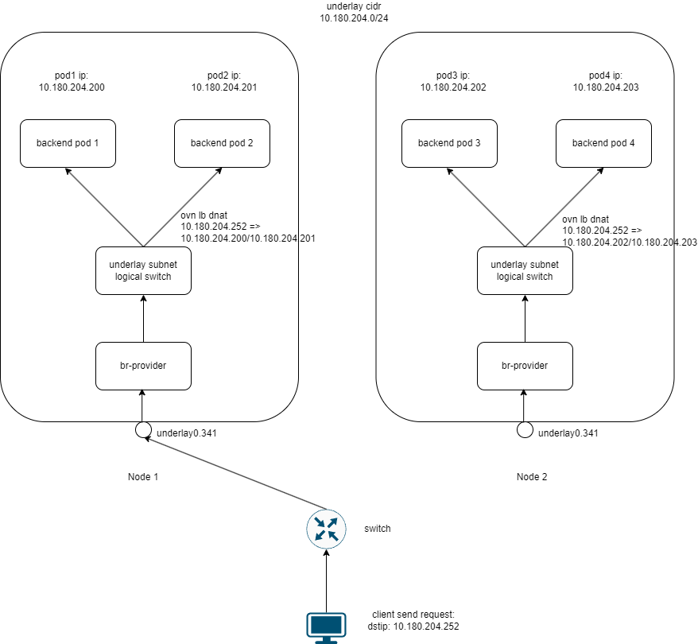

# 使用 MetalLB 与 Kube-OVN Underlay 集成

[MetalLB](https://metallb.universe.tf/) 是一个为 Kubernetes 集群提供负载均衡器实现的开源项目，可以为 Kubernetes 集群中的 Service 对象提供网络负载均衡功能。

本文档介绍如何将 MetalLB 与 Kube-OVN 的 Underlay 子网模式集成。

## 功能介绍

Kube-OVN 从版本 1.14.0 开始支持 MetalLB 与 Underlay 子网的集成，主要用于以下场景：

- 在物理网络中直接使用 MetalLB 分配的 IP 作为服务的外部访问地址
- 服务后端的 Pod 与 MetalLB VIP 在同一个 Underlay 网络中
- 保留客户端源 IP 并支持本地转发，无需 SNAT

## 工作原理



<div align="center"><em>图1：MetalLB VIP 与 Kube-OVN Underlay 集成的网络流量路径</em></div>

MetalLB 与 Kube-OVN Underlay 集成的流量走向如下：

1. 外部客户端发送请求至目标 VIP（例如 10.180.204.252），该 IP 由 MetalLB 通过 L2 模式宣告，该流量图中是由 Node1 声明 metallb 的 VIP
2. 请求通过物理网络到达宣告该 VIP 的节点，进入节点上的 `underlay0.341` 网络接口
3. 流量到达节点上的 `br-provider` 网桥，作为 Underlay 网络的入口点
4. `br-provider` 通过 OpenFlow 流表规则将流量转发到 OVN 的逻辑网络
5. 流量进入 `underlay subnet` 逻辑交换机，由 OVN 负载均衡器（`ovn lb dnat`）处理
6. OVN 负载均衡器转发给本地节点的任意 Pod：

整个子网网段为 10.180.204.0/24，包括 VIP 和后端 Pod 的 IP 地址都位于该网段内。

## 前提条件

- Kube-OVN 控制器启用 `--enable-ovn-lb-prefer-local=true` 选项
- Underlay 子网配置 `enableExternalLBAddress=true`
- 在 Underlay 子网的 `excludeIps` 中添加 MetalLB 地址池使用的 IP 范围

## 部署步骤

### 1. 部署 Kube-OVN

按照常规方式部署 Kube-OVN，确保 Kube-OVN 控制器启用 `--enable-ovn-lb-prefer-local=true` 和 `--ls-ct-skip-dst-lport-ips=false` 选项：

```bash
# 在 kube-ovn-controller 的 Deployment 配置中添加参数
kubectl edit deployment -n kube-system kube-ovn-controller
```

添加以下参数到命令行：
```
--enable-ovn-lb-prefer-local=true
--ls-ct-skip-dst-lport-ips=false
```

### 2. 配置 Underlay 子网

创建或修改 Underlay 子网，启用外部 LoadBalancer 地址支持，并在 excludeIps 中排除 MetalLB 将使用的 IP 范围：

```yaml
apiVersion: kubeovn.io/v1
kind: Subnet
metadata:
  name: underlay-subnet
spec:
  protocol: IPv4
  provider: ovn
  cidrBlock: 10.180.204.0/24  # 与图中子网网段一致
  gateway: 10.180.204.1
  excludeIps:
  - 10.180.204.250
  - 10.180.204.251
  - 10.180.204.252  # MetalLB 地址池范围，包含图中的 VIP 10.180.204.252
  natOutgoing: false
  enableExternalLBAddress: true   # 启用后，subnet 的 cidr 中的 ip 可以做为 metallb vip 使用。
```

### 3. 部署 MetalLB

按照 [MetalLB 官方文档](https://metallb.universe.tf/installation/) 部署 MetalLB：

```bash
kubectl apply -f https://raw.githubusercontent.com/metallb/metallb/v0.13.7/config/manifests/metallb-native.yaml
```

配置 MetalLB 的地址池和 L2 通告模式：

```yaml
apiVersion: metallb.io/v1beta1
kind: IPAddressPool
metadata:
  name: underlay-pool
  namespace: metallb-system
spec:
  addresses:
  - 10.180.204.250-10.180.204.254  # 包含图中的 VIP 10.180.204.252
---
apiVersion: metallb.io/v1beta1
kind: L2Advertisement
metadata:
  name: l2-advert
  namespace: metallb-system
spec:
  ipAddressPools:
  - underlay-pool
```

### 4. 创建 LoadBalancer 类型的 Service

创建一个 LoadBalancer 类型的 Service，将流量导向 Underlay 子网中的 Pod：

```yaml
apiVersion: apps/v1
kind: Deployment
metadata:
  labels:
    app: nginx
  name: deploy-169402624
spec:
  replicas: 3
  selector:
    matchLabels:
      app: nginx
  template:
    metadata:
      annotations:
        ovn.kubernetes.io/logical_switch: underlay-subnet
      labels:
        app: nginx
    spec:
      containers:
      - args:
        - netexec
        - --http-port
        - "80"
        image: kubeovn/agnhost:2.47
        imagePullPolicy: IfNotPresent
        name: nginx
---
apiVersion: v1
kind: Service
metadata:
  name: nginx-lb
spec:
  externalTrafficPolicy: Local
  ipFamilies:
  - IPv4
  ipFamilyPolicy: PreferDualStack
  ports:
  - port: 80
    protocol: TCP
    targetPort: 80
  selector:
    app: nginx
  type: LoadBalancer
```

## 测试和验证

1. 确认 Service 获取到了 MetalLB 分配的 IP 地址：

```bash
kubectl get svc nginx-lb
```

应该看到 EXTERNAL-IP 列显示分配的 IP 地址（如 10.180.204.252）。

2. 从外部访问 Service 的 IP 地址：

```bash
curl http://10.180.204.252
```

3. 验证流量优先转发到本地节点的 Pod：

可以通过检查 Service 的 endpoints 和 Pod 的分布来验证本地优先功能是否生效：

```bash
# 查看 Service 的 endpoints
kubectl get endpoints nginx-lb

# 查看 Pod 分布在哪些节点上
kubectl get pods -l app=nginx -o wide
```

4. 验证客户端 IP 保留情况：

在 nginx Pod 中可以查看访问日志，确认记录的客户端 IP 是原始客户端的真实 IP，而不是经过 SNAT 后的 IP：

```bash
kubectl exec -it $(kubectl get pods -l app=nginx -o name | head -n1) -- cat /var/log/nginx/access.log
```

## 注意事项

1. **IP 地址池配置**：MetalLB 的地址池范围必须是 Underlay 子网 CIDR 的子集，并且需要在 Underlay 子网的 `excludeIps` 字段中明确排除，以避免 IP 分配冲突。

2. **网络接口要求**：MetalLB 必须使用与 Kube-OVN Underlay 子网相同的网络接口（如示例中的 `underlay0.341`）。该接口应配置为 VLAN 子接口，以确保能够正确广播带有 VLAN 标签的 ARP 报文，从而正确通告 MetalLB VIP。

3. **本地流量策略**：要启用本地优先功能，需要满足两个条件：
   - Kube-OVN 控制器启用 `--enable-ovn-lb-prefer-local=true` 参数
   - Service 配置中设置 `externalTrafficPolicy: Local`
