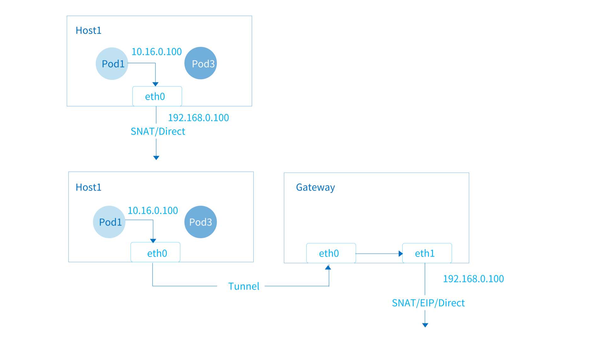

# EIP 和 SNAT 配置

> 该配置针对默认 VPC 下的网络，用户自定义 VPC 请参考 [VPC 网关](./vpc.md#vpc_2)

Kube-OVN 支持利用 OVN 中的 L3 Gateway 功能来实现 Pod 级别的 SNAT 和 EIP 功能。
通过使用 SNAT，一组 Pod 可以共享一个 IP 地址对外进行访问。 通过 EIP 的功能，一个 Pod 可以直接和一个外部 IP 关联，
外部服务可以通过 EIP 直接访问 Pod，Pod 也将通过这个 EIP 访问外部服务。



## 准备工作

- 为了使用 OVN 的 L3 Gateway 能力，必须将一个单独的网卡接入 OVS 网桥中进行 Overlay 和 Underlay 网络的打通，
主机必须有其他的网卡用于运维管理。
- 由于经过 NAT 后的数据包会直接进入 Underlay 网络，必须确认当前的网络架构下此类数据包可以安全通过。
- 目前 EIP 和 SNAT 地址没有冲突检测，需要管理员手动分配避免地址冲突。

## 创建配置文件

在 `kube-system` 下创建 ConfigMap `ovn-external-gw-config`：

```yaml
apiVersion: v1
kind: ConfigMap
metadata:
  name: ovn-external-gw-config
  namespace: kube-system
data:
  enable-external-gw: "true"
  external-gw-nodes: "kube-ovn-worker"
  external-gw-nic: "eth1"
  external-gw-addr: "172.56.0.1/16"
  nic-ip: "172.56.0.254/16"
  nic-mac: "16:52:f3:13:6a:25"
```

- `enable-external-gw`: 是否开启 SNAT 和 EIP 功能。
- `type`: `centrailized` 或 `distributed`， 默认为 `centralized` 如果使用 `distributed`，则集群所有节点都需要有同名网卡来承担网关功能。
- `external-gw-nodes`: `centralized` 模式下，承担网关作用的节点名，逗号分隔。
- `external-gw-nic`: 节点上承担网关作用的网卡名。
- `external-gw-addr`: 物理网络网关的 IP 和掩码。
- `nic-ip`,`nic-mac`: 分配给逻辑网关端口的 IP 和 Mac，需为物理段未被占用的 IP 和 Mac。

## 观察 OVN 和 OVS 状态确认配置生效

检查 OVN-NB 状态, 确认 `ovn-external` 逻辑交换机存在，并且 `ovn-cluster-ovn-external`
逻辑路由器端口上 绑定了正确的地址和 chassis。

```bash
# kubectl ko nbctl show
switch 3de4cea7-1a71-43f3-8b62-435a57ef16a6 (ovn-external)
    port ln-ovn-external
        type: localnet
        addresses: ["unknown"]
    port ovn-external-ovn-cluster
        type: router
        router-port: ovn-cluster-ovn-external
router e1eb83ad-34be-4ed5-9a02-fcc8b1d357c4 (ovn-cluster)
    port ovn-cluster-ovn-external
        mac: "ac:1f:6b:2d:33:f1"
        networks: ["172.56.0.100/16"]
        gateway chassis: [a5682814-2e2c-46dd-9c1c-6803ef0dab66]
```

检查 OVS 状态，确认相应的网卡已经桥接进 `br-external` 网桥：

```bash
# kubectl ko vsctl ${gateway node name} show
e7d81150-7743-4d6e-9e6f-5c688232e130
    Bridge br-external
        Port br-external
            Interface br-external
                type: internal
        Port eno2
            Interface eno2
        Port patch-ln-ovn-external-to-br-int
            Interface patch-ln-ovn-external-to-br-int
                type: patch
                options: {peer=patch-br-int-to-ln-ovn-external}
```

## Pod 配置 EIP 和 SNAT

可通过在 Pod 上增加 `ovn.kubernetes.io/snat` 或 `ovn.kubernetes.io/eip` annotation 来分别配置 SNAT 和 EIP：

```yaml
apiVersion: v1
kind: Pod
metadata:
  name: pod-gw
  annotations:
    ovn.kubernetes.io/snat: 172.56.0.200
spec:
  containers:
  - name: snat-pod
    image: docker.io/library/nginx:alpine
---
apiVersion: v1
kind: Pod
metadata:
  name: pod-gw
  annotations:
    ovn.kubernetes.io/eip: 172.56.0.233
spec:
  containers:
  - name: eip-pod
    image: docker.io/library/nginx:alpine
```

可通过 kubectl 或其他工具动态调整 Pod 所配置的 EIP 或 SNAT 规则，更改时请注意要同时删除 `ovn.kubernetes.io/routed` annotation
触发路由的变更：

```bash
kubectl annotate pod pod-gw ovn.kubernetes.io/eip=172.56.0.221 --overwrite
kubectl annotate pod pod-gw ovn.kubernetes.io/routed-
```

当 EIP 或 SNAT 规则生效后，`ovn.kubernetes.io/routed` annotation 会被重新添加。

## 高级配置

`kube-ovn-controller` 的部分启动参数可对 SNAT 和 EIP 功能进行高阶配置：

- `--external-gateway-config-ns`: Configmap `ovn-external-gw-config` 所属 Namespace， 默认为 `kube-system`。
- `--external-gateway-net`: 物理网卡所桥接的网桥名，默认为 `external`。
- `--external-gateway-vlanid`: 物理网络 Vlan Tag 号，默认为 0， 即不使用 Vlan。
