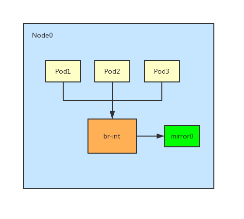

# 流量镜像

流量镜像功能可以将进出容器网络的数据包进行复制到主机的特定网卡。管理员或开发者
可以通过监听这块网卡获得完整的容器网络流量来进一步进行分析，监控，安全审计等操作。
也可和传统的 NPM 对接获取更细粒度的流量监控。

流量镜像功能会带来一定的性能损失，根据 CPU 性能以及流量的特征，会有 5%~10% 的
额外 CPU 消耗。



## 全局流量镜像配置

流量镜像功能默认为关闭状态，如果需要开启请修改 `kube-ovn-cni` DaemonSet 的启动参数：

- `--enable-mirror=true`：是否开启流量镜像。
- `--mirror-iface=mirror0`: 流量镜像所复制到的网卡名。该网卡可为主机上已存在的一块物理网卡，
此时该网卡会被桥接进 br-int 网桥，镜像流量会直接接入底层交换机。若网卡名不存在，Kube-OVN 会自动
创建一块同名的虚拟网卡，管理员或开发者可以在宿主机上通过该网卡获取当前节点所有流量。默认为 `mirror0`。

接下来可以用 tcpdump 或其他流量分析工具监听 `mirror0` 上的流量：

```bash
tcpdump -ni mirror0
```

## Pod 级别流量镜像配置

如果只需对部分 Pod 流量进行镜像，则需要关闭全局的流量镜像功能，然后在特定 Pod 上增加
`ovn.kubernetes.io/mirror` annotation 来开启 Pod 级别流量镜像。

```yaml
apiVersion: v1
kind: Pod
metadata:
  name: mirror-pod
  namespace: ls1
  annotations:
    ovn.kubernetes.io/mirror: "true"
spec:
  containers:
  - name: mirror-pod
    image: docker.io/library/nginx:alpine
```

## 性能测试

在相同环境上，分别开启和关闭流量镜像开关，进行测试

### 1. Pod to Pod in the same Nodes

#### 开启流量镜像

| Size | TCP Latency | TCP Bandwidth | UDP Latency | UDP Lost Rate | UDP Bandwidth |
| --- | --- | --- | --- | --- | --- |
| 64              | 12.7 us         | 289 Mbits/sec   | 12.6 us         | (1.8%)          | 77.9 Mbits/sec |
| 128             | 15.5 us         | 517 Mbits/sec   | 12.7 us         | (0%)            | 155 Mbits/sec  |
| 512             | 12.2 us         | 1.64 Gbits/sec  | 12.4 us         | (0%)            | 624 Mbits/sec  |
| 1k              | 13 us           | 2.96 Gbits/sec  | 11.4 us         | (0.53%)         | 1.22 Gbits/sec |
| 4k              | 18 us           | 7.67 Gbits/sec  | 25.7 us         | (0.41%)         | 1.50 Gbits/sec |

#### 关闭流量镜像

| Size | TCP Latency | TCP Bandwidth | UDP Latency | UDP Lost Rate | UDP Bandwidth |
| --- | --- | --- | --- | --- | --- |
| 64              | 11.9 us         | 324 Mbits/sec   | 12.2 us         | (0.22%)         | 102 Mbits/sec  |
| 128             | 10.5 us         | 582 Mbits/sec   | 9.5 us          | (0.21%)         | 198 Mbits/sec  |
| 512             | 11.6 us         | 1.84 Gbits/sec  | 9.32 us         | (0.091%)        | 827 Mbits/sec  |
| 1k              | 10.5 us         | 3.44 Gbits/sec  | 10 us           | (1.2%)          | 1.52 Gbits/sec |
| 4k              | 16.7 us         | 8.52 Gbits/sec  | 18.2 us         | (1.3%)          | 2.42 Gbits/sec |

### 2. Pod to Pod in the different Nodes

#### 开启流量镜像

| Size | TCP Latency | TCP Bandwidth | UDP Latency | UDP Lost Rate | UDP Bandwidth |
| --- | --- | --- | --- | --- | --- |
| 64              | 258 us          | 143 Mbits/sec   | 237 us          | (61%)           | 28.5 Mbits/sec |
| 128             | 240 us          | 252 Mbits/sec   | 231 us          | (64%)           | 54.9 Mbits/sec |
| 512             | 236 us          | 763 Mbits/sec   | 256 us          | (68%)           | 194 Mbits/sec  |
| 1k              | 242 us          | 969 Mbits/sec   | 225 us          | (62%)           | 449 Mbits/sec  |
| 4k              | 352 us          | 1.12 Gbits/sec  | 382 us          | (0.71%)         | 21.4 Mbits/sec |

#### 关闭流量镜像

| Size | TCP Latency | TCP Bandwidth | UDP Latency | UDP Lost Rate | UDP Bandwidth |
| --- | --- | --- | --- | --- | --- |
| 64              | 278 us          | 140 Mbits/sec   | 227 us          | (24%)           | 59.6 Mbits/sec |
| 128             | 249 us          | 265 Mbits/sec   | 265 us          | (23%)           | 114 Mbits/sec  |
| 512             | 233 us          | 914 Mbits/sec   | 235 us          | (21%)           | 468 Mbits/sec  |
| 1k              | 238 us          | 1.14 Gbits/sec  | 240 us          | (15%)           | 891 Mbits/sec  |
| 4k              | 370 us          | 1.25 Gbits/sec  | 361 us          | (0.43%)         | 7.54 Mbits/sec |

### 3. Node to Node

#### 开启流量镜像

| Size | TCP Latency | TCP Bandwidth | UDP Latency | UDP Lost Rate | UDP Bandwidth |
| --- | --- | --- | --- | --- | --- |
| 64              | 205 us          | 162 Mbits/sec   | 183 us          | (11%)           | 74.2 Mbits/sec |
| 128             | 222 us          | 280 Mbits/sec   | 206 us          | (6.3%)          | 155 Mbits/sec  |
| 512             | 220 us          | 1.04 Gbits/sec  | 177 us          | (20%)           | 503 Mbits/sec  |
| 1k              | 213 us          | 2.06 Gbits/sec  | 201 us          | (8.6%)          | 1.14 Gbits/sec |
| 4k              | 280 us          | 5.01 Gbits/sec  | 315 us          | (37%)           | 1.20 Gbits/sec |

#### 关闭流量镜像

| Size | TCP Latency | TCP Bandwidth | UDP Latency | UDP Lost Rate | UDP Bandwidth |
| --- | --- | --- | --- | --- | --- |
| 64              | 204 us          | 157 Mbits/sec   | 204 us          | (8.8%)          | 81.9 Mbits/sec |
| 128             | 213 us          | 262 Mbits/sec   | 225 us          | (19%)           | 136 Mbits/sec  |
| 512             | 220 us          | 1.02 Gbits/sec  | 227 us          | (21%)           | 486 Mbits/sec  |
| 1k              | 217 us          | 1.79 Gbits/sec  | 218 us          | (29%)           | 845 Mbits/sec  |
| 4k              | 275 us          | 5.27 Gbits/sec  | 336 us          | (34%)           | 1.21 Gbits/sec |

### 4. Pod to the Node where the Pod is located

#### 开启流量镜像

| Size | TCP Latency | TCP Bandwidth | UDP Latency | UDP Lost Rate | UDP Bandwidth |
| --- | --- | --- | --- | --- | --- |
| 64              | 12.2 us         | 295 Mbits/sec   | 12.7 us         | (0.27%)         | 74.1 Mbits/sec |
| 128             | 14.1 us         | 549 Mbits/sec   | 10.6 us         | (0.41%)         | 153 Mbits/sec  |
| 512             | 13.5 us         | 1.83 Gbits/sec  | 12.7 us         | (0.23%)         | 586 Mbits/sec  |
| 1k              | 12 us           | 2.69 Gbits/sec  | 13 us           | (1%)            | 1.16 Gbits/sec |
| 4k              | 18.9 us         | 4.51 Gbits/sec  | 21.8 us         | (0.42%)         | 1.81 Gbits/sec |

#### 关闭流量镜像

| Size | TCP Latency | TCP Bandwidth | UDP Latency | UDP Lost Rate | UDP Bandwidth |
| --- | --- | --- | --- | --- | --- |
| 64              | 10.4 us         | 335 Mbits/sec   | 12.2 us         | (0.75%)         | 95.4 Mbits/sec |
| 128             | 12.1 us         | 561 Mbits/sec   | 11.3 us         | (0.25%)         | 194 Mbits/sec  |
| 512             | 11.6 us         | 1.87 Gbits/sec  | 10.7 us         | (0.66%)         | 745 Mbits/sec  |
| 1k              | 12.7 us         | 3.12 Gbits/sec  | 10.9 us         | (1.2%)          | 1.46 Gbits/sec |
| 4k              | 16.5 us         | 8.23 Gbits/sec  | 17.9 us         | (1.5%)          | 2.51 Gbits/sec |

### 5. Pod to the Node where the Pod is not located

#### 开启流量镜像

| Size | TCP Latency | TCP Bandwidth | UDP Latency | UDP Lost Rate | UDP Bandwidth |
| --- | --- | --- | --- | --- | --- |
| 64              | 234 us          | 153 Mbits/sec   | 232 us          | (63%)           | 29.4 Mbits/sec |
| 128             | 237 us          | 261 Mbits/sec   | 238 us          | (49%)           | 76.1 Mbits/sec |
| 512             | 231 us          | 701 Mbits/sec   | 238 us          | (57%)           | 279 Mbits/sec  |
| 1k              | 256 us          | 1.05 Gbits/sec  | 228 us          | (56%)           | 524 Mbits/sec  |
| 4k              | 330 us          | 1.08 Gbits/sec  | 359 us          | (1.5%)          | 35.7 Mbits/sec |

#### 关闭流量镜像

| Size | TCP Latency | TCP Bandwidth | UDP Latency | UDP Lost Rate | UDP Bandwidth |
| --- | --- | --- | --- | --- | --- |
| 64              | 283 us          | 141 Mbits/sec   | 230 us          | (26%)           | 55.8 Mbits/sec |
| 128             | 234 us          | 255 Mbits/sec   | 234 us          | (25%)           | 113 Mbits/sec  |
| 512             | 246 us          | 760 Mbits/sec   | 234 us          | (22%)           | 458 Mbits/sec  |
| 1k              | 268 us          | 1.23 Gbits/sec  | 242 us          | (20%)           | 879 Mbits/sec  |
| 4k              | 326 us          | 1.20 Gbits/sec  | 369 us          | (0.5%)          | 7.87 Mbits/sec |

### 6. Pod to the cluster ip service

#### 开启流量镜像

| Size | TCP Latency | TCP Bandwidth | UDP Latency | UDP Lost Rate | UDP Bandwidth |
| --- | --- | --- | --- | --- | --- |
| 64              | 237 us          | 133 Mbits/sec   | 213 us          | (65%)           | 25.5 Mbits/sec |
| 128             | 232 us          | 271 Mbits/sec   | 222 us          | (62%)           | 54.8 Mbits/sec |
| 512             | 266 us          | 800 Mbits/sec   | 234 us          | (60%)           | 232 Mbits/sec  |
| 1k              | 248 us          | 986 Mbits/sec   | 239 us          | (50%)           | 511 Mbits/sec  |
| 4k              | 314 us          | 1.03 Gbits/sec  | 367 us          | (0.6%)          | 13.2 Mbits/sec |

| TCP-Conn-Number | QPS | Avg-Resp-Time | Stdev-Resp-Time | Max-Resp-Time |
| --- | --- | --- | --- | --- |
| 10              | 14305.17        | 0.87ms          | 1.48ms          | 24.46ms  |
| 100             | 29082.07        | 3.87ms          | 4.35ms          | 102.85ms |

#### 关闭流量镜像

| Size | TCP Latency | TCP Bandwidth | UDP Latency | UDP Lost Rate | UDP Bandwidth |
| --- | --- | --- | --- | --- | --- |
| 64              | 241 us          | 145 Mbits/sec   | 225 us          | (19%)           | 60.2 Mbits/sec |
| 128             | 245 us          | 261 Mbits/sec   | 212 us          | (15%)           | 123 Mbits/sec  |
| 512             | 252 us          | 821 Mbits/sec   | 219 us          | (14%)           | 499 Mbits/sec  |
| 1k              | 253 us          | 1.08 Gbits/sec  | 242 us          | (16%)           | 852 Mbits/sec  |
| 4k              | 320 us          | 1.32 Gbits/sec  | 360 us          | (0.47%)         | 6.70 Mbits/sec |

| TCP-Conn-Number | QPS | Avg-Resp-Time | Stdev-Resp-Time | Max-Resp-Time |
| --- | --- | --- | --- | --- |
| 10              | 13634.07        | 0.96ms          | 1.72ms          | 30.07ms  |
| 100             | 30215.23        | 3.59ms          | 3.20ms          | 77.56ms  |

### 7. Host to the Node port service where the Pod is not located on the target Node

#### 开启流量镜像

| TCP-Conn-Number | QPS | Avg-Resp-Time | Stdev-Resp-Time | Max-Resp-Time |
| --- | --- | --- | --- | --- |
| 10              | 14802.73        | 0.88ms          | 1.66ms          | 31.49ms  |
| 100             | 29809.58        | 3.78ms          | 4.12ms          | 105.34ms |

#### 关闭流量镜像

| TCP-Conn-Number | QPS | Avg-Resp-Time | Stdev-Resp-Time | Max-Resp-Time |
| --- | --- | --- | --- | --- |
| 10              | 14273.33        | 0.90ms          | 1.60ms          | 37.16ms  |
| 100             | 30757.81        | 3.62ms          | 3.41ms          | 59.78ms  |

### 8. Host to the Node port service where the Pod is located on the target Node

#### 开启流量镜像

| TCP-Conn-Number | QPS | Avg-Resp-Time | Stdev-Resp-Time | Max-Resp-Time |
| --- | --- | --- | --- | --- |
| 10              | 15402.39        | 802.50us        | 1.42ms          | 30.91ms  |
| 100             | 29424.66        | 4.05ms          | 4.31ms          | 90.60ms  |

#### 关闭流量镜像

| TCP-Conn-Number | QPS | Avg-Resp-Time | Stdev-Resp-Time | Max-Resp-Time |
| --- | --- | --- | --- | --- |
| 10              | 14649.21        | 0.91ms          | 1.72ms          | 43.92ms  |
| 100             | 32143.61        | 3.66ms          | 3.76ms          | 67.02ms  |
