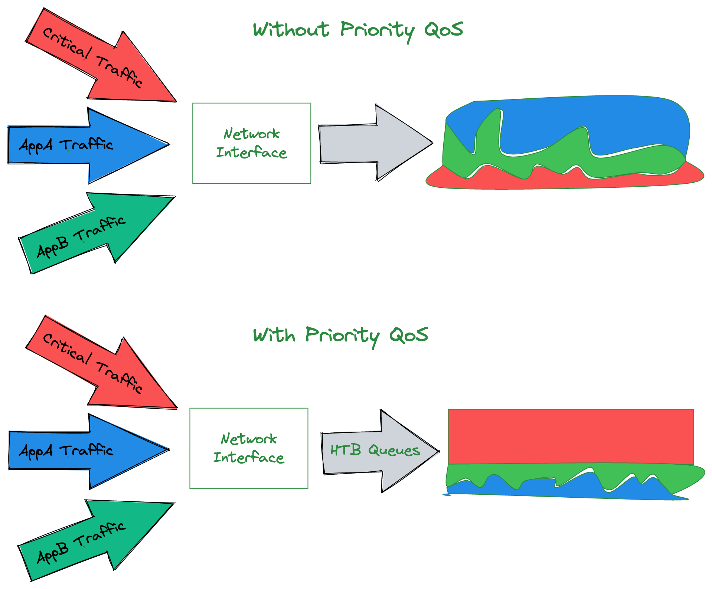

# Manage QoS

Kube-OVN supports three types of QoS:

- Maximum bandwidth limit QoS.
- `linux-htb`, Priority-based QoS, where higher-priority traffic is satisfied first when there is insufficient bandwidth.
- `linux-netem`, QoS for simulating latency and packet loss that can be used for simulation testing.

`linux-htb` and `linux-netem` can not take effect at the same time.
If both QoS are configured to the same Pod, only the `linux-htb` type QoS is in effect.

## Maximum Bandwidth Limit QoS

This type of QoS can be dynamically configured via Pod annotation and can be adjusted without restarting running Pod.
Bandwidth speed limit unit is `Mbit/s`.

```yaml
apiVersion: v1
kind: Pod
metadata:
  name: qos
  namespace: ls1
  annotations:
    ovn.kubernetes.io/ingress_rate: "3"
    ovn.kubernetes.io/egress_rate: "1"
spec:
  containers:
  - name: qos
    image: nginx:alpine
```

Use annotation to dynamically adjust QoS:

```bash
kubectl annotate --overwrite  pod nginx-74d5899f46-d7qkn ovn.kubernetes.io/ingress_rate=3
```

### Test QoS

Deploy the containers needed for performance testing:

```yaml
kind: DaemonSet
apiVersion: apps/v1
metadata:
  name: perf
  namespace: ls1
  labels:
    app: perf
spec:
  selector:
    matchLabels:
      app: perf
  template:
    metadata:
      labels:
        app: perf
    spec:
      containers:
      - name: nginx
        image: kubeovn/perf
```

Exec into one Pod and run iperf3 server:

```bash
# kubectl exec -it perf-4n4gt -n ls1 sh
# iperf3 -s
-----------------------------------------------------------
Server listening on 5201
-----------------------------------------------------------
```

Exec into the other Pod and run iperf3 client to connect above server address:

```bash
# kubectl exec -it perf-d4mqc -n ls1 sh
# iperf3 -c 10.66.0.12
Connecting to host 10.66.0.12, port 5201
[  4] local 10.66.0.14 port 51544 connected to 10.66.0.12 port 5201
[ ID] Interval           Transfer     Bandwidth       Retr  Cwnd
[  4]   0.00-1.00   sec  86.4 MBytes   725 Mbits/sec    3    350 KBytes
[  4]   1.00-2.00   sec  89.9 MBytes   754 Mbits/sec  118    473 KBytes
[  4]   2.00-3.00   sec   101 MBytes   848 Mbits/sec  184    586 KBytes
[  4]   3.00-4.00   sec   104 MBytes   875 Mbits/sec  217    671 KBytes
[  4]   4.00-5.00   sec   111 MBytes   935 Mbits/sec  175    772 KBytes
[  4]   5.00-6.00   sec   100 MBytes   840 Mbits/sec  658    598 KBytes
[  4]   6.00-7.00   sec   106 MBytes   890 Mbits/sec  742    668 KBytes
[  4]   7.00-8.00   sec   102 MBytes   857 Mbits/sec  764    724 KBytes
[  4]   8.00-9.00   sec  97.4 MBytes   817 Mbits/sec  1175    764 KBytes
[  4]   9.00-10.00  sec   111 MBytes   934 Mbits/sec  1083    838 KBytes
- - - - - - - - - - - - - - - - - - - - - - - - -
[ ID] Interval           Transfer     Bandwidth       Retr
[  4]   0.00-10.00  sec  1010 MBytes   848 Mbits/sec  5119             sender
[  4]   0.00-10.00  sec  1008 MBytes   846 Mbits/sec                  receiver

iperf Done.
```

Modify the ingress bandwidth QoS for the first Pod:

```bash
kubectl annotate --overwrite  pod perf-4n4gt -n ls1 ovn.kubernetes.io/ingress_rate=30
```

Test the Pod bandwidth again from the second Pod:

```bash
# iperf3 -c 10.66.0.12
Connecting to host 10.66.0.12, port 5201
[  4] local 10.66.0.14 port 52372 connected to 10.66.0.12 port 5201
[ ID] Interval           Transfer     Bandwidth       Retr  Cwnd
[  4]   0.00-1.00   sec  3.66 MBytes  30.7 Mbits/sec    2   76.1 KBytes
[  4]   1.00-2.00   sec  3.43 MBytes  28.8 Mbits/sec    0    104 KBytes
[  4]   2.00-3.00   sec  3.50 MBytes  29.4 Mbits/sec    0    126 KBytes
[  4]   3.00-4.00   sec  3.50 MBytes  29.3 Mbits/sec    0    144 KBytes
[  4]   4.00-5.00   sec  3.43 MBytes  28.8 Mbits/sec    0    160 KBytes
[  4]   5.00-6.00   sec  3.43 MBytes  28.8 Mbits/sec    0    175 KBytes
[  4]   6.00-7.00   sec  3.50 MBytes  29.3 Mbits/sec    0    212 KBytes
[  4]   7.00-8.00   sec  3.68 MBytes  30.9 Mbits/sec    0    294 KBytes
[  4]   8.00-9.00   sec  3.74 MBytes  31.4 Mbits/sec    0    398 KBytes
[  4]   9.00-10.00  sec  3.80 MBytes  31.9 Mbits/sec    0    526 KBytes
- - - - - - - - - - - - - - - - - - - - - - - - -
[ ID] Interval           Transfer     Bandwidth       Retr
[  4]   0.00-10.00  sec  35.7 MBytes  29.9 Mbits/sec    2             sender
[  4]   0.00-10.00  sec  34.5 MBytes  29.0 Mbits/sec                  receiver

iperf Done.
```


## linux-htb QoS



`linux-htb` QoS is a priority-based QoS, where higher-priority traffic is satisfied first when there is insufficient bandwidth.
And it can be configured in Kube-OVN via HtbQos CRD.

HtbQos CRD has only one field, `.spec.priority`, and the field takes a value that represents the priority.

Three instances with different priority levels are preconfigured at the initialization of Kube-OVN:

```bash
# kubectl get htbqos
NAME            PRIORITY
htbqos-high     1
htbqos-low      5
htbqos-medium   3
```

The priority order is relative; the smaller the priority value, the higher the QoS priority.

OVS itself does not limit the value of the field, you can refer to [Qos parameter](https://www.mankier.com/5/ovs-vswitchd.conf.db#QoS_TABLE). 
However, the actual Linux supports Priority in the range of 0-7, and values outside the range will be set to 7.

The `HtbQos` field in Subnet Spec, used to specify the HtbQos instance of the current Subnet binding as below:

```bash
# kubectl get subnet test -o yaml
apiVersion: kubeovn.io/v1
kind: Subnet
metadata:
  name: test
spec:
  cidrBlock: 192.168.0.0/16
  default: false
  gatewayType: distributed
  htbqos: htbqos-high
  ...
```
When a Subnet is bound to an instance of HtbQos, all Pods under that Subnet have the same priority setting.

If you need to set a separate HtbQoS for a Pod you can use the Pod annotation `ovn.kubernetes.io/priority`.
The value is a specific priority value, such as `ovn.kubernetes.io/priority: "50"`, which can be used to set the QoS priority parameter of the Pod individually.

```bash
kubectl annotate --overwrite  pod perf-4n4gt -n ls1 ovn.kubernetes.io/priority=50
```

When the Pod's Subnet specifies the HtbQos parameter and the Pod sets the QoS priority annotation, the Pod annotation takes effect.

The bandwidth settings are still set individually based on the Pod, using the previous annotations `ovn.kubernetes.io/ingress_rate` 
and `ovn.kubernetes.io/egress_rate`, which are used to control the bi-direction bandwidth of the Pod.

## linux-netem QoS

Pod can use annotation below to config `linux-netem` type QoS： `ovn.kubernetes.io/latency`、`ovn.kubernetes.io/limit` and 
`ovn.kubernetes.io/loss`。

- `ovn.kubernetes.io/latency`: 设Sets the Pod traffic delay to an integer value in ms.
- `ovn.kubernetes.io/limit`： is the maximum number of packets that the `qdisc` queue can hold, and takes an integer value, such as 1000.
- `ovn.kubernetes.io/loss`： Set packet loss probability, the value is float type, for example, the value is 0.2, then it is set 20% packet loss probability.
