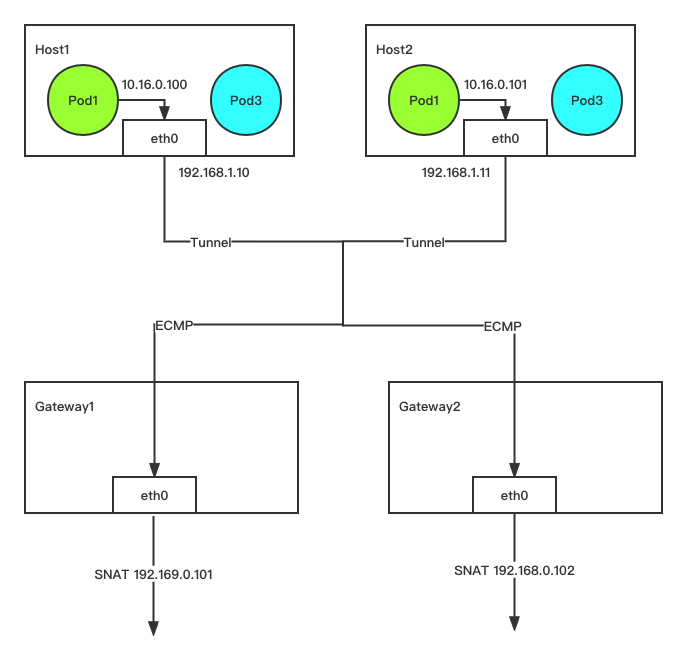

# 子网使用

子网是 Kube-OVN 中的一个核心概念和基本使用单元，Kube-OVN 会以子网来组织 IP 和网络配置，每个 Namespace 可以归属于特定的子网，
Namespace 下的 Pod 会自动从所属的子网中获取 IP 并共享子网的网络配置（CIDR，网关类型，访问控制，NAT 控制等）。

和其他 CNI 的每个节点绑定一个子网的实现不同，在 Kube-OVN 中子网为一个全局的虚拟网络配置，同一个子网的地址可以分布在任意一个节点上。

注意：同一 VPC 下的不同子网不能包含同样的 IP，以及基于 VPC peering 或者 VPN 互相打通的不同子网不能包含同样的 IP。


Overlay 和 Underlay 的子网在使用和配置上存在一些差异，本文档将会介绍不同类型子网的一些共同配置和差异化功能。

## 默认子网

为了方便用户的快速上手使用，Kube-OVN 内置了一个默认子网，所有未显式声明子网归属的 Namespace 会自动从默认子网中分配 IP，
并使用默认子网的网络信息。该子网的配置为安装时指定，可以参考[内置网络设置](../reference/setup-options.md#_2)，
如果要在安装后修改默认网络的 CIDR 请参考[修改默认网络](../ops/change-default-subnet.md)。

在 Overlay 模式下，默认子网使用了分布式网关并对出网流量进行 NAT 转换，其行为和 Flannel 的默认行为基本一致，
用户无需额外的配置即可使用到大部分的网络功能。

在 Underlay 模式下，默认子网使用物理网关作为出网网关，并开启 arping 检查网络连通性。

### 查看默认子网

默认子网 spec 中的 default 字段为 true，一个集群下只有一个默认子网，默认名为 `ovn-default`。

查看默认子网：

```bash
# kubectl get subnet ovn-default -o yaml
apiVersion: kubeovn.io/v1
kind: Subnet
metadata:
  creationTimestamp: "2019-08-06T09:33:43Z"
  generation: 1
  name: ovn-default
  resourceVersion: "1571334"
  selfLink: /apis/kubeovn.io/v1/subnets/ovn-default
  uid: 7e2451f8-fb44-4f7f-b3e0-cfd27f6fd5d6
spec:
  cidrBlock: 10.16.0.0/16
  default: true
  excludeIps:
  - 10.16.0.1
  gateway: 10.16.0.1
  gatewayType: distributed
  natOutgoing: true
  private: false
  protocol: IPv4
```

## Join 子网

在 Kubernetes 的网络规范中，要求 Node 可以和所有的 Pod 直接通信。
为了在 Overlay 网络模式下达到这个目的， Kube-OVN 创建了一个 `join` 子网，
并在每个 Node 节点创建了一块虚拟网卡 ovn0 接入 `join` 子网，通过该网络完成节点和 Pod 之间的网络互通。

所有 Pods 和 Nodes 之间的网络通信都会通过 ovn0 网卡进行，Node 访问 Pod 时通过 ovn0 网卡进入虚拟网络，虚拟网络通过 ovn0 网卡进入主机网络。

该子网的配置为安装时指定，可以参考[内置网络设置](../reference/setup-options.md#_2)，如果要在安装后修改。
join 子网的 CIDR 请参考[修改 Join 子网](../ops/change-join-subnet.md)

### 查看 Join 子网

> 注意：集中式子网下的 Pod 无法通过 `hostport`，以及设置了 `externalTrafficPolicy: Local` 的 NodePort 类型 Service 进行访问。

该子网默认名为 `join` 一般无需对该子网 CIDR 外的其他网络配置进行修改。

```bash
# kubectl get subnet join -o yaml
apiVersion: kubeovn.io/v1
kind: Subnet
metadata:
  creationTimestamp: "2019-08-06T09:33:43Z"
  generation: 1
  name: join
  resourceVersion: "1571333"
  selfLink: /apis/kubeovn.io/v1/subnets/join
  uid: 9c744810-c678-4d50-8a7d-b8ec12ef91b8
spec:
  cidrBlock: 100.64.0.0/16
  default: false
  excludeIps:
  - 100.64.0.1
  gateway: 100.64.0.1
  gatewayNode: ""
  gatewayType: ""
  natOutgoing: false
  private: false
  protocol: IPv4
```

在 Node 节点查看 ovn0 网卡：

```bash
# ifconfig ovn0
ovn0: flags=4163<UP,BROADCAST,RUNNING,MULTICAST>  mtu 1420
        inet 100.64.0.4  netmask 255.255.0.0  broadcast 100.64.255.255
        inet6 fe80::800:ff:fe40:5  prefixlen 64  scopeid 0x20<link>
        ether 0a:00:00:40:00:05  txqueuelen 1000  (Ethernet)
        RX packets 18  bytes 1428 (1.3 KiB)
        RX errors 0  dropped 0  overruns 0  frame 0
        TX packets 19  bytes 1810 (1.7 KiB)
        TX errors 0  dropped 0 overruns 0  carrier 0  collisions 0
```

## 创建自定义子网

这里我们介绍创建一个子网，并将其和某个 Namespace 做关联的基本操作，更多高级配置请参考后续内容。

### 创建子网

```bash
cat <<EOF | kubectl create -f -
apiVersion: kubeovn.io/v1
kind: Subnet
metadata:
  name: subnet1
spec:
  protocol: IPv4
  cidrBlock: 10.66.0.0/16
  excludeIps:
  - 10.66.0.1..10.66.0.10
  - 10.66.0.101..10.66.0.151
  gateway: 10.66.0.1
  gatewayType: distributed
  natOutgoing: true
  routeTable: ""
  namespaces:
  - ns1
  - ns2
EOF
```

- `cidrBlock`: 子网 CIDR 范围，同一个 VPC 下的不同 Subnet CIDR 不能重叠。
- `excludeIps`: 保留地址列表，容器网络将不会自动分配列表内的地址，可用作固定 IP 地址分配段，也可在 Underlay 模式下避免和物理网络中已有设备冲突。
- `gateway`：该子网网关地址，Overlay 模式下 Kube-OVN 会自动分配对应的逻辑网关，Underlay 模式下该地址需为底层物理网关地址。
- `namespaces`: 绑定该子网的 Namespace 列表，绑定后 Namespace 下的 Pod 将会从当前子网分配地址。
- `routeTable`: 关联的路由表，可选项，默认关联主路由表，路由表定义请参考[静态路由](../vpc/vpc.md#_3)。

### 验证子网绑定生效

```bash
# kubectl create ns ns1
namespace/ns1 created

# kubectl run nginx --image=docker.io/library/nginx:alpine -n ns1
deployment.apps/nginx created

# kubectl get pod -n ns1 -o wide
NAME                     READY   STATUS    RESTARTS   AGE   IP           NODE    NOMINATED NODE   READINESS GATES
nginx-74d5899f46-n8wtg   1/1     Running   0          10s   10.66.0.11   node1   <none>           <none>
```

### Workload 绑定子网

默认情况下 Pod 会从 Namespace 所属的子网内分配 IP 地址，如果 Namespace 下某个 Workload 需要特殊指定一个子网，可以通过设置 Pod 的 Annotation `ovn.kubernetes.io/logical_switch` 来实现：

```yaml
apiVersion: v1
kind: Pod
metadata:
  name: another-subnet
  annotations:
    ovn.kubernetes.io/logical_switch: subnet1
spec:
  containers:
  - name: another-subnet
    image: docker.io/library/nginx:alpine
```

如果需要给 Workload 类型资源如 Deployment，StatefulSet 绑定子网，需要将 `ovn.kubernetes.io/logical_switch` Annotation 设置在 `spec.template.metadata.annotations`。

## Overlay 子网网关配置

> 该功能只对默认 VPC 下的 Overlay 类型子网生效，该配置在 Underlay 子网和自定义 VPC 下不会起作用。

Overlay 子网下的 Pod 需要通过网关来访问集群外部网络，Kube-OVN 目前支持两种类型的网关：
分布式网关和集中式网关，用户可以在子网中对网关的类型进行调整。

两种类型网关均支持 `natOutgoing` 设置，用户可以选择 Pod 访问外网时是否需要进行 snat。

### 分布式网关

子网的默认类型网关，每个 Node 会作为当前 Node 上 Pod 访问外部网络的网关。
数据包会通过本机的 `ovn0` 网卡流入主机网络栈，再根据主机的路由规则进行出网。
当 `natOutgoing` 为 `true` 时，Pod 访问外部网络将会使用当前所在宿主机的 IP。


子网示例，其中 `gatewayType` 字段为 `distributed`：

```yaml
apiVersion: kubeovn.io/v1
kind: Subnet
metadata:
  name: distributed
spec:
  protocol: IPv4
  cidrBlock: 10.166.0.0/16
  default: false
  excludeIps:
  - 10.166.0.1
  gateway: 10.166.0.1
  gatewayType: distributed
  natOutgoing: true
```

### 集中式网关



如果希望子网内流量访问外网使用固定的 IP，以便审计和白名单等安全操作，可以在子网中设置网关类型为集中式网关。
在集中式网关模式下，Pod 访问外网的数据包会首先被路由到特定节点的 `ovn0` 网卡，再通过主机的路由规则进行出网。
当 `natOutgoing` 为 `true` 时，Pod 访问外部网络将会使用特定宿主机的 IP。

子网示例，其中 `gatewayType` 字段为 `centralized`，`gatewayNode` 为特定机器在 Kubernetes 中的 NodeName。
其中 `gatewayNode` 字段可以认为逗号分隔的多台主机。

```yaml
apiVersion: kubeovn.io/v1
kind: Subnet
metadata:
  name: centralized
spec:
  protocol: IPv4
  cidrBlock: 10.166.0.0/16
  default: false
  excludeIps:
  - 10.166.0.1
  gateway: 10.166.0.1
  gatewayType: centralized
  gatewayNode: "node1,node2"
  natOutgoing: true
```

- 集中式网关如果希望指定机器的特定网卡进行出网，`gatewayNode`
可更改为 `kube-ovn-worker:172.18.0.2, kube-ovn-control-plane:172.18.0.3` 格式。
- 集中式网关默认为主备模式，只有主节点进行流量转发，
如果需要切换为 ECMP 模式，请参考[集中式网关 ECMP 开启设置](../reference/setup-options.md#ecmp)。
- 从 Kube-OVN v1.12.0 版本开始，在 subnet crd 定义中增加了 spec 字段 `enableEcmp`，将集中式子网 ECMP 开关控制迁移到子网层级，可以基于不同的子网分别设置是否开启 ECMP 模式。原有的 `kube-ovn-controller` Deployment 中的 `enable-ecmp` 参数不再使用。之前版本升级到 v1.12.0 之后，子网开关会自动继承原有的全局开关参数取值。

## 子网 ACL 设置

!!! warning

    Kube-OVN 同时支持 [NetworkPolicy](https://kubernetes.io/docs/concepts/services-networking/network-policies/)，[Network Policy API](https://network-policy-api.sigs.k8s.io/)，Subnet ACL 和 [Security Group](../vpc/security-group.md) 四种类型的访问控制，其底层都是通过 OVN ACL 来实现。其中 NetworkPolicy 和 NetworkPolicy API 在设计时考虑了规则分层，可以做到优先级不冲突，其他类型的访问控制方式混用都可能导致优先级冲突。我们推荐不要同时使用多种访问控制规则，以避免优先级冲突带来的规则混乱。

对于有细粒度 ACL 控制的场景，Kube-OVN 的 Subnet 提供了 ACL 规则的设置，可以实现网络规则的精细控制。

Subnet 中的 ACL 规则和 OVN 的 ACL 规则一致，相关字段内容可以参考 [ovn-nb ACL Table](https://man7.org/linux/man-pages/man5/ovn-nb.5.html#ACL_TABLE){: target = "_blank" }，
`match` 字段支持的字段可参考 [ovn-sb Logical Flow Table](https://man7.org/linux/man-pages/man5/ovn-sb.5.html#Logical_Flow_TABLE){: target = "_blank" }。

允许 IP 地址为 `10.10.0.2` 的 Pod 访问所有地址，但不允许其他地址主动访问自己的 ACL 规则示例如下：

```yaml
apiVersion: kubeovn.io/v1
kind: Subnet
metadata:
  name: acl
spec:
  allowEWTraffic: false
  acls:
    - action: drop
      direction: to-lport
      match: ip4.dst == 10.10.0.2 && ip
      priority: 1002
    - action: allow-related
      direction: from-lport
      match: ip4.src == 10.10.0.2 && ip
      priority: 1002
  cidrBlock: 10.10.0.0/24
```

某些场景下用户希望配置了 ACL 规则的子网内部网络通信不受影响，可以通过配置 `allowEWTraffic: true` 来实现。

## 子网隔离设置

> 子网 ACL 的功能可以覆盖子网隔离的功能，并有更好的灵活性，我们推荐使用子网 ACL 来做相应的配置。

默认情况下 Kube-OVN 创建的子网之间可以相互通信，Pod 也可以通过网关访问外部网络。

如需对子网间的访问进行控制，可以在子网 CRD 中将 `private` 设置为 true，则该子网将和其他子网以及外部网络隔离，
只能进行子网内部的通信。如需开白名单，可以通过 `allowSubnets` 设置。`allowSubnets` 内的网段和该子网可以双向互访。

### 开启访问控制的子网示例

```yaml
apiVersion: kubeovn.io/v1
kind: Subnet
metadata:
  name: private
spec:
  protocol: IPv4
  default: false
  namespaces:
  - ns1
  - ns2
  cidrBlock: 10.69.0.0/16
  private: true
  allowSubnets:
  - 10.16.0.0/16
  - 10.18.0.0/16
```

## Underlay 相关选项

> 该部分功能只对 Underlay 类型子网生效。

- `vlan`: 如果使用 Underlay 网络，该字段用来控制该 Subnet 和哪个 Vlan CR 进行绑定。该选项默认为空字符串，即不使用 Underlay 网络。
- `logicalGateway`: 一些 Underlay 环境为纯二层网络，不存在物理的三层网关。在这种情况下可以借助 OVN 本身的能力设置一个虚拟网关，将 Underlay
  和 Overlay 网络打通。默认值为：`false`。

## 网关检查设置

默认情况下 `kube-ovn-cni` 在启动 Pod 后会使用 ICMP 或 ARP 协议请求网关并等待返回，
以验证网络工作正常，在部分 Underlay 环境网关无法响应 ICMP 请求，或无需网络外部联通的场景
可以关闭网关检查。

```yaml
apiVersion: kubeovn.io/v1
kind: Subnet
metadata:
  name: disable-gw-check
spec:
  disableGatewayCheck: true
```

## Multicast-Snoop 配置

默认情况下 subnet 下的 Pod 如果发送组播报文，OVN 的默认行为是会广播组播报文到子网下所有的 Pod。如果开启 subnet 的 multicast snoop 开关，OVN 会根据 `South Database` 中的组播表 `Multicast_Group` 来转发，而不再进行广播。

```yaml
apiVersion: kubeovn.io/v1
kind: Subnet
metadata:
  name: sample1
spec:
  enableMulticastSnoop: true
```

## Subnet MTU 配置

配置 Subnet 下 Pod 的 MTU，配置后需要重启 Subnet 下的 Pod 才生效

```yaml
apiVersion: kubeovn.io/v1
kind: Subnet
metadata:
  name: sample1
spec:
  mtu: 1300
```

## 其他高级设置

- [IP 池使用](./ippool.md)
- [默认 VPC NAT 策略规则](../advance/nat-policy-rule.md)
- [QoS 设置](./qos.md)
- [多网卡管理](../advance/multi-nic.md)
- [DHCP 选项](../kubevirt/dhcp.md)
- [外部网关设置](../advance/external-gateway.md)
- [集群互联设置](../advance/with-ovn-ic.md)
- [虚拟 IP 设置](../advance/vip.md)
