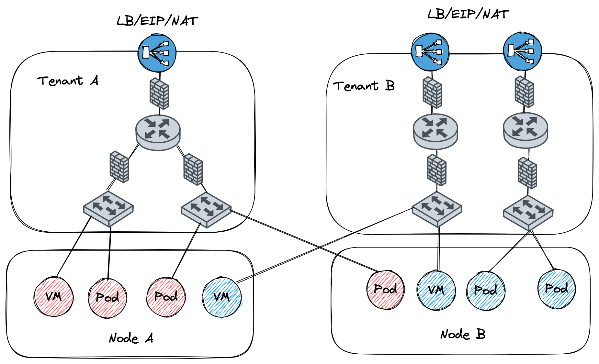

# 子网使用

子网是 Kube-OVN 中的一个核心概念和基本使用单元，Kube-OVN 会以子网来组织 IP 和网络配置，每个 Namespace 可以归属于特定的子网，
Namespace 下的 Pod 会自动从所属的子网中获取 IP 并共享子网的网络配置（CIDR，网关类型，访问控制，NAT控制等）。

和其他 CNI 的每个节点绑定一个子网的实现不同，在 Kube-OVN 中子网为一个全局的虚拟网络配置，同一个子网的地址可以分布在任意一个节点上。



Overlay 和 Underlay 的子网在使用和配置上存在一些差异，本文档将会介绍不同类型子网的一些共同配置和差异化功能。

## 默认子网

为了方便用户的快速上手使用，Kube-OVN 内置了一个默认子网，所有未显式声明子网归属的 Namespace 会自动从默认子网中分配 IP，
并使用默认子网的网络信息。该子网的配置为安装时指定，可以参考[内置网络设置](setup-options.md#_2)，
如果要在安装后修改默认网络的 CIDR 请参考[修改默认网络](../ops/change-default-subnet.md)

在 Overlay 模式下，默认子网使用了分布式网关并对出网流量进行 NAT 转换，其行为和 Flannel 的默认行为基本一致，
用户无需额外的配置即可使用到大部分的网络功能。

在 Underlay 模式下，默认子网使用物理网关作为出网网关，并开启 arping 检查网络连通性。

### 查看默认子网
默认子网 spec 中的 default 字段为 true，一个集群下只有一个默认子网，默认名为 `ovn-default`。

查看默认子网：
```bash
[root@node2 ~]# kubectl get subnet ovn-default -o yaml
apiVersion: kubeovn.io/v1
kind: Subnet
metadata:
  creationTimestamp: "2019-08-06T09:33:43Z"
  generation: 1
  name: ovn-default
  resourceVersion: "1571334"
  selfLink: /apis/kubeovn.io/v1/subnets/ovn-default
  uid: 7e2451f8-fb44-4f7f-b3e0-cfd27f6fd5d6
spec:
  cidrBlock: 10.16.0.0/16
  default: true
  excludeIps:
  - 10.16.0.1
  gateway: 10.16.0.1
  gatewayType: distributed
  natOutgoing: true
  private: false
  protocol: IPv4
```

## Node 子网

在 Kubernetes 的网络规范中，要求 Node 可以和所有的 Pod 直接通信。
为了在 Overlay 网络模式下达到这个目的， Kube-OVN 创建了一个 join 子网，
并在每个 Node 节点创建了一块虚拟网卡 ovn0 接入 join 子网，通过该网络完成节点和 Pod 之间的网络互通。

该子网的配置为安装时指定，可以参考[内置网络设置](setup-options.md#_2)，如果要在安装后修改
join 子网的 CIDR 请参考[修改 Join 希望](../ops/change-join-subnet.md)

### 查看 Node 子网

该子网默认名为 `join` 一般无需对该子网 CIDR 外的其他网络配置进行修改

```bash
[root@node2 yamls]# kubectl get subnet join -o yaml
apiVersion: kubeovn.io/v1
kind: Subnet
metadata:
  creationTimestamp: "2019-08-06T09:33:43Z"
  generation: 1
  name: join
  resourceVersion: "1571333"
  selfLink: /apis/kubeovn.io/v1/subnets/join
  uid: 9c744810-c678-4d50-8a7d-b8ec12ef91b8
spec:
  cidrBlock: 100.64.0.0/16
  default: false
  excludeIps:
  - 100.64.0.1
  gateway: 100.64.0.1
  gatewayNode: ""
  gatewayType: ""
  natOutgoing: false
  private: false
  protocol: IPv4
```
在 node 节点查看 ovn0 网卡

```bash
[root@node2 yamls]# ifconfig ovn0
ovn0: flags=4163<UP,BROADCAST,RUNNING,MULTICAST>  mtu 1420
        inet 100.64.0.4  netmask 255.255.0.0  broadcast 100.64.255.255
        inet6 fe80::800:ff:fe40:5  prefixlen 64  scopeid 0x20<link>
        ether 0a:00:00:40:00:05  txqueuelen 1000  (Ethernet)
        RX packets 18  bytes 1428 (1.3 KiB)
        RX errors 0  dropped 0  overruns 0  frame 0
        TX packets 19  bytes 1810 (1.7 KiB)
        TX errors 0  dropped 0 overruns 0  carrier 0  collisions 0
```

## 创建自定义子网

这里我们介绍创建一个子网，并将其和某个 Namespace 做关联的基本操作，更多高级配置请参考后续内容

### 创建子网

```bash
cat <<EOF | kubectl create -f -
apiVersion: kubeovn.io/v1
kind: Subnet
metadata:
  name: subnet1
spec:
  cidrBlock: 10.66.0.0/16
  excludeIps:
  - 10.66.0.1..10.66.0.10
  - 10.66.0.101..10.66.0.151
  gateway: 10.66.0.1
  namespaces:
  - ns1
  - ns2
EOF
```

- `cidrBlock`: 子网 CIDR 范围，同一个 VPC 下的不同 Subnet CIDR 不能重叠
- `excludeIps`: 保留地址列表，容器网络将不会自动分配列表内的地址，可用做固定 IP 地址分配段，也可在 Underlay 模式下避免和物理网络中已有设备冲突
- `gateway`：该子网网关地址，Overlay 模式下 Kube-OVN 会自动分配对应的逻辑网关，Underlay 模式下该地址需为底层物理网关地址
- `namespaces`: 绑定该子网的 Namespace 列表。绑定后

### 验证子网绑定生效

```bash
[root@node2 yamls]# kubectl create ns ls1
namespace/ls1 created

[root@node2 yamls]# kubectl run nginx --image=nginx:alpine -n ls1
deployment.apps/nginx created

[root@node2 yamls]# kubectl get pod -n ls1 -o wide
NAME                     READY   STATUS    RESTARTS   AGE   IP           NODE    NOMINATED NODE   READINESS GATES
nginx-74d5899f46-n8wtg   1/1     Running   0          10s   10.66.0.11   node1   <none>           <none>
```

## Overlay 子网网关配置

## 子网 ACL 设置

## 子网隔离设置

## DHCP 选项

## Underlay 逻辑网关设置

## 外部网关设置

## 网关检查设置

## 集群互联设置

## VIP 设置

## 其他高级设置

- [QoS 设置](./qos.md)
- [多网络管理，通用 CNI IPAM 管理](../advance/multi-nic.md)
