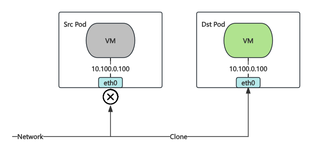

# Live Migration

In virtual machine usage scenarios, live migration allows a virtual machine to be moved from one node to another for operations such as node maintenance, upgrades, and failover.

KubeVirt faces the following challenges during live migration:

- KubeVirt does not support live migration of virtual machines using bridge network mode by default.
- KubeVirt only handles memory and disk migration without specific optimizations for network migration.
- If the virtual machine's IP changes during migration, it cannot achieve a seamless live migration.
- If the network is interrupted during migration, it cannot achieve a seamless live migration.

Kube-OVN specifically addresses the above issues during the virtual machine migration process, allowing users to perform network-transparent live migrations. Our tests show that network interruption time can be controlled within 0.5 seconds, and TCP connections remain uninterrupted.

## Usage

Users only need to add the annotation `kubevirt.io/allow-pod-bridge-network-live-migration: "true"` in the VM Spec. Kube-OVN will automatically handle network migration during the process.

1. **Create VM**

    ```bash
    kubectl apply -f - <<EOF
    apiVersion: kubevirt.io/v1
    kind: VirtualMachine
    metadata:
      name: testvm
    spec:
      runStrategy: Always 
      template:
        metadata:
          labels:
            kubevirt.io/size: small
            kubevirt.io/domain: testvm
          annotations:
            kubevirt.io/allow-pod-bridge-network-live-migration: "true"
        spec:
          domain:
            devices:
              disks:
                - name: containerdisk
                  disk:
                    bus: virtio
                - name: cloudinitdisk
                  disk:
                    bus: virtio
              interfaces:
              - name: default
                bridge: {}
            resources:
              requests:
                memory: 64M
          networks:
          - name: default
            pod: {}
          volumes:
            - name: containerdisk
              containerDisk:
                image: quay.io/kubevirt/cirros-container-disk-demo
            - name: cloudinitdisk
              cloudInitNoCloud:
                userDataBase64: SGkuXG4=
    EOF
    ```

2. **SSH into the Virtual Machine and Test Network Connectivity**

    ```bash
    # password: gocubsgo
    virtctl ssh cirros@testvm
    ping 8.8.8.8
    ```

3. **Perform Migration in Another Terminal and Observe Virtual Machine Network Connectivity**

    ```bash
    virtctl migrate testvm
    ```

It can be observed that during the VM live migration process, the SSH connection remains uninterrupted, and ping only experiences packet loss in a few instances.

## Live Migration Principles

During the live migration process, Kube-OVN implements techniques inspired by the Red Hat team's [Live migration - Reducing downtime with multi-chassis port bindings](https://www.openvswitch.org/support/ovscon2022/slides/Live-migration-with-OVN.pdf).

To ensure network consistency between the source and target virtual machines during migration, the same IP address exists on the network for both the source and target VMs. This requires handling network conflicts and traffic confusion. The specific steps are as follows:

1. KubeVirt initiates the migration and creates the corresponding Pod on the target machine.

   

2. Kube-OVN detects that the Pod is the target Pod for a live migration and reuses the network port information from the source Pod.

   

3. Kube-OVN sets up traffic replication, so network traffic will be copied to both the source Pod and the target Pod. This helps reduce the interruption time caused by control plane switch during network migration. The network port of the target Pod is temporarily disabled, so the target Pod will not actually receive the replicated traffic, avoiding traffic confusion.

   

4. KubeVirt synchronizes the VM memory.

   

5. KubeVirt completes the memory synchronization and deactivates the source Pod. At this point, the source Pod will not handle network traffic.

   

6. KubeVirt activates the target Pod. At this point, libvirt sends a RARP to activate the network port of the target Pod, and the target Pod starts processing traffic.

   

7. KubeVirt deletes the source Pod, completing the live migration. Kube-OVN listens for the migration completion event through the Watch Migration CR and stops traffic replication after the migration is finished.

   

In this process, the network interruption mainly occurs between steps 5 and 6. The network interruption time primarily depends on the time it takes for libvirt to send the RARP. Tests show that the network interruption time can be controlled within 0.5 seconds, and TCP connections will not experience interruptions due to the retry mechanism.
