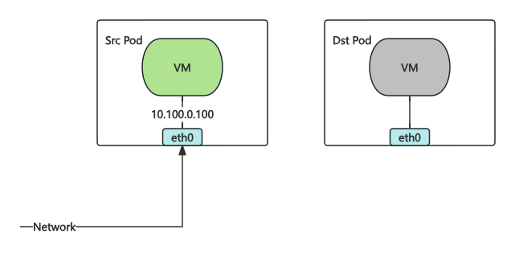
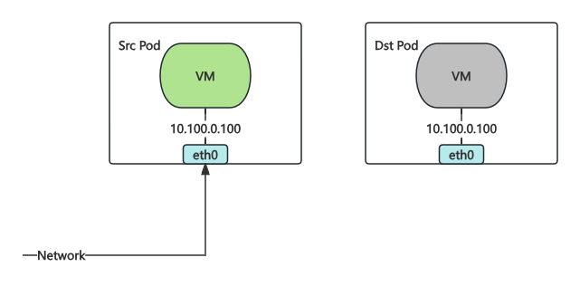
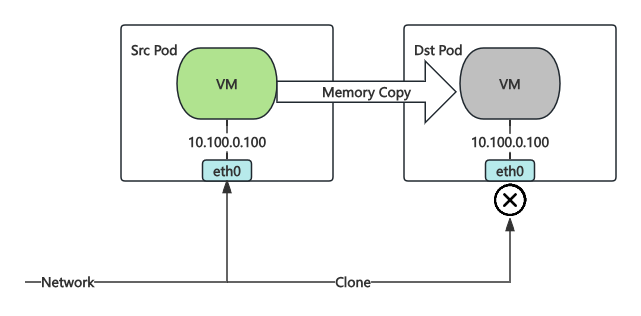
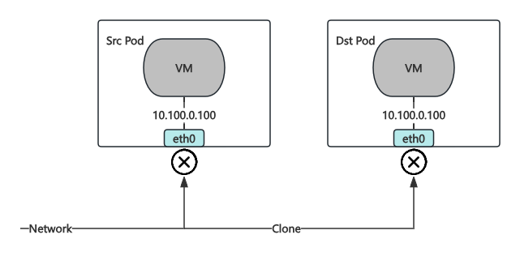
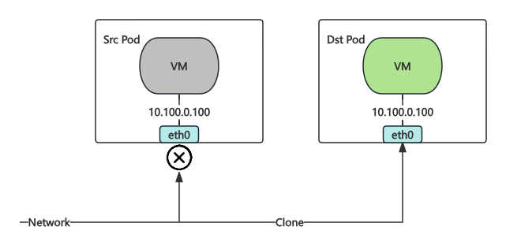
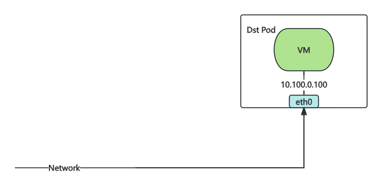

# 热迁移

在虚拟机的使用场景下，热迁移可以将虚拟机从一个节点迁移到另一个节点，以便进行节点维护、升级、故障转移等操作。

KubeVirt 在热迁移过程中面临如下几个挑战：

- KubeVirt 默认不支持 Bridge 网络模式虚拟机进行热迁移
- KubeVirt 本身只进行内存和磁盘的迁移，并没有针对网络迁移进行特定优化
- 迁移过程中若虚拟机 IP 发生变化则无法达到热迁移无感知的效果
- 迁移过程中若网络发生中断，则无法达到热迁移无感知的效果

Kube-OVN 通过在虚拟机迁移过程中针对上述问题进行了专门的处理，用户可以实现在网络方面无感知的热迁移，经我们测试网络的中断时间可以控制在 0.5 秒以内，且不会出现 TCP 连接中断。

## 使用方式

用户只需在 VM Spec 中添加 `kubevirt.io/allow-pod-bridge-network-live-migration: "true"` 的 annotation，Kube-OVN 会自动在迁移过程中对网络进行迁移。

1. 创建 VM

  ```bash
  kubectl apply -f - <<EOF
  apiVersion: kubevirt.io/v1
  kind: VirtualMachine
  metadata:
    name: testvm
  spec:
    runStrategy: Always 
    template:
      metadata:
        labels:
          kubevirt.io/size: small
          kubevirt.io/domain: testvm
        annotations:
          kubevirt.io/allow-pod-bridge-network-live-migration: "true"
      spec:
        domain:
          devices:
            disks:
              - name: containerdisk
                disk:
                  bus: virtio
              - name: cloudinitdisk
                disk:
                  bus: virtio
            interfaces:
            - name: default
              bridge: {}
          resources:
            requests:
              memory: 64M
        networks:
        - name: default
          pod: {}
        volumes:
          - name: containerdisk
            containerDisk:
              image: quay.io/kubevirt/cirros-container-disk-demo
          - name: cloudinitdisk
            cloudInitNoCloud:
              userDataBase64: SGkuXG4=
  EOF
  ```

2. SSH 进入虚拟机，测试网络连通性

  ```bash
  # password: gocubsgo
  virtctl ssh cirros@testvm
  ping 8.8.8.8
  ```

3. 在另一个终端执行迁移，并观察虚拟机网络连通性

  ```bash
  virtctl migrate testvm
  ```

可观测到在 VM 热迁移过程中 SSH 连接不会中断，且 ping 只会在少量情况下出现丢包。

## 热迁移原理

Kube-OVN 在热迁移的过程中实现借鉴了来自红帽团队的[Live migration - Reducing downtime with multchassis port bindings](https://www.openvswitch.org/support/ovscon2022/slides/Live-migration-with-OVN.pdf)
在热迁移过程中为了保证源虚拟机和目标虚拟机的网络一致，在迁移过程中网络中会同时存在两个相同的 IP 地址，在这个过程中需要处理网络冲突和流量混乱。具体步骤如下：

1. KubeVirt 发起迁移，并在目标机器创建对应的 Pod。

  

2. Kube-OVN 检测到该 Pod 为热迁移的目标 Pod，复用源 Pod 的网络端口信息。

  

3. Kube-OVN 设置流量复制，此时网络流量会同时复制到源 Pod 和目标 Pod，以减少网络切换时控制平面切换带来的中断时间，同时将目标 Pod 的网络端口暂时停用，因此目标 Pod 不会真正接受到复制的流量，避免流量混乱。
  
  

4. KubeVirt 进行 VM 内存同步。

  

5. KubeVirt 完成内存的同步，deactive 源 Pod，此时源 Pod 将不会处理网络流量。

  

6. KubeVirt 激活目标 Pod，此时 libvirt 会发送 RARP 从而激活目标 Pod 的网络端口，目标 Pod 开始流量处理。

  

7. KubeVirt 删除源 Pod，完成热迁移，Kube-OVN 通过 Watch Migration CR 来监听迁移完成事件，迁移完成后关闭流量复制。

  
  
这个过程中网络中断主要发生在步骤 5 和步骤 6 之间，网络中断时间主要取决于 libvirt 的 RARP 发送时间，经测试网络中断时间可以控制在 0.5 秒以内，且 TCP 连接由于有重试机制不会出现中断。
