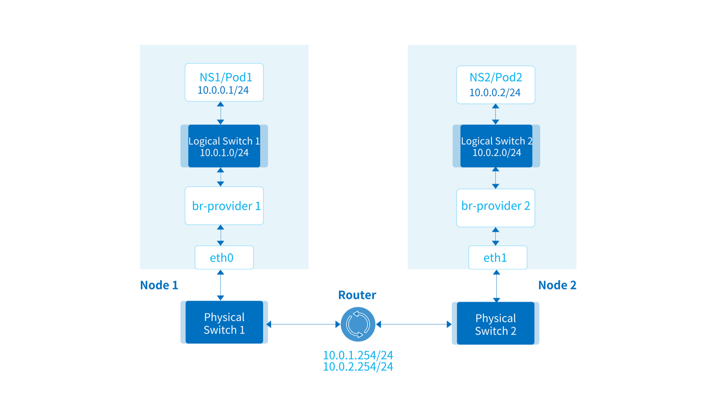
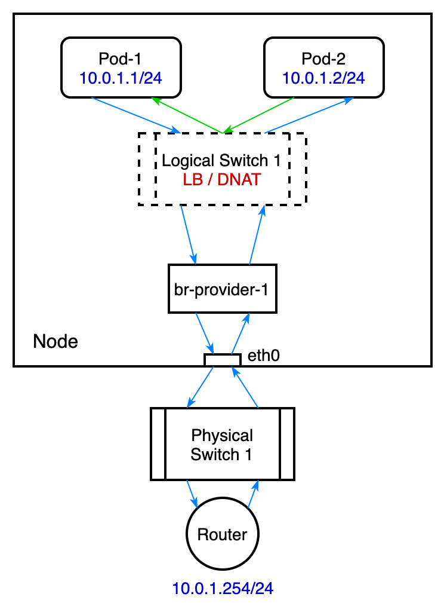

# Underlay Traffic Topology

This document describes the forwarding path of traffic in Underlay mode under different scenarios.

## Pods in Same Node and Same Subnet

Internal logical switches exchange packets directly, without access to the external network.

## Pods in Different Nodes and Same Subnet

Packets enter the physical switch via the node NIC and are exchanged by the physical switch.

## Pods in Same Node and Different Subnets

Packets enter the physical network via the node NIC and are exchanged and routed and forwarded by physical switches and routers.

> Here br-provider-1 and br-provider-2 can be the same OVS bridge,multiple subnet can share a Provider Network.

## Pods in Different Nodes and Different Subnets

Packets enter the physical network via the node NIC and are exchanged and routed and forwarded by physical switches and routers.

## Access to External

Packets enter the physical network via the node NIC and are exchanged and routed and forwarded by physical switches and routers.

> The communication between nodes and Pods follows the same logic.

## Overview without Vlan Tag

## Overview with Vlan Tag

## Pod visit Service IP

Kube-OVN configures load balancing for each Kubernetes Service on a logical switch on each subnet.
When a Pod accesses other Pods by accessing the Service IP, a network packet is constructed with the Service IP as
the destination address and the MAC address of the gateway as the destination MAC address.
After the network packet enters the logical switch, load balancing will intercept and DNAT the network packet to modify
the destination IP and port to the IP and port of one of the Endpoint corresponding to the Service.
Since the logical switch does not modify the Layer 2 destination MAC address of the network packet,
the network packet will still be delivered to the physical gateway after entering the physical switch,
and the physical gateway will be required to forward the network packet.

### Service Backend is the Same Node and Same Subnet Pod

### Service Backend is the Same Node and Different Subnets Pod

