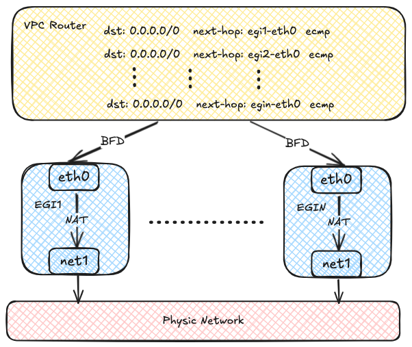

# VPC Egress Gateway

**VPC Egress Gateway** is used to control external network access for Pods within a VPC (including the default VPC) with a group of static addresses and has the following features:

- Achieves Active-Active high availability through ECMP, enabling horizontal throughput scaling
- Implements fast failover (<1s) via BFD
- Supports IPv6 and dual-stack
- Enables granular routing control through `NamespaceSelector` and `PodSelector`
- Allows flexible scheduling of Egress Gateway through `NodeSelector`

At the same time, VPC Egress Gateway has the following limitations:

- Uses macvlan for underlying network connectivity, requiring [Underlay support](../start/underlay.en.md#environment-requirements) from the underlying network
- In multi-instance Gateway mode, multiple Egress IPs are required
- Currently, only supports SNAT; EIP and DNAT are not supported
- Currently, recording source address translation relationships is not supported

Here's the English translation of the provided text:

## Implementation Details

Each Egress Gateway consists of multiple Pods with multiple network interfaces. Each Pod has two network interfaces: one joins the virtual network for communication within the VPC, and the other connects to the underlying physical network via Macvlan for external network communication. Virtual network traffic ultimately accesses the external network through NAT within the Egress Gateway instances.


Each Egress Gateway instance registers its address in the OVN routing table. When a Pod within the VPC needs to access external network, OVN uses source address hashing to forward traffic to multiple Egress Gateway instance addresses, achieving load balancing. As the number of Egress Gateway instances increases, throughput can also scale horizontally.



OVN uses the BFD protocol to probe multiple Egress Gateway instances. When an Egress Gateway instance fails, OVN marks the corresponding route as unavailable, enabling rapid failure detection and recovery.


## Requirements

The VPC Egress Gateway is the same as the VPC NAT Gateway in that it requires [Multus-CNI](https://github.com/k8snetworkplumbingwg/multus-cni/blob/master/docs/quickstart.md){: target = "_blank" }.

> No ConfigMap needs to be configured to use VPC Egress Gateway.

## Usage

### Creating a Network Attachment Definition

The VPC Egress Gateway uses multiple NICs to access both the VPC and the external network, so you need to create a Network Attachment Definition to connect to the external network. An example of using the `macvlan` plugin with IPAM provided by Kube-OVN is shown below:

```yaml
apiVersion: k8s.cni.cncf.io/v1
kind: NetworkAttachmentDefinition
metadata:
  name: eth1
  namespace: default
spec:
  config: '{
      "cniVersion": "0.3.0",
      "type": "macvlan",
      "master": "eth1",
      "mode": "bridge",
      "ipam": {
        "type": "kube-ovn",
        "server_socket": "/run/openvswitch/kube-ovn-daemon.sock",
        "provider": "eth1.default"
      }
    }'
---
apiVersion: kubeovn.io/v1
kind: Subnet
metadata:
  name: macvlan1
spec:
  protocol: IPv4
  provider: eth1.default
  cidrBlock: 172.17.0.0/16
  gateway: 172.17.0.1
  excludeIps:
    - 172.17.0.0..172.17.0.10
```

> You can create a Network Attachment Definition with any CNI plugin to access the corresponding network.

For details on how to use multi-nic, please refer to [Manage Multiple Interface](../advance/multi-nic.en.md).

### Creating a VPC Egress Gateway

Create a VPC Egress Gateway resource as shown in the example below:

```yaml
apiVersion: kubeovn.io/v1
kind: VpcEgressGateway
metadata:
  name: gateway1
  namespace: default
spec:
  vpc: ovn-cluster
  replicas: 1
  externalSubnet: macvlan1
  policies:
    - snat: true
      subnets:
        - ovn-default
```

The above resource creates a VPC Egress Gateway named gateway1 for VPC `ovn-cluster` under the default namespace, and all Pods under the `ovn-default` subnet (10.16.0.0/16) within `ovn-cluster` VPC will access the external network via the `macvlan1` subnet with SNAT applied.

After the creation is complete, check out the VPC Egress Gateway resource:

```shell
$ kubectl get veg gateway1
NAME       VPC           REPLICAS   BFD ENABLED   EXTERNAL SUBNET   PHASE       READY   AGE
gateway1   ovn-cluster   1          false         macvlan1          Completed   true    13s
```

To view more informations:

```shell
kubectl get veg gateway1 -o wide
NAME       VPC           REPLICAS   BFD ENABLED   EXTERNAL SUBNET   PHASE       READY   INTERNAL IPS     EXTERNAL IPS      WORKING NODES         AGE
gateway1   ovn-cluster   1          false         macvlan1          Completed   true    ["10.16.0.12"]   ["172.17.0.11"]   ["kube-ovn-worker"]   82s
```

To view the workload:

```shell
$ kubectl get deployment -l ovn.kubernetes.io/vpc-egress-gateway=gateway1
NAME       READY   UP-TO-DATE   AVAILABLE   AGE
gateway1   1/1     1            1           4m40s

$ kubectl get pod -l ovn.kubernetes.io/vpc-egress-gateway=gateway1 -o wide
NAME                       READY   STATUS    RESTARTS   AGE     IP           NODE              NOMINATED NODE   READINESS GATES
gateway1-b9f8b4448-76lhm   1/1     Running   0          4m48s   10.16.0.12   kube-ovn-worker   <none>           <none>
```

To view IP addresses, routes, and iptables rules in the Pod:

```shell
$ kubectl exec gateway1-b9f8b4448-76lhm -c gateway -- ip address show
1: lo: <LOOPBACK,UP,LOWER_UP> mtu 65536 qdisc noqueue state UNKNOWN group default qlen 1000
    link/loopback 00:00:00:00:00:00 brd 00:00:00:00:00:00
    inet 127.0.0.1/8 scope host lo
       valid_lft forever preferred_lft forever
    inet6 ::1/128 scope host
       valid_lft forever preferred_lft forever
2: net1@if13: <BROADCAST,MULTICAST,UP,LOWER_UP> mtu 1500 qdisc noqueue state UP group default qlen 1000
    link/ether 62:d8:71:90:7b:86 brd ff:ff:ff:ff:ff:ff link-netnsid 0
    inet 172.17.0.11/16 brd 172.17.255.255 scope global net1
       valid_lft forever preferred_lft forever
    inet6 fe80::60d8:71ff:fe90:7b86/64 scope link
       valid_lft forever preferred_lft forever
17: eth0@if18: <BROADCAST,MULTICAST,UP,LOWER_UP> mtu 1400 qdisc noqueue state UP group default
    link/ether 36:7c:6b:c7:82:6b brd ff:ff:ff:ff:ff:ff link-netnsid 0
    inet 10.16.0.12/16 brd 10.16.255.255 scope global eth0
       valid_lft forever preferred_lft forever
    inet6 fe80::347c:6bff:fec7:826b/64 scope link
       valid_lft forever preferred_lft forever

$ kubectl exec gateway1-b9f8b4448-76lhm -c gateway -- ip route show
default via 172.17.0.1 dev net1
10.16.0.0/16 dev eth0 proto kernel scope link src 10.16.0.12
172.17.0.0/16 dev net1 proto kernel scope link src 172.17.0.11

$ kubectl exec gateway1-b9f8b4448-76lhm -c gateway -- iptables -t nat -S
-P PREROUTING ACCEPT
-P INPUT ACCEPT
-P OUTPUT ACCEPT
-P POSTROUTING ACCEPT
-A POSTROUTING -s 10.16.0.0/16 -j MASQUERADE --random-fully
```

Capture packets in the Gateway Pod to verify network traffic:

```shell
$ kubectl exec -ti gateway1-b9f8b4448-76lhm -c gateway -- bash
nobody@gateway1-b9f8b4448-76lhm:/kube-ovn$ tcpdump -i any -nnve icmp and host 172.17.0.1
tcpdump: data link type LINUX_SLL2
tcpdump: listening on any, link-type LINUX_SLL2 (Linux cooked v2), snapshot length 262144 bytes
06:50:58.936528 eth0  In  ifindex 17 92:26:b8:9e:f2:1c ethertype IPv4 (0x0800), length 104: (tos 0x0, ttl 63, id 30481, offset 0, flags [DF], proto ICMP (1), length 84)
    10.16.0.9 > 172.17.0.1: ICMP echo request, id 37989, seq 0, length 64
06:50:58.936574 net1  Out ifindex 2 62:d8:71:90:7b:86 ethertype IPv4 (0x0800), length 104: (tos 0x0, ttl 62, id 30481, offset 0, flags [DF], proto ICMP (1), length 84)
    172.17.0.11 > 172.17.0.1: ICMP echo request, id 39449, seq 0, length 64
06:50:58.936613 net1  In  ifindex 2 02:42:39:79:7f:08 ethertype IPv4 (0x0800), length 104: (tos 0x0, ttl 64, id 26701, offset 0, flags [none], proto ICMP (1), length 84)
    172.17.0.1 > 172.17.0.11: ICMP echo reply, id 39449, seq 0, length 64
06:50:58.936621 eth0  Out ifindex 17 36:7c:6b:c7:82:6b ethertype IPv4 (0x0800), length 104: (tos 0x0, ttl 63, id 26701, offset 0, flags [none], proto ICMP (1), length 84)
    172.17.0.1 > 10.16.0.9: ICMP echo reply, id 37989, seq 0, length 64
```

Routing policies (static routes for custom VPCs) are automatically created on the OVN Logical Router:

```shell
$ kubectl ko nbctl lr-policy-list ovn-cluster
Routing Policies
     31000                            ip4.dst == 10.16.0.0/16           allow
     31000                           ip4.dst == 100.64.0.0/16           allow
     30000                              ip4.dst == 172.18.0.2         reroute                100.64.0.3
     30000                              ip4.dst == 172.18.0.3         reroute                100.64.0.2
     30000                              ip4.dst == 172.18.0.4         reroute                100.64.0.4
     29100                            ip4.src == 10.16.0.0/16         reroute                10.16.0.12
     29000 ip4.src == $ovn.default.kube.ovn.control.plane_ip4         reroute                100.64.0.2
     29000       ip4.src == $ovn.default.kube.ovn.worker2_ip4         reroute                100.64.0.4
     29000        ip4.src == $ovn.default.kube.ovn.worker_ip4         reroute                100.64.0.3
```

If you need to enable load balancing, modify `.spec.replicas` as shown in the following example:

```shell
$ kubectl scale veg gateway1 --replicas=2
vpcegressgateway.kubeovn.io/gateway1 scaled

$ kubectl get veg gateway1
NAME       VPC           REPLICAS   BFD ENABLED   EXTERNAL SUBNET   PHASE       READY   AGE
gateway1   ovn-cluster   2          false         macvlan           Completed   true    39m

$ kubectl get pod -l ovn.kubernetes.io/vpc-egress-gateway=gateway1 -o wide
NAME                       READY   STATUS    RESTARTS   AGE   IP           NODE               NOMINATED NODE   READINESS GATES
gateway1-b9f8b4448-76lhm   1/1     Running   0          40m   10.16.0.12   kube-ovn-worker    <none>           <none>
gateway1-b9f8b4448-zd4dl   1/1     Running   0          64s   10.16.0.13   kube-ovn-worker2   <none>           <none>

$ kubectl ko nbctl lr-policy-list ovn-cluster
Routing Policies
     31000                            ip4.dst == 10.16.0.0/16           allow
     31000                           ip4.dst == 100.64.0.0/16           allow
     30000                              ip4.dst == 172.18.0.2         reroute                100.64.0.3
     30000                              ip4.dst == 172.18.0.3         reroute                100.64.0.2
     30000                              ip4.dst == 172.18.0.4         reroute                100.64.0.4
     29100                            ip4.src == 10.16.0.0/16         reroute                10.16.0.12, 10.16.0.13
     29000 ip4.src == $ovn.default.kube.ovn.control.plane_ip4         reroute                100.64.0.2
     29000       ip4.src == $ovn.default.kube.ovn.worker2_ip4         reroute                100.64.0.4
     29000        ip4.src == $ovn.default.kube.ovn.worker_ip4         reroute                100.64.0.3
```

### Enabling BFD-based High Availability

BFD-based high availability relies on the VPC BFD LRP function, so you need to modify the VPC resource to enable BFD Port. Here is an example:

```yaml
apiVersion: kubeovn.io/v1
kind: Vpc
metadata:
  name: vpc1
spec:
  bfdPort:
    enabled: true
    ip: 10.255.255.255
---
apiVersion: kubeovn.io/v1
kind: Subnet
metadata:
  name: subnet1
spec:
  vpc: vpc1
  protocol: IPv4
  cidrBlock: 192.168.0.0/24
```

After the BFD Port is enabled, an LRP dedicated to BFD is automatically created on the corresponding OVN LR:

```shell
$ kubectl ko nbctl show vpc1
router 0c1d1e8f-4c86-4d96-88b2-c4171c7ff824 (vpc1)
    port bfd@vpc1
        mac: "8e:51:4b:16:3c:90"
        networks: ["10.255.255.255"]
    port vpc1-subnet1
        mac: "de:c9:5c:38:7a:61"
        networks: ["192.168.0.1/24"]
```

After that, set `.spec.bfd.enabled` to `true` in VPC Egress Gateway. An example is shown below:

```yaml
apiVersion: kubeovn.io/v1
kind: VpcEgressGateway
metadata:
  name: gateway2
  namespace: default
spec:
  vpc: vpc1
  replicas: 2
  internalSubnet: subnet1
  externalSubnet: macvlan
  bfd:
    enabled: true
  policies:
    - snat: true
      ipBlocks:
        - 192.168.0.0/24
```

To view VPC Egress Gateway information:

```shell
$ kubectl get veg gateway2 -o wide
NAME       VPC    REPLICAS   BFD ENABLED   EXTERNAL SUBNET   PHASE       READY   INTERNAL IPS                    EXTERNAL IPS                    WORKING NODES                            AGE
gateway2   vpc1   2          true          macvlan           Completed   true    ["192.168.0.2","192.168.0.3"]   ["172.17.0.13","172.17.0.14"]   ["kube-ovn-worker","kube-ovn-worker2"]   58s

$ kubectl get pod -l ovn.kubernetes.io/vpc-egress-gateway=gateway2 -o wide
NAME                       READY   STATUS    RESTARTS   AGE     IP            NODE               NOMINATED NODE   READINESS GATES
gateway2-fcc6b8b87-8lgvx   1/1     Running   0          2m18s   192.168.0.3   kube-ovn-worker2   <none>           <none>
gateway2-fcc6b8b87-wmww6   1/1     Running   0          2m18s   192.168.0.2   kube-ovn-worker    <none>           <none>

$ kubectl ko nbctl lr-route-list vpc1
IPv4 Routes
Route Table <main>:
           192.168.0.0/24               192.168.0.2 src-ip ecmp ecmp-symmetric-reply bfd
           192.168.0.0/24               192.168.0.3 src-ip ecmp ecmp-symmetric-reply bfd

$ kubectl ko nbctl list bfd
_uuid               : 223ede10-9169-4c7d-9524-a546e24bfab5
detect_mult         : 3
dst_ip              : "192.168.0.2"
external_ids        : {af="4", vendor=kube-ovn, vpc-egress-gateway="default/gateway2"}
logical_port        : "bfd@vpc1"
min_rx              : 1000
min_tx              : 1000
options             : {}
status              : up

_uuid               : b050c75e-2462-470b-b89c-7bd38889b758
detect_mult         : 3
dst_ip              : "192.168.0.3"
external_ids        : {af="4", vendor=kube-ovn, vpc-egress-gateway="default/gateway2"}
logical_port        : "bfd@vpc1"
min_rx              : 1000
min_tx              : 1000
options             : {}
status              : up
```

To view BFD connections:

```shell
$ kubectl exec gateway2-fcc6b8b87-8lgvx -c bfdd -- bfdd-control status
There are 1 sessions:
Session 1
 id=1 local=192.168.0.3 (p) remote=10.255.255.255 state=Up

$ kubectl exec gateway2-fcc6b8b87-wmww6 -c bfdd -- bfdd-control status
There are 1 sessions:
Session 1
 id=1 local=192.168.0.2 (p) remote=10.255.255.255 state=Up
```

### Configuration Parameters

#### VPC BFD Port

| Fields | Type | Optional | Default Value | Description | Example |
| :--- | :--- | :--- | :--- | :--- | :--- |
| `enabled` | `boolean` | Yes | `false` | Whether to enable the BFD Port. | `true` |
| `ip` | `string` | No | - | The IP address used by the BFD Port. Must NOT conflict with other addresses. IPv4, IPv6 and dual-stack are supported. | `169.255.255.255` / `fdff::1` / `169.255.255.255,fdff::1` |
| `nodeSelector` | `object` | Yes | - | Label selector used to select nodes that carries the BFD Port work. the BFD Port binds an OVN HA Chassis Group of selected nodes and works in Active/Backup mode. If this field is not specified, Kube-OVN automatically selects up to three nodes. You can view all OVN HA Chassis Group resources by executing `kubectl ko nbctl list ha_chassis_group`. | - |
| `nodeSelector.matchLabels` | `dict/map` | Yes | - | A map of {key,value} pairs. | - |
| `nodeSelector.matchExpressions` | `object array` | Yes | - | A list of label selector requirements. The requirements are ANDed. | - |

#### VPC Egress Gateway

Spec:

| Fields | Type | Optional | Default Value | Description | Example |
| :--- | :--- | :--- | :--- | :--- | :--- |
| `vpc` | `string` | Yes | Name of the default VPC (ovn-cluster) | VPC name. | `vpc1` |
| `replicas` | `integer/int32` | Yes | `1` | Replicas. | `2` |
| `prefix` | `string` | Yes | - | Prefix of the workload deployment name. This field is immutable. | `veg-` |
| `image` | `string` | Yes | - | The image used by the workload deployment. | `docker.io/kubeovn/kube-ovn:v1.14.0-debug` |
| `internalSubnet` | `string` | Yes | Name of the default subnet within the VPC. | Name of the subnet used to access the VPC network. | `subnet1` |
| `externalSubnet` | `string` | No | - | Name of the subnet used to access the external network. | `ext1` |
| `internalIPs` | `string array` | Yes | - | IP addresses used for accessing the VPC network. IPv4, IPv6 and dual-stack are supported. The number of IPs specified must NOT be less than `replicas`. It is recommended to set the number to `<replicas> + 1` to avoid extreme cases where the Pod is not created properly. | `10.16.0.101` / `fd00::11` / `10.16.0.101,fd00::11` |
| `externalIPs` | `string array` | Yes | - | IP addresses used for accessing the external network. IPv4, IPv6 and dual-stack are supported. The number of IPs specified must NOT be less than `replicas`. It is recommended to set the number to `<replicas> + 1` to avoid extreme cases where the Pod is not created properly. | `10.16.0.101` / `fd00::11` / `10.16.0.101,fd00::11` |
| `bfd` | `object` | Yes | - | BFD Configuration.| - |
| `policies` | `object array` | Yes | - | Egress policies. Configurable when `selectors` is configured. | - |
| `selectors` | `object array` | Yes | - | Configure Egress policies by namespace selectors and Pod selectors. SNAT/MASQUERADE will be applied to the matched Pods. Configurable when `policies` is configured. | - |
| `nodeSelector` | `object array` | Yes | - | Node selector applied to the workload. The workload (Deployment/Pod) will run on the selected nodes. | - |
| `trafficPolicy` | `string` | Yes | `Cluster` | Available values: `Cluster`/`Local`. **Effective only when BFD is enabled**. When set to `Local`, Egress traffic will be redirected to the VPC Egress Gateway instance running on the same node if available. If the instance is down, Egress traffic will be redirected to other instances. | `Local` |

BFD Configuration:

| Fields | Type | Optional | Default Value | Description | Example |
| :--- | :--- | :--- | :--- | :--- | :--- |
| `enabled` | `boolean` | Yes | `false` | Whether to enable BFD. | `true` |
| `minRX` | `integer/int32` | Yes | `1000` |  BFD minRX in milliseconds. | `500` |
| `minTX` | `integer/int32` | Yes | `1000` | BFD minTX in milliseconds.  | `500` |
| `multiplier` | `integer/int32` | Yes | `3` | BFD multiplier. | `1` |

Egress Policies:

| Fields | Type | Optional | Default Value | Description | Example |
| :--- | :--- | :--- | :--- | :--- | :--- |
| `snat` | `boolean` | Yes | `false` | Whether to enable SNAT/MASQUERADE. | `true` |
| `ipBlocks` | `string array` | Yes | - | IP range segments applied to this Gateway. Both IPv4 and IPv6 are supported. | `192.168.0.1` / `192.168.0.0/24` |
| `subnets` | `string array` | Yes | - | The VPC subnet name applied to this Gateway. IPv4, IPv6 and dual-stack subnets are supported. | `subnet1` |

Selectors:

| Fields | Type | Optional | Default Value | Description | Example |
| :--- | :--- | :--- | :--- | :--- | :--- |
| `namespaceSelector` | `object` | Yes | - | Namespace selector. An empty label selector matches all namespaces. | - |
| `namespaceSelector.matchLabels` | `dict/map` | Yes | - | A map of {key,value} pairs. | - |
| `namespaceSelector.matchExpressions` | `object array` | Yes | - | A list of label selector requirements. The requirements are ANDed. | - |
| `podSelector` | `object` | Yes | - | Pod selector. An empty label selector matches all Pods. | - |
| `podSelector.matchLabels` | `dict/map` | Yes | - | A map of {key,value} pairs. | - |
| `podSelector.matchExpressions` | `object array` | Yes | - | A list of label selector requirements. The requirements are ANDed. | - |

Node selector:

| Fields | Type | Optional | Default Value | Description | Example |
| :--- | :--- | :--- | :--- | :--- | :--- |
| `matchLabels` | `dict/map` | Yes | - | A map of {key,value} pairs. | - |
| `matchExpressions` | `object array` | Yes | - | A list of label selector requirements. The requirements are ANDed. | - |
| `matchFields` | `object array` | Yes | - | A list of field selector requirements. The requirements are ANDed. | - |

Status:

| Fields | Type | Description | Example |
| :--- | :--- | :--- | :--- |
| `ready` | `boolean` | Whether the gateway is ready. | `true` |
| `phase` | `string` | The gateway processing phase. | `Pending` / `Processing` / `Completed` |
| `internalIPs` | `string array` | IP addresses used to access the VPC network. | - |
| `externalIPs` | `string array` | IP addresses used to access the external network. | - |
| `workload` | `object` | Workload information. | - |
| `workload.apiVersion` | `string` | Workload API version. | `apps/v1` |
| `workload.kind` | `string` | Workload kind. | `Deployment` |
| `workload.name` | `string` | Workload name. | `gateway1` |
| `workload.nodes` | `string array` | Names of the nodes where the workload resides. | - |
| `conditions` | `object array` | - | - |
