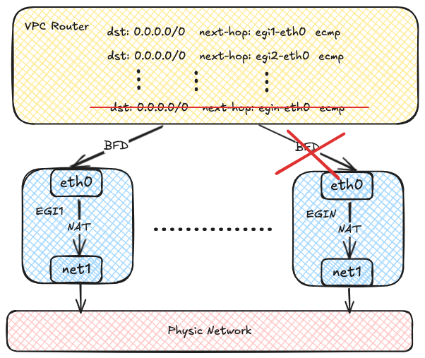

# VPC Egress Gateway

!!! note

    自定义 VPC 下的子网不支持默认 VPC 下的分布式网关和集中式网关。

    目前自定义 VPC 支持三种和外网互通的方案：VPC NAT 网关，OVN 网关和 Egress Gateway。其中 VPC NAT 网关为 Kube-OVN 最早支持的出网方式，为每个 VPC NAT 网关创建一个多网卡 Pod，一个网卡接入自定义 VPC 网络，另一个网卡通过 Macvlan 接入底层物理网络，通过 Pod 内的 iptables 实现各类出网和入网操作。该方式目前支持最多的功能，被使用的时间也最长，但也存在单点故障和使用复杂的缺点。

    OVN 网关使用了 OVN 内部原生支持的各类 NAT 能力实现出网和入网，可通过硬件加速提升性能，通过 OVN 内置的 BFD 实现故障切换，由于暴露的是 OVN 原生的概念，需要用户对 OVN 的使用较为熟悉。

    Egress Gateway 是针对 VPC NAT 网关的单点问题的改进，实现了水平扩展和故障快速切换，但是目前只实现了出网能力，没有入网能力。

VPC Egress Gateway 用于控制 VPC（包括默认 VPC）内 Pod 使用一组固定地址访问外部网络，并具有以下特点：

- 通过 ECMP 实现 Active-Active 高可用，可实现吞吐量横向扩展
- 通过 BFD 实现 <1s 的快速故障切换
- 支持 IPv6 及双栈
- 可通过 Namespace 选择器和 Pod 选择器实现细粒度路由控制
- 可通过 Node 选择器，实现 Egress Gateway 灵活调度

同时 VPC Egress Gateway 具有如下限制：

- 使用 Macvlan 实现底层网络打通，需要底层网络[支持 Underlay](../start/underlay.md#_2)
- Gateway 多实例模式下需要占用多个 Egress IP
- 目前只支持 SNAT，不支持 EIP 和 DNAT
- 目前不支持记录源地址转换关系

## 实现原理

每个 Egress Gateway 由多个多网卡的 Pod 组成，每个 Pod 两块网卡，一个网卡加入虚拟网络用于和 VPC 内地址通信，另一个网卡通过 Macvlan 接入底层物理网络，用于和外部网络通信。虚拟网络流量最终在 Egress Gateway 实例内通过 NAT 访问外部网络。


每个 Egress Gateway 实例会将自己的地址注册到 OVN 路由表内，当 VPC 内 Pod 需要访问外部网络时，OVN 会使用源地址哈希将流量转发到多个 Egress Gateway 实例地址，从而实现负载均衡，随着 Egress Gateway 实例数量的增加，吞吐量也可以实现横向扩展。


OVN 通过 BFD 协议对多个 Egress Gateway 实例进行探测，当某个 Egress Gateway 实例故障后，OVN 会将对应路由设置为不可用，从而实现故障的快速恢复。



## 使用要求

VPC Egress Gateway 与 VPC NAT Gateway 相同，都需要先在集群中 [部署 Multus-CNI](https://github.com/k8snetworkplumbingwg/multus-cni/blob/master/docs/quickstart.md){: target = "_blank" }。

> 使用 VPC Egress Gateway 无需配置任何 ConfigMap。

## 使用方法

### 创建 NetworkAttachmentDefinition

VPC Egress Gateway 使用多网卡来同时接入 VPC 及外部网络，因此需要先创建 NetworkAttachmentDefinition 用于连接外部网络。使用 `macvlan` 插件并由 Kube-OVN 提供 IPAM 的示例如下：

```yaml
apiVersion: k8s.cni.cncf.io/v1
kind: NetworkAttachmentDefinition
metadata:
  name: eth1
  namespace: default
spec:
  config: '{
      "cniVersion": "0.3.0",
      "type": "macvlan",
      "master": "eth1",
      "mode": "bridge",
      "ipam": {
        "type": "kube-ovn",
        "server_socket": "/run/openvswitch/kube-ovn-daemon.sock",
        "provider": "eth1.default"
      }
    }'
---
apiVersion: kubeovn.io/v1
kind: Subnet
metadata:
  name: macvlan1
spec:
  protocol: IPv4
  provider: eth1.default
  cidrBlock: 172.17.0.0/16
  gateway: 172.17.0.1
  excludeIps:
    - 172.17.0.0..172.17.0.10
```

> 您可使用任意 CNI 插件创建 NetworkAttachmentDefinition 使 VPC Egress Gateway 接入相应的网络中。

关于多网卡的具体使用方法，请参考 [多网卡管理](../advance//multi-nic.md)。

### 创建 VPC Egress Gateway

创建 VPC Egress Gateway 资源，示例如下：

```yaml
apiVersion: kubeovn.io/v1
kind: VpcEgressGateway
metadata:
  name: gateway1
  namespace: default
spec:
  vpc: ovn-cluster
  replicas: 1
  externalSubnet: macvlan1
  policies:
    - snat: true
      subnets:
        - ovn-default
```

上述资源会在 default 命名空间下为 VPC `ovn-cluster` 创建一个名为 gateway1 的单副本 VPC Egress Gateway，`ovn-cluster` 下 `ovn-default` 子网（10.16.0.0/16）下的所有 Pod 将通过 `macvlan1` 子网以 SNAT 的方式访问外部网络。

创建完成后，查看 VPC Egress Gateway：

```shell
$ kubectl get veg gateway1
NAME       VPC           REPLICAS   BFD ENABLED   EXTERNAL SUBNET   PHASE       READY   AGE
gateway1   ovn-cluster   1          false         macvlan1          Completed   true    13s
```

查看更多信息：

```shell
kubectl get veg gateway1 -o wide
NAME       VPC           REPLICAS   BFD ENABLED   EXTERNAL SUBNET   PHASE       READY   INTERNAL IPS     EXTERNAL IPS      WORKING NODES         AGE
gateway1   ovn-cluster   1          false         macvlan1          Completed   true    ["10.16.0.12"]   ["172.17.0.11"]   ["kube-ovn-worker"]   82s
```

查看工作负载：

```shell
$ kubectl get deployment -l ovn.kubernetes.io/vpc-egress-gateway=gateway1
NAME       READY   UP-TO-DATE   AVAILABLE   AGE
gateway1   1/1     1            1           4m40s

$ kubectl get pod -l ovn.kubernetes.io/vpc-egress-gateway=gateway1 -o wide
NAME                       READY   STATUS    RESTARTS   AGE     IP           NODE              NOMINATED NODE   READINESS GATES
gateway1-b9f8b4448-76lhm   1/1     Running   0          4m48s   10.16.0.12   kube-ovn-worker   <none>           <none>
```

查看 Pod 中的 IP、路由及 iptables 规则：

```shell
$ kubectl exec gateway1-b9f8b4448-76lhm -c gateway -- ip address show
1: lo: <LOOPBACK,UP,LOWER_UP> mtu 65536 qdisc noqueue state UNKNOWN group default qlen 1000
    link/loopback 00:00:00:00:00:00 brd 00:00:00:00:00:00
    inet 127.0.0.1/8 scope host lo
       valid_lft forever preferred_lft forever
    inet6 ::1/128 scope host
       valid_lft forever preferred_lft forever
2: net1@if13: <BROADCAST,MULTICAST,UP,LOWER_UP> mtu 1500 qdisc noqueue state UP group default qlen 1000
    link/ether 62:d8:71:90:7b:86 brd ff:ff:ff:ff:ff:ff link-netnsid 0
    inet 172.17.0.11/16 brd 172.17.255.255 scope global net1
       valid_lft forever preferred_lft forever
    inet6 fe80::60d8:71ff:fe90:7b86/64 scope link
       valid_lft forever preferred_lft forever
17: eth0@if18: <BROADCAST,MULTICAST,UP,LOWER_UP> mtu 1400 qdisc noqueue state UP group default
    link/ether 36:7c:6b:c7:82:6b brd ff:ff:ff:ff:ff:ff link-netnsid 0
    inet 10.16.0.12/16 brd 10.16.255.255 scope global eth0
       valid_lft forever preferred_lft forever
    inet6 fe80::347c:6bff:fec7:826b/64 scope link
       valid_lft forever preferred_lft forever

$ kubectl exec gateway1-b9f8b4448-76lhm -c gateway -- ip route show
default via 172.17.0.1 dev net1
10.16.0.0/16 dev eth0 proto kernel scope link src 10.16.0.12
172.17.0.0/16 dev net1 proto kernel scope link src 172.17.0.11

$ kubectl exec gateway1-b9f8b4448-76lhm -c gateway -- iptables -t nat -S
-P PREROUTING ACCEPT
-P INPUT ACCEPT
-P OUTPUT ACCEPT
-P POSTROUTING ACCEPT
-A POSTROUTING -s 10.16.0.0/16 -j MASQUERADE --random-fully
```

在 Gateway Pod 中抓包验证网络流量：

```shell
$ kubectl exec -ti gateway1-b9f8b4448-76lhm -c gateway -- bash
nobody@gateway1-b9f8b4448-76lhm:/kube-ovn$ tcpdump -i any -nnve icmp and host 172.17.0.1
tcpdump: data link type LINUX_SLL2
tcpdump: listening on any, link-type LINUX_SLL2 (Linux cooked v2), snapshot length 262144 bytes
06:50:58.936528 eth0  In  ifindex 17 92:26:b8:9e:f2:1c ethertype IPv4 (0x0800), length 104: (tos 0x0, ttl 63, id 30481, offset 0, flags [DF], proto ICMP (1), length 84)
    10.16.0.9 > 172.17.0.1: ICMP echo request, id 37989, seq 0, length 64
06:50:58.936574 net1  Out ifindex 2 62:d8:71:90:7b:86 ethertype IPv4 (0x0800), length 104: (tos 0x0, ttl 62, id 30481, offset 0, flags [DF], proto ICMP (1), length 84)
    172.17.0.11 > 172.17.0.1: ICMP echo request, id 39449, seq 0, length 64
06:50:58.936613 net1  In  ifindex 2 02:42:39:79:7f:08 ethertype IPv4 (0x0800), length 104: (tos 0x0, ttl 64, id 26701, offset 0, flags [none], proto ICMP (1), length 84)
    172.17.0.1 > 172.17.0.11: ICMP echo reply, id 39449, seq 0, length 64
06:50:58.936621 eth0  Out ifindex 17 36:7c:6b:c7:82:6b ethertype IPv4 (0x0800), length 104: (tos 0x0, ttl 63, id 26701, offset 0, flags [none], proto ICMP (1), length 84)
    172.17.0.1 > 10.16.0.9: ICMP echo reply, id 37989, seq 0, length 64
```

OVN Logical Router 中会自动创建路由策略（自定义 VPC 中是静态路由）：

```shell
$ kubectl ko nbctl lr-policy-list ovn-cluster
Routing Policies
     31000                            ip4.dst == 10.16.0.0/16           allow
     31000                           ip4.dst == 100.64.0.0/16           allow
     30000                              ip4.dst == 172.18.0.2         reroute                100.64.0.3
     30000                              ip4.dst == 172.18.0.3         reroute                100.64.0.2
     30000                              ip4.dst == 172.18.0.4         reroute                100.64.0.4
     29100                            ip4.src == 10.16.0.0/16         reroute                10.16.0.12
     29000 ip4.src == $ovn.default.kube.ovn.control.plane_ip4         reroute                100.64.0.2
     29000       ip4.src == $ovn.default.kube.ovn.worker2_ip4         reroute                100.64.0.4
     29000        ip4.src == $ovn.default.kube.ovn.worker_ip4         reroute                100.64.0.3
```

如果您需要开启多副本负载均衡，修改 `.spec.replicas` 即可，示例如下：

```shell
$ kubectl scale veg gateway1 --replicas=2
vpcegressgateway.kubeovn.io/gateway1 scaled

$ kubectl get veg gateway1
NAME       VPC           REPLICAS   BFD ENABLED   EXTERNAL SUBNET   PHASE       READY   AGE
gateway1   ovn-cluster   2          false         macvlan           Completed   true    39m

$ kubectl get pod -l ovn.kubernetes.io/vpc-egress-gateway=gateway1 -o wide
NAME                       READY   STATUS    RESTARTS   AGE   IP           NODE               NOMINATED NODE   READINESS GATES
gateway1-b9f8b4448-76lhm   1/1     Running   0          40m   10.16.0.12   kube-ovn-worker    <none>           <none>
gateway1-b9f8b4448-zd4dl   1/1     Running   0          64s   10.16.0.13   kube-ovn-worker2   <none>           <none>

$ kubectl ko nbctl lr-policy-list ovn-cluster
Routing Policies
     31000                            ip4.dst == 10.16.0.0/16           allow
     31000                           ip4.dst == 100.64.0.0/16           allow
     30000                              ip4.dst == 172.18.0.2         reroute                100.64.0.3
     30000                              ip4.dst == 172.18.0.3         reroute                100.64.0.2
     30000                              ip4.dst == 172.18.0.4         reroute                100.64.0.4
     29100                            ip4.src == 10.16.0.0/16         reroute                10.16.0.12, 10.16.0.13
     29000 ip4.src == $ovn.default.kube.ovn.control.plane_ip4         reroute                100.64.0.2
     29000       ip4.src == $ovn.default.kube.ovn.worker2_ip4         reroute                100.64.0.4
     29000        ip4.src == $ovn.default.kube.ovn.worker_ip4         reroute                100.64.0.3
```

### 指定 Egress Gateway IP 和部署节点

可以通过 `externalIPs` 和 `nodeSelector` 字段选择 Egress Gateway Pods 所使用的 Egress IP 和所部署的节点：

```yaml
apiVersion: kubeovn.io/v1
kind: VpcEgressGateway
metadata:
  name: gateway1
  namespace: default
spec:
  vpc: ovn-cluster
  replicas: 2
  externalSubnet: macvlan1
  policies:
    - snat: true
      subnets:
        - ovn-default
  externalIPs:
    - 172.17.0.10
    - 172.17.0.11
  nodeSelector:
    - matchLabels:
        kubernetes.io/hostname: kube-ovn-worker
```

### 开启 BFD 高可用

BFD 高可用依赖 VPC 的 BFD LRP 功能，因此需要先修改 VPC 资源，开启 BFD Port。示例如下：

```yaml
apiVersion: kubeovn.io/v1
kind: Vpc
metadata:
  name: vpc1
spec:
  bfdPort:
    enabled: true
    ip: 10.255.255.255
---
apiVersion: kubeovn.io/v1
kind: Subnet
metadata:
  name: subnet1
spec:
  vpc: vpc1
  protocol: IPv4
  cidrBlock: 192.168.0.0/24
```

开启 BFD Port 后，对应的 OVN LR 上会自动创建一个专用于 BFD 的 LRP：

```shell
$ kubectl ko nbctl show vpc1
router 0c1d1e8f-4c86-4d96-88b2-c4171c7ff824 (vpc1)
    port bfd@vpc1
        mac: "8e:51:4b:16:3c:90"
        networks: ["10.255.255.255"]
    port vpc1-subnet1
        mac: "de:c9:5c:38:7a:61"
        networks: ["192.168.0.1/24"]
```

完成后，将 VPC Egress Gateway 的 `.spec.bfd.enabled` 设置为 `true` 即可。示例如下：

```yaml
apiVersion: kubeovn.io/v1
kind: VpcEgressGateway
metadata:
  name: gateway2
  namespace: default
spec:
  vpc: vpc1
  replicas: 2
  internalSubnet: subnet1
  externalSubnet: macvlan
  bfd:
    enabled: true
  policies:
    - snat: true
      ipBlocks:
        - 192.168.0.0/24
```

查看 VPC Egress Gateway 信息：

```shell
$ kubectl get veg gateway2 -o wide
NAME       VPC    REPLICAS   BFD ENABLED   EXTERNAL SUBNET   PHASE       READY   INTERNAL IPS                    EXTERNAL IPS                    WORKING NODES                            AGE
gateway2   vpc1   2          true          macvlan           Completed   true    ["192.168.0.2","192.168.0.3"]   ["172.17.0.13","172.17.0.14"]   ["kube-ovn-worker","kube-ovn-worker2"]   58s

$ kubectl get pod -l ovn.kubernetes.io/vpc-egress-gateway=gateway2 -o wide
NAME                       READY   STATUS    RESTARTS   AGE     IP            NODE               NOMINATED NODE   READINESS GATES
gateway2-fcc6b8b87-8lgvx   1/1     Running   0          2m18s   192.168.0.3   kube-ovn-worker2   <none>           <none>
gateway2-fcc6b8b87-wmww6   1/1     Running   0          2m18s   192.168.0.2   kube-ovn-worker    <none>           <none>

$ kubectl ko nbctl lr-route-list vpc1
IPv4 Routes
Route Table <main>:
           192.168.0.0/24               192.168.0.2 src-ip ecmp ecmp-symmetric-reply bfd
           192.168.0.0/24               192.168.0.3 src-ip ecmp ecmp-symmetric-reply bfd

$ kubectl ko nbctl list bfd
_uuid               : 223ede10-9169-4c7d-9524-a546e24bfab5
detect_mult         : 3
dst_ip              : "192.168.0.2"
external_ids        : {af="4", vendor=kube-ovn, vpc-egress-gateway="default/gateway2"}
logical_port        : "bfd@vpc1"
min_rx              : 1000
min_tx              : 1000
options             : {}
status              : up

_uuid               : b050c75e-2462-470b-b89c-7bd38889b758
detect_mult         : 3
dst_ip              : "192.168.0.3"
external_ids        : {af="4", vendor=kube-ovn, vpc-egress-gateway="default/gateway2"}
logical_port        : "bfd@vpc1"
min_rx              : 1000
min_tx              : 1000
options             : {}
status              : up
```

进入 Pod 查看 BFD 连接：

```shell
$ kubectl exec gateway2-fcc6b8b87-8lgvx -c bfdd -- bfdd-control status
There are 1 sessions:
Session 1
 id=1 local=192.168.0.3 (p) remote=10.255.255.255 state=Up

$ kubectl exec gateway2-fcc6b8b87-wmww6 -c bfdd -- bfdd-control status
There are 1 sessions:
Session 1
 id=1 local=192.168.0.2 (p) remote=10.255.255.255 state=Up
```

### 配置参数

#### VPC BFD Port

| 字段 | 类型 | 可选 | 默认值 | 说明 | 示例 |
| :--- | :--- | :--- | :--- | :--- | :--- |
| `enabled` | `boolean` | 是 | `false` | 是否开启 BFD Port。 | `true` |
| `ip` | `string` | 否 | - | BFD Port 使用的 IP 地址，不可与其它地址冲突。支持 IPv6 及双栈。 | `169.255.255.255` / `fdff::1` / `169.255.255.255,fdff::1` |
| `nodeSelector` | `object` | 是 | - | 用于选择承载 BFD Port 工作节点的标签选择器。BFD Port 会绑定一个由选择出来的节点组成的 OVN HA Chassis Group，并以 Active/Backup 的模式工作在 Active 节点上。如果未指定 nodeSelector，Kube-OVN 会自动选择至多三个节点。您可以通过 `kubectl ko nbctl list ha_chassis_group` 查看当前所有的 OVN HA Chassis Group 资源。 | - |
| `nodeSelector.matchLabels` | `dict/map` | 是 | - | 键值对形式的标签选择器。| - |
| `nodeSelector.matchExpressions` | `object array` | 是 | - | 表达式形式的标签选择器。| - |

#### VPC Egress Gateway

Spec：

| 字段 | 类型 | 可选 | 默认值 | 说明 | 示例 |
| :--- | :--- | :--- | :--- | :--- | :--- |
| `vpc` | `string` | 是 | 默认 VPC 名称（ovn-cluster） | VPC 名称。 | `vpc1` |
| `replicas` | `integer/int32` | 是 | `1` | 副本数。 | `2` |
| `prefix` | `string` | 是 | - | 工作负载 Deployment 名称前缀。不可修改。 | `veg-` |
| `image` | `string` | 是 | - | 工作负载 Deployment 使用的镜像。 | `docker.io/kubeovn/kube-ovn:v1.14.0-debug` |
| `internalSubnet` | `string` | 是 | VPC 默认子网名称 | 接入 VPC 网络的子网名称。 | `subnet1` |
| `externalSubnet` | `string` | 否 | - | 接入外部网络的子网名称。 | `ext1` |
| `internalIPs` | `string array` | 是 | - | 接入 VPC 网络使用的 IP 地址，支持 IPv6 及双栈。指定的 IP 数量不得小于副本数。建议将数量设置为 `<replicas> + 1` 以避免某些极端情况下 Pod 无法正常创建的问题。 | `10.16.0.101` / `fd00::11` / `10.16.0.101,fd00::11` |
| `externalIPs` | `string array` | 是 | - | 接入外部网络使用的 IP 地址，支持 IPv6 及双栈。指定的 IP 数量不得小于副本数。建议将数量设置为 `<replicas> + 1` 以避免某些极端情况下 Pod 无法正常创建的问题。 | `10.16.0.101` / `fd00::11` / `10.16.0.101,fd00::11` |
| `bfd` | `object` | 是 | - | BFD 配置。| - |
| `policies` | `object array` | 是 | - | Egress 策略。可与 `selectors` 同时配置。| - |
| `selectors` | `object array` | 是 | - | 通过 Namespace Selector 以及 Pod Selector 配置 Egress 策略。匹配到的 Pod 将开启 SNAT/MASQUERADE。可与 `policies` 同时配置。| - |
| `nodeSelector` | `object array` | 是 | - | 工作负载的节点选择器，工作负载（Deployment/Pod）将运行在被选择的节点上。| - |
| `trafficPolicy` | `string` | 是 | `Cluster` | 可选值：`Cluster`/`Local`。**仅开启 BFD 时生效**。 设置为 `Local` 时，Egress 流量将优先导向同节点上的 VPC Egress Gateway 实例。若同节点上的 VPC Egress Gateway 实例出现故障，Egress 流量将导向其它实例。 | `Local` |

BFD 配置：

| 字段 | 类型 | 可选 | 默认值 | 说明 | 示例 |
| :--- | :--- | :--- | :--- | :--- | :--- |
| `enabled` | `boolean` | 是 | `false` | 是否开启 BFD。 | `true` |
| `minRX` | `integer/int32` | 是 | `1000` | BFD minRX 值（ms）。 | `500` |
| `minTX` | `integer/int32` | 是 | `1000` | BFD minTX 值（ms）。 | `500` |
| `multiplier` | `integer/int32` | 是 | `3` | BFD multiplier 值。 | `1` |

Egress 策略：

| 字段 | 类型 | 可选 | 默认值 | 说明 | 示例 |
| :--- | :--- | :--- | :--- | :--- | :--- |
| `snat` | `boolean` | 是 | `false` | 是否开启 SNAT/MASQUERADE。 | `true` |
| `ipBlocks` | `string array` | 是 | - | 应用于此 Gateway 的 IP 范围段。支持 IPv6。 | `192.168.0.1` / `192.168.0.0/24` |
| `subnets` | `string array` | 是 | - | 应用于此 Gateway 的 VPC 子网名称。支持 IPv6 子网及双栈子网。 | `subnet1` |

Selectors：

| 字段 | 类型 | 可选 | 默认值 | 说明 | 示例 |
| :--- | :--- | :--- | :--- | :--- | :--- |
| `namespaceSelector` | `object` | 是 | - | Namespace 选择器。空值时将匹配所有 Namespace。 | - |
| `namespaceSelector.matchLabels` | `dict/map` | 是 | - | 键值对形式的标签选择器。 | - |
| `namespaceSelector.matchExpressions` | `object array` | 是 | - | 表达式形式的标签选择器。| - |
| `podSelector` | `object` | 是 | - | Pod 选择器。空值时将匹配所有 Pod。 | - |
| `podSelector.matchLabels` | `dict/map` | 是 | - | 键值对形式的标签选择器。| - |
| `podSelector.matchExpressions` | `object array` | 是 | - | 表达式形式的标签选择器。| - |

节点选择器：

| 字段 | 类型 | 可选 | 默认值 | 说明 | 示例 |
| :--- | :--- | :--- | :--- | :--- | :--- |
| `matchLabels` | `dict/map` | 是 | - | 键值对形式的标签选择器。| - |
| `matchExpressions` | `object array` | 是 | - | 表达式形式的标签选择器。| - |
| `matchFields` | `object array` | 是 | - | 表达式形式的字段选择器。| - |

Status：

| 字段 | 类型 | 说明 | 示例 |
| :--- | :--- | :--- | :--- |
| `ready` | `boolean` | Gateway 是否就绪。 | `true` |
| `phase` | `string` | Gateway 处理阶段。 | `Pending` / `Processing` / `Completed` |
| `internalIPs` | `string array` | 接入 VPC 网络使用的 IP 地址。| - |
| `externalIPs` | `string array` | 接入外部网络使用的 IP 地址。| - |
| `workload` | `object` | 工作负载信息。| - |
| `workload.apiVersion` | `string` | 工作负载 API 版本。| `apps/v1` |
| `workload.kind` | `string` | 工作负载类型。| `Deployment` |
| `workload.name` | `string` | 工作负载名称。| `gateway1` |
| `workload.nodes` | `string array` | 工作负载所在的节点名称。| - |
| `conditions` | `object array` | - | - |
